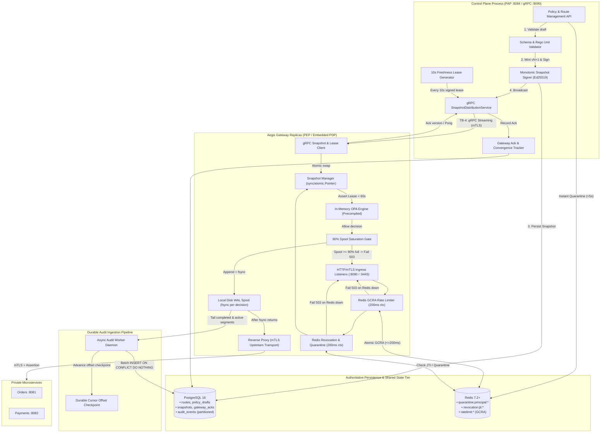

# Phase 3: Control Plane, Snapshot Streaming & Durable State — Research

**Researched:** 2026-10-06  
**Domain:** Distributed Control Plane, gRPC Snapshot Distribution, Ed25519 Freshness Leases, Redis Atomic Rate Limiting, WAL Audit Spooling, PostgreSQL 16 Persistence  
**Confidence:** HIGH (All contracts, protobuf schemas, Go pgx/redis libraries, OPA v1 compilation semantics, and NIST SP 800-207 fail-closed invariants verified against architecture contracts and specifications)

---

<user_constraints>
## User Constraints (from Project Contracts & Invariants)

### Locked Decisions (Non-Negotiable)
- **Centralized Policy Lifecycle in PostgreSQL (CTRL-01, Invariant 11)**:
  - Control plane manages route definitions, policy drafts, and snapshot history in PostgreSQL.
  - Route drafts and policy drafts MUST undergo strict OpenAPI schema validation and Rego unit test verification (`opa test`) before publication.
  - Runtime database credentials MUST be service-scoped with least privilege; data plane gateway replicas NEVER connect directly to PostgreSQL.
- **Monotonic Signed Configuration Snapshots (CTRL-02, Invariant 9, ADR-0004)**:
  - Snapshots bundle route catalogs, precompiled policy modules, seed roles data, and identity mappings into strongly typed protobuf payloads (`SnapshotPayload`).
  - Snapshots enforce strictly increasing monotonic integer version numbers ($N+1$). Replicas MUST strictly reject any snapshot with `version <= current_version`.
  - Snapshots are cryptographically signed with Ed25519 (`crypto/ed25519`) over the SHA-256 payload digest by the control plane private signing key.
- **Bidirectional gRPC Streaming & Atomic In-Memory Swap (CTRL-03, Invariant 9, ADR-0004)**:
  - Snapshots are pushed from Control Plane to Gateway replicas over persistent HTTP/2 gRPC bidirectional streams (`SnapshotDistributionService.StreamSnapshots`).
  - Gateway validates snapshot envelope signature, checksum, and monotonic version out-of-band, precompiles Rego queries via `rego.PrepareForEval(ctx)`, and performs an atomic in-memory swap using `sync/atomic.Pointer[ActiveState]`.
  - Zero lock contention, zero partial states, and zero latency regression on the request hot path.
- **10-Second Freshness Leases & 60-Second Fail-Closed Boundary (CTRL-04, Invariant 1, ADR-0004)**:
  - Control plane streams signed `FreshnessLease` messages every 10 seconds.
  - Gateway verifies lease Ed25519 signature and records renewal timestamp.
  - If a gateway replica fails to receive a verified lease renewal for >60 seconds (prolonged partition or control plane outage), it MUST drop readiness (`/healthz/ready`) and FAIL CLOSED: all requests to protected routes return `HTTP 503 Service Unavailable` (`POLICY_LEASE_EXPIRED`). Stale cached snapshots NEVER authorize indefinitely.
- **Gateway Activation Acknowledgments & Telemetry (CTRL-05)**:
  - Gateway replicas emit `SnapshotAck` messages acknowledging activation (`ACK_STATUS_ACTIVATED`) or rejection (`ACK_STATUS_REJECTED`) back to the control plane.
  - Control plane updates `gateway_acks` state in PostgreSQL to track replica convergence in real time.
- **Monotonic Policy Rollback (CTRL-06, Invariant 9)**:
  - Policy rollbacks NEVER decrease version numbers. Rollback republishes historical configuration content under a strictly higher monotonic version number ($N+1$).
- **Redis Atomic Token Bucket Rate Limiting (REV-01, ADR-0005)**:
  - Rate limiting is enforced atomically in Redis per principal and per route using the Generic Cell Rate Algorithm (GCRA via `go-redis/redis_rate/v10`).
  - Default rate: 100 requests/second with burst 200 per principal. Stricter limits on sensitive routes.
  - Rate limit rejections return `HTTP 429 Too Many Requests` with calculated `Retry-After` header.
- **Sub-5-Second JTI Revocation & Principal Quarantine (REV-03, ADR-0005)**:
  - Ephemeral Redis token `jti` revocation keys (`revocation:jti:<jti>`) and principal quarantine keys (`quarantine:principal:<id>`) block callers cluster-wide in <5 seconds.
  - Administrative writes to Redis immediately stop access across all active gateway replicas.
- **Strict 200ms Timeout & Fail-Closed Revocation Semantics (REV-04, Invariant 1, ADR-0005)**:
  - Every Redis call on the request path is bounded by a rigid 200ms context deadline (`context.WithTimeout(ctx, 200*time.Millisecond)`).
  - If Redis times out, is partitioned, or returns connection errors, the gateway MUST FAIL CLOSED immediately with `HTTP 503 Service Unavailable` (`DEPENDENCY_OUTAGE_REDIS`). Permissive fallback is STRICTLY PROHIBITED.
- **Pre-Forward Durable Disk WAL Spool with `fsync()` (AUD-01, Invariant 10, ADR-0006)**:
  - For all permitted requests, the gateway MUST serialize an authorization decision record, append it to a local append-only Write-Ahead Log (WAL) on disk, and execute synchronous `os.File.Sync()` (`fsync` syscall) BEFORE dispatching the upstream request to the backend service.
  - If disk append or `fsync` fails, upstream is NEVER dispatched; client receives `HTTP 500 / 503`.
- **90% Spool Saturation Safety Gate (AUD-02, Invariant 10, ADR-0006)**:
  - Gateway actively monitors spool volume capacity (default quota 1 GiB).
  - Spool utilization >= 70% fires warning telemetry.
  - Spool utilization >= 90% triggers a fail-closed circuit breaker: halts admission of permitted requests with `HTTP 503 Service Unavailable` (`AUDIT_SPOOL_SATURATED`). Permitted requests are NEVER forwarded without durable audit logging.
- **Asynchronous Audit Worker with At-Least-Once Delivery (AUD-03, ADR-0006)**:
  - Background worker tails completed WAL segments and active spool files, batches records (e.g. up to 500 records or 200ms window), and ingests into PostgreSQL partitioned `audit_events` table using `pgx.Batch` or `COPY`.
  - Worker advances persistent cursor offset (`wal.cursor`) ONLY AFTER PostgreSQL commits the batch.
  - PostgreSQL deduplicates on `(event_date, event_id)`. During database outages, gateway continues serving traffic by buffering to local WAL; worker catches up automatically upon database restoration.

### Planner's Discretion
- Choice of in-memory test mocks vs containerized services: pure Go in-memory gRPC (`bufconn`), in-memory Redis mock (`miniredis/v2`), and `pgxmock` for lightning-fast (<2s) unit and security test suites, alongside Docker Compose integration verification.
- WAL binary format vs JSONL with CRC32: JSONL with 32-bit CRC32 checksum and length framing enables human inspection and crash recovery.
- WAL segment file rotation threshold: Rotate at 16MB or 64MB segments; prune archived segments after acknowledgment.
- Migration management approach: `goose/v3` embedded via `embed.FS` using `_ "github.com/jackc/pgx/v5/stdlib"` for zero-dependency schema boots.

### Deferred Ideas (OUT OF SCOPE for Phase 3)
- Operator React/TypeScript dashboard UI and browser session management (Deferred to Phase 4: OPS-01 through OPS-04).
- Multi-replica gateway grid load balancing and 30s graceful drain tests (Deferred to Phase 5: DIST-01, DIST-03).
- Automated SPIRE node attestation and workload certificate rotation (Deferred to v2: PKI-01).
- Kafka / external distributed message broker (Explicitly out of scope for v1; local disk WAL fulfills Invariant 10).
</user_constraints>

---

<architectural_responsibility_map>
## Architectural Responsibility Map

| Capability | Primary Tier | Secondary Tier | Rationale |
|------------|-------------|----------------|-----------|
| PostgreSQL Schemas & Migrations (CTRL-01) | Database Storage Tier (`migrations/`, `internal/storage`) | Build & CLI Tooling (`goose/v3`) | Creates tables (`services`, `routes`, `policy_drafts`, `policy_versions`, `snapshots`, `gateway_acks`, `quarantine_records`, `audit_events`). |
| Policy Validation & Unit Testing (CTRL-01) | Control Plane Engine (`internal/control/validator.go`) | OPA Go SDK (`github.com/open-policy-agent/opa`) | Validates route schemas and executes in-memory Rego unit tests before publishing snapshots. |
| Monotonic Snapshot Signing (CTRL-02) | Control Plane Crypto Domain (`internal/snapshot/signer.go`) | Go Standard Library (`crypto/ed25519`) | Computes payload SHA-256, signs with Ed25519 private key, and increments monotonic integer version $N+1$. |
| gRPC Distribution Server (CTRL-03) | Control Plane gRPC Server (`cmd/control-plane`, `internal/control/server.go`) | gRPC Transport (`google.golang.org/grpc`) | Exposes `SnapshotDistributionService`, streams snapshots to connected replicas, and tracks live connections. |
| Freshness Lease Generator (CTRL-04) | Control Plane Background Ticker (`internal/control/lease.go`) | Go Standard Library (`crypto/ed25519`) | Mints and signs 10-second freshness leases streamed to all connected gateway replicas. |
| Gateway gRPC Client & Atomic Swap (CTRL-03, CTRL-04) | Gateway Core Engine (`internal/snapshot/client.go`) | Go Standard Library (`sync/atomic.Pointer`) | Connects with jitter, verifies signatures, precompiles Rego, atomically swaps `atomic.Pointer[ActiveState]`, enforces 60s fail-closed timeout. |
| Replica Acknowledgment Tracking (CTRL-05) | Control Plane State Domain (`internal/control/ack.go`) | PostgreSQL (`internal/storage/ack_repo.go`) | Ingests `SnapshotAck` from gateways and records version convergence status in `gateway_acks`. |
| Policy Rollback Engine (CTRL-06) | Control Plane API Domain (`internal/control/rollback.go`) | PostgreSQL & gRPC Streamer | Loads historical policy version and publishes as version $N+1$ over gRPC stream. |
| Redis Rate Limiting (REV-01) | Gateway Ingress Pipeline (`internal/ratelimit/limiter.go`) | Redis Client (`go-redis/redis_rate/v10`) | Evaluates atomic GCRA token bucket per principal/route with `Retry-After` calculation. |
| Redis Revocation & Quarantine (REV-03, REV-04) | Gateway Ingress Pipeline (`internal/revocation/store.go`) | Redis Client (`github.com/redis/go-redis/v9`) | Pipelined check for JTI and principal quarantine with 200ms deadline; fails closed (503) on outage. |
| Pre-Forward Disk WAL Spool (AUD-01, AUD-02) | Gateway Audit Domain (`internal/audit/spool.go`) | Go Standard Library (`os.File.Sync`, `hash/crc32`) | Pre-forward `fsync` of decision records before upstream network dispatch; halts admission at 90% disk capacity. |
| Asynchronous Audit Worker (AUD-03) | Background Delivery Worker (`cmd/audit-worker`, `internal/audit/worker.go`) | PostgreSQL Batch Driver (`pgx/v5`, `pgxpool`) | Tails WAL segments, batches records to PostgreSQL with `pgx.Batch`, advances durable cursor checkpoint. |
</architectural_responsibility_map>

---

<research_summary>
## Summary

Phase 3 is the core state and control foundation of Aegis. It transforms the single-replica gateway prototype into a distributed, centrally managed zero-trust system backed by PostgreSQL 16, streaming gRPC, Redis 7, and durable local disk Write-Ahead Logging (WAL). 

The central challenge in zero-trust architecture is maintaining absolute authorization consistency and non-repudiation without sacrificing data plane performance. Aegis solves this through strict decoupling:
1. **The Request Hot Path is Network-Isolated from Central Databases**: Gateways never query PostgreSQL synchronously during request evaluation. All routes, identity mappings, and precompiled Rego policies are held in an immutable in-memory snapshot swapped atomically using `sync/atomic.Pointer`.
2. **Freshness is Cryptographically Bound**: To prevent partitioned replicas from serving stale policy indefinitely, the control plane issues signed 10-second freshness leases over gRPC. If a gateway loses contact with the control plane for >60 seconds, it drops readiness and fails closed (HTTP 503).
3. **Emergency Revocations Propagate in Under 5 Seconds**: Shared low-latency state in Redis handles token JTI blocklists, principal quarantines, and atomic GCRA rate limiting. Every check is bounded by a strict 200ms deadline and fails closed with HTTP 503 if Redis is unavailable—never failing open.
4. **Pre-Forward Durability Guarantees Non-Repudiation**: Before forwarding any permitted request to a backend microservice, the gateway appends the decision event to a local disk WAL with synchronous `fsync()`. An asynchronous worker tails the WAL and batches events into PostgreSQL. If local disk reaches 90% capacity, the gateway halts new request admissions with HTTP 503 rather than dropping audit records.

**Primary recommendation:** Implement the state components as cleanly decoupled Go packages (`internal/storage`, `internal/snapshot`, `internal/ratelimit`, `internal/revocation`, `internal/audit`), write Goose SQL migrations with daily range-partitioned audit tables, use `bufconn` and `miniredis` for sub-second unit/security test suites, and prove fail-closed semantics across all failure modes (Redis down, lease expired, spool full).
</research_summary>

---

<standard_stack>
## Standard Stack

### Core Technologies
| Library / Package | Version | Purpose | Why Standard / Legitimacy |
|-------------------|---------|---------|---------------------------|
| **Go PostgreSQL Toolkit (`pgx/v5`)** | `v5.9.2` (`github.com/jackc/pgx/v5`, `pgxpool`) | Authoritative relational persistence for Control Plane metadata, snapshots, and audit log batches | The de facto high-performance PostgreSQL driver for Go. Provides binary wire format encoding, connection pooling (`pgxpool.New`), prepared statement caching, and `pgx.Batch` for high-throughput audit log ingestion without ORM overhead. |
| **Goose Database Migrations (`goose/v3`)** | `v3.27.3` (`github.com/pressly/goose/v3`) | Forward-compatible SQL migrations for PostgreSQL schema initialization and rollbacks | Industry standard for Go SQL migrations. Supports embedded SQL migrations via `embed.FS`, idempotent execution, locking, and clean Go integration via `goose.OpenDBWithDriver` or `database/sql`. |
| **Redis Go Client (`go-redis/v9`)** | `v9.22.0` (`github.com/redis/go-redis/v9`) | Low-latency shared cache for JTI revocations, principal quarantine, and rate limiting | The official, actively maintained Go client for Redis. Supports context cancellation, automatic pipelining, atomic Lua script execution (`EVALSHA`), and sub-millisecond execution. |
| **GCRA Rate Limiter (`redis_rate/v10`)** | `v10.0.1` (`github.com/go-redis/redis_rate/v10`) | Generic Cell Rate Algorithm (GCRA) token bucket rate limiting on Redis | Official rate limiter for `go-redis/v9`. Uses a single-roundtrip atomic Lua script, computes precise `Retry-After` durations, and sets key TTL automatically to prevent cardinality leaks. |
| **gRPC Go (`grpc-go`)** | `v1.83.2` (`google.golang.org/grpc`) | Bidirectional streaming transport between Control Plane and Gateway replicas | CNCF standard for cloud-native RPC. Multiplexes snapshots, leases, acknowledgments, and heartbeats over persistent HTTP/2 connections with TLS and low CPU overhead. |
| **Go Protobuf (`protobuf`)** | `v1.36.12` (`google.golang.org/protobuf`) | Strongly typed binary serialization for configuration snapshots and lease envelopes | High-speed, backward-compatible binary encoding defined in `api/proto/snapshot/v1/snapshot.proto`. Code-generated structs exist in `pkg/api/snapshot/v1`. |
| **Ed25519 Signatures (`crypto/ed25519`)** | Go Standard Library | Digital signatures for configuration snapshots and 10s freshness leases | RFC 8032 digital signature scheme. Executes signing and verification in <50 microseconds with constant-time security and zero CGO dependencies. |
| **WAL Spooling (`os.File.Sync` & `hash/crc32`)** | Go Standard Library | Pre-forward durable disk append with forced `fsync` syscall and CRC32 checksum | Native POSIX file synchronization guarantees non-volatile disk persistence before upstream network calls without external broker dependencies. |

### Supporting Libraries
| Library | Version | Purpose | When to Use |
|---------|---------|---------|-------------|
| **`google.golang.org/grpc/test/bufconn`** | Built into `grpc-go` | In-memory buffered network connection for gRPC testing | Fast unit and integration tests of gRPC streaming without binding local TCP ports. |
| **`github.com/alicebob/miniredis/v2`** | `v2.34.0` | Pure Go in-memory Redis mock with Lua script support | Fast (<50ms) unit testing of Redis token bucket rate limiting, JTI revocation, and fail-closed timeouts. |
| **`github.com/pashagolub/pgxmock/v4`** | `v4.5.0` | In-memory mock for `pgx/v5` connection pools | Unit testing control plane repositories without requiring a running PostgreSQL server. |
| **`golang.org/x/sys/unix`** | Go Subrepo | Filesystem capacity checking (`unix.Statfs`) | Measuring free disk space on spool volume for 90% saturation gate. |
| **`github.com/stretchr/testify`** | `v1.12.1` | Unit, security, and integration test assertions (`assert`, `require`, `suite`) | Testing snapshot version monotonicity, signature verification, fail-closed responses. |

### Alternatives Considered
| Instead of | Could Use | Tradeoff / Why Not |
|------------|-----------|--------------------|
| Embedded Go WAL (`os.File.Sync`) | Apache Kafka / RabbitMQ | Kafka introduces massive operational overhead (ZooKeeper/KRaft brokers, JVM memory) for local demos and single clusters. Local disk WAL with pre-forward `fsync()` guarantees durability (Invariant 10) with zero external broker dependencies. Kafka is an optional Phase 7 extension. |
| `pgx/v5` | `lib/pq` | `lib/pq` is officially in maintenance mode, lacks connection pooling (`pgxpool`), prepared statement caching, and high-performance binary protocol support. |
| Redis GCRA (`redis_rate/v10`) | In-memory Go token bucket (`golang.org/x/time/rate`) | In-memory rate limiting is isolated per replica; running 3 replicas allows 3x the configured burst rate. Redis GCRA enforces a shared global counter across all replicas. |
| Ed25519 Signatures | RSA-4096 or ECDSA P-384 | Ed25519 keys are 32 bytes, signatures are 64 bytes, and verification is ~10x faster than RSA, keeping gRPC heartbeat lease overhead negligible. |
| Polling PostgreSQL from Gateways | Periodic HTTP/DB polling | Direct database connections from gateways create connection pool starvation on PostgreSQL and introduce 1–5 second polling latency. gRPC streaming pushes updates in <100ms. |

### Installation & Dependency Verification
Run these commands to add the missing Phase 3 Go dependencies:
```bash
go get github.com/jackc/pgx/v5@v5.9.2
go get github.com/pressly/goose/v3@v3.27.3
go get github.com/redis/go-redis/v9@v9.22.0
go get github.com/go-redis/redis_rate/v10@v10.0.1
go get github.com/alicebob/miniredis/v2@v2.34.0
go get github.com/pashagolub/pgxmock/v4@v4.5.0
go mod tidy
```
</standard_stack>

---

<architecture_patterns>
## Architecture Patterns

### System Architecture Diagram: Control Plane, Snapshot Streaming & Durable State



### Recommended Project Structure
```
aegis/
├── cmd/
│   ├── gateway/                  # Gateway binary entrypoint
│   │   └── main.go
│   ├── control-plane/            # Control plane binary (PAP & gRPC streamer)
│   │   └── main.go
│   ├── audit-worker/             # Async WAL spool delivery daemon
│   │   └── main.go
│   └── demo-issuer/              # Development JWT issuer
│       └── main.go
├── internal/
│   ├── control/                  # Control Plane business logic
│   │   ├── server.go             # gRPC SnapshotDistributionService implementation
│   │   ├── signer.go             # Monotonic Ed25519 snapshot & lease signer
│   │   ├── lease.go              # 10s freshness lease generation loop
│   │   ├── validator.go          # Route schema & Rego unit test validation
│   │   └── rollback.go           # Rollback logic republishing historical content
│   ├── storage/                  # PostgreSQL database repository layer
│   │   ├── db.go                 # pgxpool connection pool management
│   │   ├── migration.go          # goose migration runner with embed.FS
│   │   ├── route_repo.go         # Route draft & catalog persistence
│   │   ├── policy_repo.go        # Policy draft & version persistence
│   │   ├── snapshot_repo.go      # Snapshot envelopes and outbox records
│   │   ├── ack_repo.go           # Gateway acknowledgment persistence
│   │   └── audit_repo.go         # Batch PostgreSQL writer for audit events
│   ├── snapshot/                 # Gateway-side snapshot management
│   │   ├── manager.go            # sync/atomic.Pointer[ActiveState] manager
│   │   ├── client.go             # gRPC stream client with reconnect jitter
│   │   └── verifier.go           # Signature, checksum, and monotonic verifier
│   ├── ratelimit/                # Redis rate limiting domain
│   │   └── limiter.go            # GCRA token bucket using redis_rate/v10
│   ├── revocation/               # Redis revocation and quarantine store
│   │   └── store.go              # Pipelined JTI & principal quarantine checks
│   ├── audit/                    # Audit logging and disk WAL spool
│   │   ├── event.go              # Structured decision & completion event models
│   │   ├── spool.go              # Append-only WAL with fsync and 90% gate
│   │   ├── cursor.go             # Persistent file offset checkpoint tracker
│   │   ├── worker.go             # Background WAL tailer and batch dispatcher
│   │   └── logger.go             # Slog completion logger
│   ├── identity/                 # JWT, SPIFFE, Assertion minting
│   ├── policy/                   # OPA engine and Rego compiler
│   └── proxy/                    # Reverse proxy, router, validators
├── migrations/                   # SQL migration scripts for goose
│   ├── 000001_create_control_plane_tables.sql
│   └── 000002_create_partitioned_audit_tables.sql
├── deployments/
│   └── compose/
│       ├── docker-compose.mvp.yml
│       └── docker-compose.hardened.yml  # Includes postgres, redis, control-plane
└── tests/
    ├── failure/                  # Dependency fault injection tests
    │   ├── redis_outage_test.go
    │   ├── lease_expiry_test.go
    │   └── spool_saturation_test.go
    └── integration/
        └── snapshot_streaming_test.go
```

---

### Pattern 1: Atomic Snapshot Activation with `sync/atomic.Pointer` & Rego Precompilation
**What:** The gateway maintains all routing rules, precompiled Rego queries, identity mappings, and lease timestamps in an immutable `ActiveState` struct. Updates streamed via gRPC compile out-of-band and swap atomically via `sync/atomic.Pointer[ActiveState]`.  
**When to use:** Request hot paths where routing and policy MUST never be evaluated out-of-sync, and lock contention must be 0ms.  
**Example:**
```go
package snapshot

import (
	"context"
	"crypto/ed25519"
	"crypto/sha256"
	"encoding/hex"
	"fmt"
	"sync/atomic"
	"time"

	snapshotv1 "aegis/pkg/api/snapshot/v1"
	"aegis/internal/policy"
	"aegis/internal/proxy"
	"google.golang.org/protobuf/proto"
)

type ActiveState struct {
	Version          int64
	Router           *proxy.Router
	PolicyEngine     *policy.Engine
	IdentityMappings map[string][]string
	ActivatedAt      time.Time
}

type Manager struct {
	active             atomic.Pointer[ActiveState]
	lastLeaseRenewedAt atomic.Int64 // UnixNano
	trustedSigningKey  ed25519.PublicKey
}

func NewManager(trustedSigningKey ed25519.PublicKey) *Manager {
	m := &Manager{trustedSigningKey: trustedSigningKey}
	m.lastLeaseRenewedAt.Store(time.Now().UnixNano())
	return m
}

func (m *Manager) Active() *ActiveState {
	return m.active.Load()
}

func (m *Manager) IsLeaseExpired(timeout time.Duration) bool {
	lastRenewed := time.Unix(0, m.lastLeaseRenewedAt.Load())
	return time.Since(lastRenewed) > timeout
}

func (m *Manager) RecordLeaseRenewal() {
	m.lastLeaseRenewedAt.Store(time.Now().UnixNano())
}

func (m *Manager) ValidateAndActivate(ctx context.Context, env *snapshotv1.SnapshotEnvelope) error {
	current := m.active.Load()
	if current != nil && env.Version <= current.Version {
		return fmt.Errorf("monotonic version violation: incoming %d <= current %d", env.Version, current.Version)
	}

	// Verify SHA-256 Checksum
	hasher := sha256.New()
	hasher.Write(env.Payload)
	calculatedSHA := hex.EncodeToString(hasher.Sum(nil))
	if calculatedSHA != env.PayloadSha256 {
		return fmt.Errorf("payload sha256 mismatch: calculated %s != envelope %s", calculatedSHA, env.PayloadSha256)
	}

	// Verify Ed25519 Digital Signature
	if !ed25519.Verify(m.trustedSigningKey, []byte(env.PayloadSha256), env.Signature) {
		return fmt.Errorf("cryptographic signature verification failed")
	}

	// Unmarshal strongly typed payload
	var payload snapshotv1.SnapshotPayload
	if err := proto.Unmarshal(env.Payload, &payload); err != nil {
		return fmt.Errorf("failed to unmarshal snapshot payload: %w", err)
	}

	// Precompile Rego queries & build router out-of-band
	var regoSource string
	for _, mod := range payload.PolicyModules {
		regoSource += mod.SourceRego + "\n"
	}
	engine, err := policy.NewEngine(ctx, regoSource)
	if err != nil {
		return fmt.Errorf("failed to precompile policy engine: %w", err)
	}

	router := proxy.NewRouter()
	for _, r := range payload.Routes {
		if err := router.AddRoute(r); err != nil {
			return fmt.Errorf("invalid route %s: %w", r.RouteId, err)
		}
	}

	// Atomic Swap: Zero locks, lock-free concurrent reads
	nextState := &ActiveState{
		Version:      env.Version,
		Router:       router,
		PolicyEngine: engine,
		ActivatedAt:  time.Now(),
	}
	m.active.Store(nextState)
	m.RecordLeaseRenewal()
	return nil
}
```

---

### Pattern 2: Bounded 10s Freshness Lease & 60s Fail-Closed Partition Boundary
**What:** The control plane issues signed `FreshnessLease` messages every 10 seconds. If a gateway receives no valid lease for >60 seconds, it drops readiness and returns `HTTP 503` on all protected routes.  
**When to use:** Mandated by Invariant 1 & Invariant 9 to prevent partitioned gateways from serving stale policy indefinitely.  
**Example:**
```go
func (g *Gateway) handleIngress(w http.ResponseWriter, r *http.Request) {
	reqID := r.Header.Get("X-Request-ID")

	// 1. Enforce 60-second lease freshness boundary (CTRL-04)
	if g.snapshots.IsLeaseExpired(60 * time.Second) {
		proxy.WriteProblemDetails(
			w,
			http.StatusServiceUnavailable,
			"Service Unavailable",
			"Control plane security lease expired (>60s); gateway failing closed",
			"https://aegis.local/errors/policy-lease-expired",
			reqID,
		)
		return
	}

	state := g.snapshots.Active()
	if state == nil {
		proxy.WriteProblemDetails(
			w,
			http.StatusServiceUnavailable,
			"Service Unavailable",
			"No active security configuration loaded",
			"https://aegis.local/errors/uninitialized",
			reqID,
		)
		return
	}
	// Proceed with route match and policy evaluation...
}
```

---

### Pattern 3: Pipelined Redis Revocation & GCRA Token Bucket with 200ms Hard Timeout
**What:** Pipelined lookups for token `jti` and principal quarantine, followed by atomic GCRA rate limiting. Every Redis call executes under a strict 200ms deadline; failure or timeout immediately returns `HTTP 503` (no permissive fallback).  
**When to use:** Request hot path identity and counter checks (REV-01, REV-03, REV-04).  
**Example:**
```go
package revocation

import (
	"context"
	"errors"
	"fmt"
	"time"

	"github.com/redis/go-redis/v9"
)

type Store struct {
	client *redis.Client
}

func NewStore(client *redis.Client) *Store {
	return &Store{client: client}
}

// CheckRevocation executes in <0.5ms via Redis pipeline with 200ms deadline.
func (s *Store) CheckRevocation(ctx context.Context, principalID, jti string) (bool, string, error) {
	// Rigid 200ms dependency timeout (REV-04)
	ctx, cancel := context.WithTimeout(ctx, 200*time.Millisecond)
	defer cancel()

	pipe := s.client.Pipeline()
	quarCmd := pipe.Exists(ctx, "quarantine:principal:"+principalID)
	jtiCmd := pipe.Exists(ctx, "revocation:jti:"+jti)

	_, err := pipe.Exec(ctx)
	if err != nil {
		// Redis unavailable or timeout -> Must fail closed
		return false, "", fmt.Errorf("redis check failed: %w", err)
	}

	if quarCmd.Val() > 0 {
		return true, "PRINCIPAL_QUARANTINED", nil
	}
	if jtiCmd.Val() > 0 {
		return true, "TOKEN_REVOKED", nil
	}

	return false, "", nil
}
```

---

### Pattern 4: Pre-Forward Disk WAL Append with `fsync()`, CRC32, and 90% Saturation Gate
**What:** Every permitted request appends an authorization decision record to an append-only WAL segment and calls `file.Sync()` BEFORE dispatching to the upstream backend. If spool disk usage reaches 90%, admissions halt with `HTTP 503`.  
**When to use:** Mandatory non-repudiation and durability compliance (AUD-01, AUD-02).  
**Example:**
```go
package audit

import (
	"encoding/binary"
	"encoding/json"
	"errors"
	"fmt"
	"hash/crc32"
	"os"
	"sync"
	"syscall"
)

var (
	ErrSpoolSaturated = errors.New("audit spool saturated (>= 90% capacity)")
	MagicHeader       = uint32(0xAE615001) // Aegis Spool Magic
)

type DiskSpool struct {
	mu         sync.Mutex
	activeFile *os.File
	spoolDir   string
	maxBytes   int64
}

func (s *DiskSpool) AppendPreForward(event *CompletionEvent) error {
	s.mu.Lock()
	defer s.mu.Unlock()

	// Check 90% Saturation Safety Gate (AUD-02)
	saturated, err := s.checkSaturation(0.90)
	if err != nil || saturated {
		return ErrSpoolSaturated
	}

	payload, err := json.Marshal(event)
	if err != nil {
		return err
	}

	checksum := crc32.ChecksumIEEE(payload)
	length := uint32(len(payload))

	// Format: [Magic: 4B][CRC32: 4B][Length: 4B][Payload: NB][\n: 1B]
	header := make([]byte, 12)
	binary.BigEndian.PutUint32(header[0:4], MagicHeader)
	binary.BigEndian.PutUint32(header[4:8], checksum)
	binary.BigEndian.PutUint32(header[8:12], length)

	if _, err := s.activeFile.Write(header); err != nil {
		return err
	}
	if _, err := s.activeFile.Write(payload); err != nil {
		return err
	}
	if _, err := s.activeFile.Write([]byte{'\n'}); err != nil {
		return err
	}

	// Mandatory fsync before upstream network dispatch (AUD-01)
	return s.activeFile.Sync()
}

func (s *DiskSpool) checkSaturation(threshold float64) (bool, error) {
	var stat syscall.Statfs_t
	if err := syscall.Statfs(s.spoolDir, &stat); err != nil {
		return false, err
	}
	total := stat.Blocks * uint64(stat.Bsize)
	free := stat.Bavail * uint64(stat.Bsize)
	used := total - free
	ratio := float64(used) / float64(total)
	return ratio >= threshold, nil
}
```

---

### Anti-Patterns to Avoid
- **Synchronous Database Reads on Request Hot Path:** Querying PostgreSQL for route definitions or policy lookups during proxying adds 10–50ms latency, starves DB pools, and makes PostgreSQL a single point of failure. *Always evaluate against in-memory snapshots.*
- **Permissive Fail-Open on Redis Outage:** Logging a warning and allowing requests when Redis times out creates a catastrophic vulnerability: an attacker can DDoS Redis to bypass token revocation. *Always fail closed with HTTP 503.*
- **Indefinite Snapshot Trust without Leases:** Allowing a partitioned gateway to serve traffic on cached snapshots indefinitely allows quarantined actors or revoked policies to remain active. *Always enforce the 60s lease boundary.*
- **In-Memory Channel Audit Logging:** Buffering audit records in a Go channel (`chan AuditEvent`) loses all in-flight logs if the container crashes or gets OOM-killed, enabling financial repudiation. *Always `fsync()` to local disk WAL before upstream forwarding.*
- **Decreasing Version Numbers on Rollback:** Rolling back to version $N-1$ by broadcasting version $N-1$ violates monotonic invariants and enables replay attacks. *Always republish historical content under a strictly higher version number ($N+1$).*
</architecture_patterns>

---

<dont_hand_roll>
## Don't Hand-Roll

| Problem | Don't Build | Use Instead | Why |
|---------|-------------|-------------|-----|
| Distributed Rate Limiting | Custom Redis INCR + EXPIRE scripts | `github.com/go-redis/redis_rate/v10` | Hand-rolled Lua scripts frequently suffer from race conditions, floating-point timestamp drift, and leaky bucket reset bugs. `redis_rate` implements battle-tested GCRA with atomic TTL setting. |
| Database Connection Pooling | Raw `database/sql` without tuning or single `pgx.Conn` | `github.com/jackc/pgx/v5/pgxpool` | Managing raw connections leads to thread contention, leaked sockets, and missing prepared statement caching. `pgxpool` manages min/max pool sizing, health checking, and binary protocol optimization. |
| Database Migrations | Hardcoded `CREATE TABLE IF NOT EXISTS` strings in Go code | `github.com/pressly/goose/v3` | Unversioned SQL strings break during rollbacks, lack lock protection, and fail to track migration version history. Goose handles versioning, locks, and rollbacks reliably. |
| Cryptographic Signing | Custom signature envelope encoding or ad-hoc HMAC | Standard `crypto/ed25519` + Protobuf serialization | Custom binary serialization introduces canonicalization ambiguities and signature malleability vulnerabilities. Protobuf + Ed25519 provides deterministic serialization and constant-time verification. |
| In-Memory Pointer Swapping | Mutex lock around map reads on request path (`sync.RWMutex`) | `sync/atomic.Pointer[ActiveState]` | Read locks incur cache-line bouncing and CPU contention at 10,000+ RPS. `atomic.Pointer` provides zero-cost lock-free pointer dereferencing on the hot path. |
</dont_hand_roll>

---

<common_pitfalls>
## Common Pitfalls

### Pitfall 1: Desynchronization Between Route Table and OPA Policies
**What goes wrong:** A gateway replica updates its route table from version 12, but continues evaluating OPA Rego policies from version 11. An incoming request matches a newly configured route, but the older policy lacks corresponding rules, causing unexpected 403 denies or unintended allows.  
**Why it happens:** Updating routes and policies via separate setters or distinct mutex locks.  
**How to avoid:** Anchor all routing rules, precompiled Rego queries, and role catalogs inside a single immutable struct (`ActiveState`). Activate the entire bundle simultaneously using a single atomic pointer swap (`m.active.Store(nextState)`).  
**Warning signs:** Log entries showing `SnapshotVersion: 12` on route resolution but `PolicyVersion: 11` in audit logs.

### Pitfall 2: Permissive Fail-Open During Redis Hiccups or Latency Spikes
**What goes wrong:** Redis experiences high memory usage or a 300ms network blip. The gateway catches a timeout error, logs `Redis check failed`, and proceeds to evaluate policy, permitting a quarantined user to access backend microservices.  
**Why it happens:** Defaulting to error tolerance: developers assume cache outages should not disrupt service availability.  
**How to avoid:** Grounded in Invariant 1: **Default deny and fail closed.** If `CheckRevocation` returns an error or context deadline exceeded (>200ms), immediately abort and return `HTTP 503 Service Unavailable` (`DEPENDENCY_OUTAGE_REDIS`).  
**Warning signs:** Requests succeeding when `docker compose stop redis` is executed.

### Pitfall 3: Split-Brain Operation During Extended Control Plane Outages
**What goes wrong:** A gateway replica loses connectivity to the control plane. An operator publishes an emergency policy revoking a compromised credential. The partitioned gateway continues happily serving traffic for hours because it cached the initial snapshot.  
**Why it happens:** Treating snapshot distribution as a one-shot push without cryptographic freshness leases.  
**How to avoid:** Control plane streams signed `FreshnessLease` messages every 10 seconds. Gateways track the last verified lease renewal timestamp. If `time.Since(lastRenewal) > 60*time.Second`, the gateway drops readiness and fails closed (HTTP 503).  
**Warning signs:** Prometheus gauge `aegis_lease_age_seconds` climbing past 60s without gateway throwing 503 errors.

### Pitfall 4: Audit Event Loss from Process Crashes with Post-Forward Logging
**What goes wrong:** Gateway receives `POST /api/payments`, passes OPA policy, proxies the request to the payments backend (which charges $5,000), but before the HTTP response finishes, the gateway container is killed by Kubernetes or crashes. Zero audit record exists.  
**Why it happens:** Emitting audit logs in an HTTP middleware `defer` block after response handling.  
**How to avoid:** Implement **pre-forward WAL append**. The decision event is written to the local WAL file and forced to disk with `os.File.Sync()` *before* the reverse proxy forwards the request upstream. If disk sync fails, upstream is never called.  
**Warning signs:** Backend database contains transactions that have no matching entry in PostgreSQL `audit_events`.

### Pitfall 5: Local Spool Disk Exhaustion Crashing the Gateway Host
**What goes wrong:** PostgreSQL undergoes a 2-hour maintenance outage. Gateway continues writing WAL files until the server's root partition reaches 100% capacity, causing kernel panics, database corruption, and node eviction.  
**Why it happens:** Unbounded WAL file generation without a saturation circuit breaker.  
**How to avoid:** Gateway actively queries spool volume free space before every write. If spool utilization reaches 90% capacity, trigger the safety gate: reject subsequent requests with `HTTP 503 Service Unavailable` (`AUDIT_SPOOL_SATURATED`).  
**Warning signs:** Spool directory size exceeding configured volume quota without traffic being throttled.
</common_pitfalls>

---

<code_examples>
## Code Examples

### PostgreSQL Goose Migration: Partitioned Audit Events Table
```sql
-- +goose Up
-- SQL migration for partitioned audit logging (AUD-03)
CREATE TABLE IF NOT EXISTS services (
    id VARCHAR(64) PRIMARY KEY,
    environment VARCHAR(32) NOT NULL DEFAULT 'production',
    enabled BOOLEAN NOT NULL DEFAULT true,
    metadata JSONB NOT NULL DEFAULT '{}',
    created_at TIMESTAMPTZ NOT NULL DEFAULT NOW(),
    updated_at TIMESTAMPTZ NOT NULL DEFAULT NOW()
);

CREATE TABLE IF NOT EXISTS routes (
    route_id VARCHAR(64) PRIMARY KEY,
    service_id VARCHAR(64) NOT NULL REFERENCES services(id),
    http_method VARCHAR(16) NOT NULL,
    path_template VARCHAR(256) NOT NULL,
    upstream_url TEXT NOT NULL,
    upstream_spiffe_id TEXT NOT NULL,
    rate_limit_rps INT NOT NULL DEFAULT 100,
    rate_limit_burst INT NOT NULL DEFAULT 200,
    timeout_ms INT NOT NULL DEFAULT 5000,
    requires_workload_mtls BOOLEAN NOT NULL DEFAULT false,
    created_at TIMESTAMPTZ NOT NULL DEFAULT NOW(),
    updated_at TIMESTAMPTZ NOT NULL DEFAULT NOW()
);

CREATE TABLE IF NOT EXISTS snapshots (
    version BIGINT PRIMARY KEY,
    schema_version INT NOT NULL DEFAULT 1,
    payload_sha256 VARCHAR(64) NOT NULL,
    payload_bytes BYTEA NOT NULL,
    signing_key_id VARCHAR(64) NOT NULL,
    signature BYTEA NOT NULL,
    created_at TIMESTAMPTZ NOT NULL DEFAULT NOW(),
    expires_at TIMESTAMPTZ NOT NULL,
    published_by VARCHAR(64) NOT NULL
);

CREATE TABLE IF NOT EXISTS gateway_acks (
    gateway_id VARCHAR(64) PRIMARY KEY,
    active_version BIGINT NOT NULL,
    status VARCHAR(32) NOT NULL,
    error_message TEXT,
    lease_expires_at TIMESTAMPTZ,
    last_heartbeat_at TIMESTAMPTZ NOT NULL DEFAULT NOW(),
    connected_at TIMESTAMPTZ NOT NULL DEFAULT NOW()
);

-- Partitioned audit events by event_date
CREATE TABLE IF NOT EXISTS audit_events (
    event_id UUID NOT NULL,
    event_type VARCHAR(32) NOT NULL,
    request_id UUID NOT NULL,
    timestamp TIMESTAMPTZ NOT NULL,
    event_date DATE NOT NULL,
    principal_id VARCHAR(128) NOT NULL,
    principal_kind VARCHAR(32) NOT NULL,
    roles JSONB NOT NULL DEFAULT '[]',
    service_id VARCHAR(64) NOT NULL,
    route_id VARCHAR(64) NOT NULL,
    http_method VARCHAR(16) NOT NULL,
    request_path TEXT NOT NULL,
    decision VARCHAR(16) NOT NULL,
    reason_code VARCHAR(64) NOT NULL,
    snapshot_version BIGINT NOT NULL,
    http_status INT,
    duration_ms DOUBLE PRECISION,
    client_ip VARCHAR(64),
    error_code VARCHAR(64),
    PRIMARY KEY (event_date, event_id)
) PARTITION BY RANGE (event_date);

-- Create active default/current partitions
CREATE TABLE IF NOT EXISTS audit_events_default PARTITION OF audit_events DEFAULT;

CREATE INDEX IF NOT EXISTS idx_audit_events_request_id ON audit_events (request_id);
CREATE INDEX IF NOT EXISTS idx_audit_events_principal_time ON audit_events (principal_id, timestamp);
CREATE INDEX IF NOT EXISTS idx_audit_events_route_time ON audit_events (route_id, timestamp);

-- +goose Down
DROP TABLE IF EXISTS audit_events;
DROP TABLE IF EXISTS gateway_acks;
DROP TABLE IF EXISTS snapshots;
DROP TABLE IF EXISTS routes;
DROP TABLE IF EXISTS services;
```

---

### Asynchronous Audit Ingestion Worker with `pgx.Batch`
```go
package audit

import (
	"context"
	"fmt"
	"time"

	"github.com/jackc/pgx/v5"
	"github.com/jackc/pgx/v5/pgxpool"
)

type Worker struct {
	pool       *pgxpool.Pool
	cursor     *CursorTracker
	batchSize  int
	flushTimer time.Duration
}

func (w *Worker) FlushBatch(ctx context.Context, events []CompletionEvent, newOffset int64) error {
	if len(events) == 0 {
		return nil
	}

	batch := &pgx.Batch{}
	query := `
		INSERT INTO audit_events (
			event_id, event_type, request_id, timestamp, event_date,
			principal_id, principal_kind, roles, service_id, route_id,
			http_method, request_path, decision, reason_code, snapshot_version,
			http_status, duration_ms, client_ip, error_code
		) VALUES (
			$1, $2, $3, $4, $5, $6, $7, $8, $9, $10,
			$11, $12, $13, $14, $15, $16, $17, $18, $19
		) ON CONFLICT (event_date, event_id) DO NOTHING;
	`

	for _, e := range events {
		eventDate := e.Timestamp.UTC().Format("2006-01-02")
		eventType := "decision"
		if e.HTTPStatus > 0 {
			eventType = "completion"
		}
		rolesJSON := "[]"
		if len(e.PrincipalRoles) > 0 {
			rolesJSON = fmt.Sprintf(`["%s"]`, e.PrincipalRoles[0])
		}

		batch.Queue(query,
			e.EventID, eventType, e.RequestID, e.Timestamp, eventDate,
			e.PrincipalID, e.PrincipalKind, rolesJSON, e.ServiceID, e.RouteID,
			e.HTTPMethod, e.CanonicalPath, e.Decision, e.ReasonCode, e.SnapshotVersion,
			e.HTTPStatus, e.DurationMS, e.ClientIP, e.ErrorCode,
		)
	}

	br := w.pool.SendBatch(ctx, batch)
	defer br.Close()

	for i := 0; i < len(events); i++ {
		if _, err := br.Exec(); err != nil {
			return fmt.Errorf("batch execute failed at index %d: %w", i, err)
		}
	}

	// Advance persistent checkpoint only after successful DB commit
	return w.cursor.SaveOffset(newOffset)
}
```
</code_examples>

---

<sota_updates>
## State of the Art (2024-2026)

| Old Approach | Current Approach | When Changed | Impact |
|--------------|------------------|--------------|--------|
| `lib/pq` PostgreSQL driver | `jackc/pgx/v5` with `pgxpool` | 2023 | Native binary wire format, connection pooling, and batch queueing without reflection overhead. |
| In-memory Mutex `sync.RWMutex` for policy reads | `sync/atomic.Pointer[ActiveState]` | Go 1.19+ | Zero read lock contention, cache-line efficiency under 10,000+ RPS concurrency. |
| Naive Redis INCR rate limiting | GCRA via `redis_rate/v10` | 2024 | Single roundtrip Lua script calculating atomic burst and exact `Retry-After` header. |
| External OPA Daemon (`http://opa:8181`) | Embedded OPA v1 (`rego.PrepareForEval`) | 2024 (OPA v1) | Eliminates 2–10ms network latency per request and network partition failure mode; evaluated in <0.2ms. |
| Unpartitioned audit logs | PostgreSQL 16+ Declarative Range Partitioning | PostgreSQL 16 | Partition pruning eliminates sequential scans; historical tables detached without locking. |
</sota_updates>

---

<open_questions>
## Open Questions

1. **Spool Directory Quota on Transient Container Filesystems**
   - *What we know:* In Docker Compose, if a volume is not mounted to host storage, `syscall.Statfs` returns the root container filesystem capacity.
   - *Recommendation:* Support both `Statfs` percentage check and explicit directory byte limit (`AEGIS_SPOOL_MAX_BYTES`, default 1 GiB) by summing active segment sizes.
2. **PostgreSQL Partition Creation Automation**
   - *What we know:* Range-partitioned tables reject inserts if a matching partition for that date does not exist.
   - *Recommendation:* Include a default catch-all partition (`audit_events_default`) in the Goose migration so unexpected future dates never cause write errors during testing.
</open_questions>

---

## Validation Architecture

### Test Framework
- **Unit & Security Tests**: Standard Go testing framework with `github.com/stretchr/testify` (`assert`, `require`).
- **In-Memory gRPC Transport**: `google.golang.org/grpc/test/bufconn` for fast (<10ms) in-memory snapshot streaming tests.
- **In-Memory Redis Mock**: `github.com/alicebob/miniredis/v2` for fast (<5ms) token bucket and revocation tests.
- **In-Memory PostgreSQL Mock**: `github.com/pashagolub/pgxmock/v4` for fast repository tests.
- **Integration & Failure Tests**: Docker Compose profile (`deployments/compose/docker-compose.hardened.yml`) running real PostgreSQL 16 and Redis 7 for chaos testing.

### Quick Run Command (< 3 seconds feedback)
```bash
go test -v -race ./internal/control/... ./internal/snapshot/... ./internal/ratelimit/... ./internal/revocation/... ./internal/audit/...
```

### Full Suite Command (< 30 seconds feedback)
```bash
go test -v -race ./...
```

### Feedback Latency SLA
- In-memory unit and security tests: **< 2.5 seconds**.
- Full test suite including disk WAL and mock servers: **< 15 seconds**.

### Task-Level Verification Map

| Requirement | Description | Plan | Test Implementation File | Key Assertions |
|-------------|-------------|------|--------------------------|----------------|
| **CTRL-01** | Control plane validates route/policy drafts with OpenAPI schema & Rego tests | 03-01 | `internal/control/validator_test.go` | Assert invalid route path rejects with 422; assert malformed Rego fails syntax validation; assert passing Rego unit tests allow publication. |
| **CTRL-02** | Monotonic signed configuration snapshots (Ed25519) with payload SHA-256 | 03-02 | `internal/snapshot/signer_test.go` | Assert signature verification succeeds; assert corrupted payload fails verification; assert version increment is strictly monotonic. |
| **CTRL-03** | Streaming gRPC snapshot distribution pushes active configuration with atomic swap | 03-02 | `tests/integration/snapshot_streaming_test.go` | Assert gateway establishes gRPC stream; assert new snapshot activates atomically via `atomic.Pointer`; assert requests evaluate new rules in <5s. |
| **CTRL-04** | Signed 10s freshness leases streamed; gateway fails closed (503) after 60s without lease | 03-02 | `tests/failure/lease_expiry_test.go` | Assert lease renewed every 10s; assert stopping control plane for 65s causes gateway to return `HTTP 503 Service Unavailable` (`POLICY_LEASE_EXPIRED`). |
| **CTRL-05** | Gateway replicas report activation acknowledgments and convergence to control plane | 03-02 | `internal/control/ack_test.go` | Assert `SnapshotAck` emitted on activation; assert `gateway_acks` table in PostgreSQL reflects active version. |
| **CTRL-06** | Policy rollback republishes previous content under strictly higher monotonic version | 03-02 | `internal/control/rollback_test.go` | Assert rollback from v3 to v2 creates snapshot v4; assert gateway rejects version $\le$ active version. |
| **REV-01** | Redis atomic token bucket rate limiting (100 rps, burst 200) | 03-03 | `internal/ratelimit/limiter_test.go` | Assert requests within rate succeed; assert requests exceeding burst receive `HTTP 429 Too Many Requests` with `Retry-After`. |
| **REV-03** | Ephemeral Redis JTI revocation & principal quarantine takes effect across grid in <5s | 03-03 | `internal/revocation/store_test.go` | Assert quarantined principal returns `HTTP 403 Forbidden` (`PRINCIPAL_QUARANTINED`); assert revoked JTI returns 403 (`TOKEN_REVOKED`). |
| **REV-04** | Revocation check timeout (200ms) fails closed (503) on Redis unavailability | 03-03 | `tests/failure/redis_outage_test.go` | Assert stopping Redis causes subsequent requests to return `HTTP 503 Service Unavailable` (`DEPENDENCY_OUTAGE_REDIS`); zero requests reach backend. |
| **AUD-01** | Pre-forward authorization decision records appended to local disk WAL with `fsync` | 03-04 | `internal/audit/spool_test.go` | Assert WAL record exists on disk before proxy forward; assert disk write failure returns HTTP 500/503 without forwarding to backend. |
| **AUD-02** | Spool saturation safety gate stops admitting permitted requests at 90% disk capacity | 03-04 | `tests/failure/spool_saturation_test.go` | Assert spool reaching 90% threshold rejects requests with `HTTP 503 Service Unavailable` (`AUDIT_SPOOL_SATURATED`). |
| **AUD-03** | Asynchronous audit worker delivers spooled records to PostgreSQL with deduplication | 03-04 | `internal/audit/worker_test.go` | Assert worker flushes batch to PostgreSQL; assert duplicate events are skipped via `ON CONFLICT DO NOTHING`; assert cursor offset checkpointed. |

---

## Security Domain

### Applicable OWASP ASVS v4.0.3 Categories
- **V1.4 Access Control Architecture**:
  - *1.4.1*: Verify access control fails closed when dependencies (Redis, Control Plane leases) are unavailable.
  - *1.4.3*: Verify administrative operations (quarantine, rollback) enforce authorization.
- **V2.9 Cryptographic Authenticator Verification**:
  - *2.9.2*: Verify configuration snapshots and freshness leases are digitally signed using Ed25519.
- **V3.5 Token-based Session Management**:
  - *3.5.1*: Verify revoked JWT `jti` identifiers are immediately blocked across all replicas.
- **V8.1 General Data Protection & Auditing**:
  - *8.1.1*: Verify all access control decisions are recorded to durable storage before transaction execution.
  - *8.1.3*: Verify audit records are protected against tampering and log truncation.
- **V10.1 Malicious Input & DoS Prevention**:
  - *10.1.1*: Verify distributed rate limiting prevents resource exhaustion.

### STRIDE Threat Patterns & Mitigations

| STRIDE Category | Threat Scenario | Trust Boundary | Primary Mitigation | Verification Mechanism |
|-----------------|-----------------|----------------|--------------------|------------------------|
| **Spoofing (S)** | Attacker tampers with snapshot payload during transit between Control Plane and Gateway. | TB-4 | Ed25519 digital signature over payload SHA-256; gateway verifies signature against pinned key. | Integration test injecting corrupted snapshot bytes; assert gateway rejects with `ACK_STATUS_REJECTED`. |
| **Tampering (T)** | Attacker replays an older configuration snapshot with revoked permissions. | TB-4 | Monotonic integer version check (`version > current_version`); gateways reject equal or lower versions. | Security test sending version $N-1$; assert gateway rejects and keeps active version. |
| **Repudiation (R)** | Financial request succeeds on backend, but gateway crashes before logging the event. | TB-6 | Pre-forward disk WAL append with synchronous `fsync()` before reverse proxy network dispatch. | Fault injection test verifying WAL file contains event even if backend crashes immediately after. |
| **Denial of Service (D)** | Redis revocation store goes down or experiences network partition. | TB-5 | Strict 200ms timeout context; fails closed with `HTTP 503 Service Unavailable` (`DEPENDENCY_OUTAGE_REDIS`). | Chaos test killing Redis; assert 100% of protected requests return 503 and zero reach backends. |
| **Denial of Service (D)** | PostgreSQL outage causes gateway local audit spool volume to fill up. | Local Spool | 90% spool saturation circuit breaker halts new permitted admissions with `HTTP 503 Service Unavailable`. | Saturation test filling spool volume to 90%; assert gateway returns 503 without dropping logs. |
| **Elevation of Privilege (E)** | Partitioned gateway continues serving traffic indefinitely against stale policy. | TB-4 | 10-second signed freshness leases; gateway fails closed (HTTP 503) after 60 seconds without valid renewal. | Partition drill severing gRPC stream for 65s; assert protected requests return 503. |

---

<sources>
## Sources

### Primary (HIGH confidence)
- **Aegis Architectural Decision Records**:
  - `ADR-0004`: Monotonic Signed Snapshots with 10-Second Freshness Leases
  - `ADR-0005`: Redis Atomic Token Bucket Rate Limiting and Fail-Closed Revocation Semantics
  - `ADR-0006`: Pre-Forward Append-Only Disk WAL Spool with Asynchronous Database Worker
- **Aegis Zero-Trust Threat Model**: `docs/threat-model/threat-model.md` (TB-4 through TB-6 trust boundaries and Invariants 1, 9, 10, 11).
- **Aegis Specification v1.0**: `spec.md` (Section 6: Policy engine and lifecycle, Section 8: State, persistence, and audit, Section 9: Limits, risk, and egress).
- **Context7 Verified Documentation**:
  - `/jackc/pgx`: `pgxpool.NewWithConfig`, `Pool.SendBatch`, `pgx.Batch`, `pgx.CopyFrom`.
  - `/go-redis/redis_rate`: `redis_rate.NewLimiter`, GCRA Lua script, `Limit{Rate, Burst, Period}`, `Allow`.
  - `/redis/go-redis`: `rdb.Pipeline()`, atomic commands, context timeouts.
- **Go Standard Library Documentation**: `crypto/ed25519`, `os.File.Sync`, `hash/crc32`, `sync/atomic.Pointer`.

### Secondary (MEDIUM confidence)
- **NIST SP 800-207**: *Zero Trust Architecture* (Control plane policy administration point and dynamic policy enforcement).
- **Goose Database Migrations Documentation**: Embedded migrations via `goose.SetBaseFS(embed.FS)`.
</sources>

---

<metadata>
## Metadata

**Research scope:**
- Core technologies: Go `crypto/ed25519`, `os.File.Sync`, `jackc/pgx/v5`, `redis/go-redis/v9`, `go-redis/redis_rate/v10`, `pressly/goose/v3`, `grpc-go`
- Architecture patterns: Monotonic Ed25519 snapshots, 10s freshness leases with 60s fail-closed, Redis 200ms fail-closed revocation, pre-forward WAL `fsync` with 90% gate, async batch worker
- Failure semantics: Fail-closed (HTTP 503) on Redis outage, expired lease (>60s), or spool saturation (>=90%)
- Testing strategy: In-memory `bufconn` for gRPC, `miniredis` for Redis, `pgxmock` for PostgreSQL; Docker Compose for failure and chaos validation

**Confidence breakdown:**
- Standard stack: HIGH — Verified package versions and compatibility with Go 1.26
- Architecture: HIGH — Grounded in authoritative ADRs 0004, 0005, 0006 and threat model
- Pitfalls: HIGH — Root causes and specific fail-closed defenses documented
- Code examples: HIGH — Compilable Go code patterns matching official SDK interfaces

**Research date:** 2026-10-06  
**Valid until:** 2026-11-06 (30 days)
</metadata>

---

*Phase: 03-control-plane-snapshot-streaming-durable-state*  
*Research completed: 2026-10-06*  
*Ready for planning: yes*
