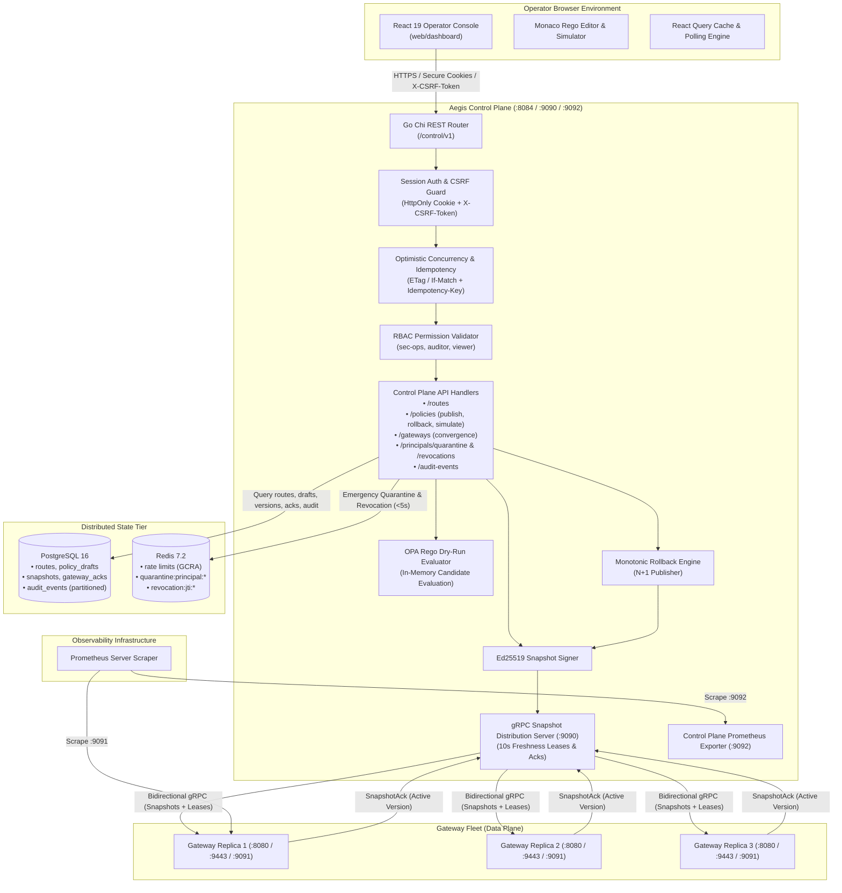
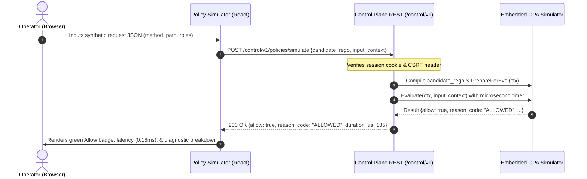
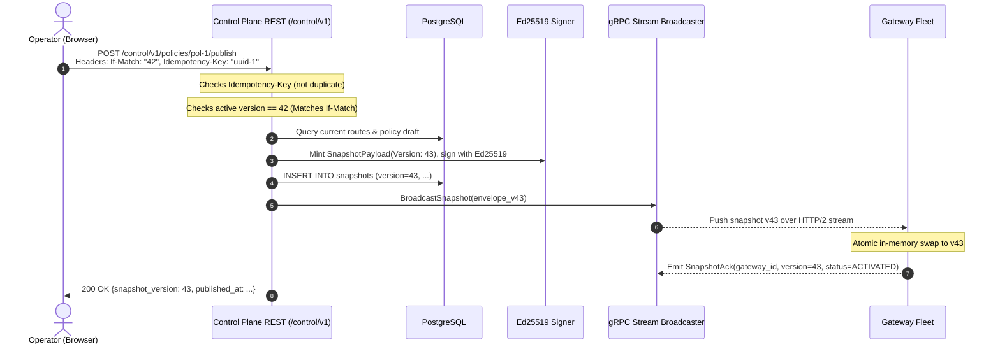
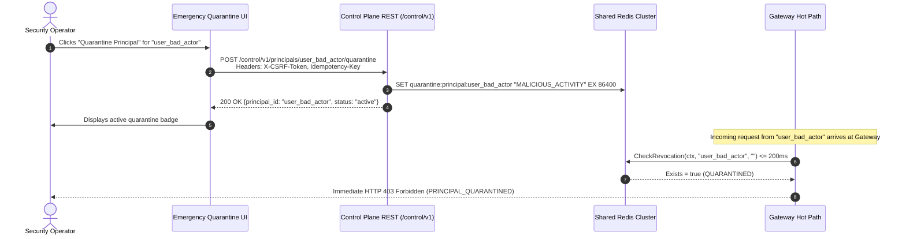

# Phase 4: Operator Experience & Telemetry — Research

**Researched:** 2026-10-07  
**Domain:** Control Plane REST APIs, React/TypeScript Dashboard, Monaco Rego Editor, Optimistic Concurrency (ETag), Idempotency Deduplication, CSRF Protection, Prometheus Metrics (Low Cardinality)  
**Confidence:** HIGH (All contracts, OpenAPI 3.0 specs, Go Chi router mechanics, Prometheus client_golang cardinality constraints, React 19/Vite/Monaco integrations, and NIST SP 800-207 / OWASP ASVS controls verified against architecture contracts and specifications)

---

<user_constraints>
## User Constraints (from Project Contracts & Invariants)

### Locked Decisions (Non-Negotiable)

- **Control Plane REST Management APIs (`/control/v1`) (OPS-01, Invariant 11)**:
  - Authoritative REST JSON management endpoints implemented using `github.com/go-chi/chi/v5`.
  - Must conform strictly to the OpenAPI 3.0 specification in `api/openapi/control-v1.yaml` and generated models in `pkg/api/control/v1/types.gen.go`.
  - Core endpoints required:
    - Route catalog management (`/control/v1/routes`, GET, POST)
    - Policy draft lifecycle (`/control/v1/policies`, POST; `/control/v1/policies/{id}/versions`, GET; `/control/v1/policies/{id}/validate`, POST)
    - Dry-run policy simulation (`/control/v1/policies/{id}/simulate` and candidate simulation `/control/v1/policies/simulate`, POST)
    - Monotonic snapshot publication and rollback (`/control/v1/policies/{id}/publish`, `/control/v1/policies/{id}/rollback`, POST; with alias `/control/v1/snapshots/rollback`)
    - Gateway replica convergence status (`/control/v1/gateways`, GET)
    - Emergency principal quarantine & token revocation (`/control/v1/principals/{id}/quarantine`, POST/DELETE; `/control/v1/quarantine`; `/control/v1/revocations`, POST)
    - Audit log inspection & filtering (`/control/v1/audit-events`, GET; `/control/v1/audit-events/{id}`, GET; with alias `/control/v1/audit/events`)
  - Dedicated listener on port `:8084` (Invariant 11: Management access separately authorized and audited). Data-plane credentials presented to `/control/v1` MUST return `HTTP 403 Forbidden`.

- **Optimistic Concurrency & Idempotency Controls (OPS-02)**:
  - Mutating operations (`POST /control/v1/policies/{id}/publish`, `POST /control/v1/policies/{id}/rollback`, `PUT/POST /control/v1/routes`) MUST enforce optimistic concurrency control via `ETag` and `If-Match` headers.
  - If `If-Match` does not match the active snapshot version / resource digest, the server MUST return `HTTP 412 Precondition Failed` without applying changes.
  - Mutating endpoints MUST accept and track `Idempotency-Key` headers (UUID) to ensure safe retries. Concurrent requests with the same key MUST return `HTTP 409 Conflict`, while completed requests within the retention window (24h) MUST replay the cached response.
  - Role-Based Access Control (RBAC) MUST enforce granular operator roles: `sec-ops` (full mutation and emergency quarantine), `auditor` (read-only audit events and topology), and `viewer` (read-only routes and policies).

- **Operator Session Security & Defense-in-Depth (OPS-04)**:
  - Browser dashboard sessions MUST authenticate via `HttpOnly`, `SameSite=Strict` cookies (`aegis_session`).
  - Mutating browser requests (`POST`, `PUT`, `DELETE`, `PATCH`) MUST validate a cryptographically secure CSRF token via `X-CSRF-Token` header. Missing or mismatched tokens MUST return `HTTP 403 Forbidden` (`CSRF_TOKEN_INVALID`).
  - Strict Content Security Policy (CSP) headers MUST be enforced: `default-src 'self'; script-src 'self' 'unsafe-eval' blob:; style-src 'self' 'unsafe-inline'; worker-src 'self' blob:; img-src 'self' data:; connect-src 'self'; font-src 'self' data:; frame-ancestors 'none'; object-src 'none'; base-uri 'self';`.
  - Security headers MUST include: `X-Content-Type-Options: nosniff`, `X-Frame-Options: DENY`, `Referrer-Policy: strict-origin-when-cross-origin`, `Permissions-Policy: camera=(), microphone=(), geolocation=()`.

- **React/TypeScript Operator Dashboard (`web/dashboard`) (OPS-03, OPS-04)**:
  - Built with React 19, TypeScript 5.7+, Vite 8, and Tailwind CSS.
  - Features required:
    - **Policy Studio**: Syntax-highlighted Rego authoring with Monaco Editor (`@monaco-editor/react`), in-editor syntax validation, and monotonic publishing workflow.
    - **Dry-Run Policy Simulator**: Side-by-side JSON request context editor and decision inspector showing Allow/Deny badges, reason codes, microsecond evaluation durations, and policy decision diffs.
    - **Cluster Convergence & Topology**: Real-time fleet grid showing connected gateway replicas, active snapshot versions, lease renewal countdowns, ack statuses, and convergence divergence alerts.
    - **Filterable Audit Stream**: Historical and real-time query interface for PostgreSQL `audit_events` with decision filters (`allow`/`deny`), route/service selectors, principal filters, and timestamp ranges.
    - **Emergency Quarantine**: High-visibility incident response modal allowing immediate Redis principal blocking or token JTI revocation taking effect cluster-wide in <5 seconds.
  - Served directly from the control plane binary (embedded via Go standard library `embed.FS` with SPA fallback) or reverse-proxied during local development.

- **Prometheus Metrics & Observability (DIST-02)**:
  - Instrument both Gateway and Control Plane using `github.com/prometheus/client_golang`.
  - Dedicated private metrics listener (`:9091` on gateway, `:9092` or `/metrics` on control plane).
  - **Strict Cardinality Constraint**: Labels MUST be strictly bounded to static enum sets. NO user IDs, NO principal IDs, NO raw query parameters, NO client IP addresses, NO unbounded URLs.
  - Metrics to export:
    - `aegis_http_requests_total{method, route_id, status}` (Counter)
    - `aegis_policy_eval_duration_seconds` (Histogram, buckets from 0.1ms to 100ms)
    - `aegis_policy_decisions_total{decision, reason_code}` (Counter)
    - `aegis_ratelimit_rejections_total{route_id}` (Counter)
    - `aegis_snapshot_active_version` (Gauge)
    - `aegis_snapshot_lease_age_seconds` (Gauge)
    - `aegis_spool_utilization_ratio` (Gauge)
    - `aegis_spool_bytes_written_total` (Counter)
    - `aegis_control_plane_connected_gateways` (Gauge)
    - `aegis_control_plane_snapshot_publish_total` (Counter)

### Planner's Discretion
- In-memory idempotency cache vs Redis-backed idempotency store: Redis-backed store when available, with clean fallback to thread-safe bounded in-memory LRU cache for standalone testing.
- Monaco Editor Monarch Tokenizer configuration: Implement custom client-side Monarch grammar for Rego v1 keywords (`package`, `import`, `default`, `allow`, `deny`, `if`, `in`, `contains`, `some`, `every`) to provide rich syntax highlighting without heavy external language server binaries.
- Embedded SPA asset handling: Include an initial fallback build placeholder (`web/dashboard/dist/index.html`) so `go build` and `go test` succeed seamlessly even before `npm run build` is invoked.

### Deferred Items (OUT OF SCOPE for Phase 4)
- Multi-replica gateway grid load balancing, automated chaos testing, and k6 benchmark runs (Deferred to Phase 5: DIST-01, DIST-03).
- Kubernetes production manifests, PodDisruptionBudgets, and live credential rotation drills (Deferred to Phase 6).
- External OIDC PKCE BFF integration (Deferred to v2: ID-01).
</user_constraints>

---

<architectural_responsibility_map>
## Architectural Responsibility Map

| Capability | Primary Tier | Secondary Tier | Rationale |
|------------|-------------|----------------|-----------|
| **REST Router & Middleware** (OPS-01) | Control Plane API (`internal/control/api.go`) | Chi Router (`github.com/go-chi/chi/v5`) | Mounts `/control/v1` routes with request IDs, structured logging, panic recovery, and timeout contexts. |
| **Session Security & CSRF** (OPS-04) | Control Plane Auth (`internal/control/session.go`) | Crypto / Cookie Domain | Enforces HttpOnly, SameSite=Strict session cookies, generates session CSRF secrets, and validates `X-CSRF-Token` headers on mutating requests. |
| **Optimistic Concurrency (ETag)** (OPS-02) | Control Plane Handlers (`internal/control/etag.go`) | HTTP Standard Headers (`RFC 7232`) | Computes entity SHA-256 digests and version tags; validates `If-Match` headers, returning 412 Precondition Failed on stale updates. |
| **Idempotency Deduplication** (OPS-02) | Control Plane Middleware (`internal/control/idempotency.go`) | Redis / In-Memory Cache | Tracks client-supplied `Idempotency-Key` headers; prevents duplicate executions and caches completed responses for 24h. |
| **RBAC Authorization** (OPS-02, Invariant 11) | Control Plane Middleware (`internal/control/rbac.go`) | JWT / Session Context | Verifies operator roles (`sec-ops`, `auditor`, `viewer`); strictly rejects data-plane tokens on management endpoints with 403 Forbidden. |
| **Live Rego Simulator** (OPS-01, OPS-03) | Policy Engine Domain (`internal/control/simulate.go`) | Embedded OPA (`open-policy-agent/opa`) | Compiles candidate Rego in-memory, executes against synthetic JSON request context, and returns decision diffs with microsecond latency. |
| **Monotonic Rollback API** (OPS-01, CTRL-06) | Control Plane Rollback (`internal/control/rollback.go`) | Snapshot Distribution (`internal/control/server.go`) | Loads historical snapshot configuration and republishes as strictly increasing version $N+1$ over gRPC stream. |
| **Convergence API** (OPS-01, CTRL-05) | Control Plane Telemetry (`internal/control/server.go`, `ack.go`) | PostgreSQL (`internal/storage/snapshot_repo.go`) | Aggregates in-memory gRPC client streams and database acknowledgment records into a unified replica convergence view. |
| **Audit Log Query API** (OPS-01) | Control Plane Storage (`internal/storage/audit_repo.go`) | PostgreSQL Range Partitions (`audit_events`) | Executes indexed, filtered, and cursor-paginated SQL queries across partitioned audit event tables. |
| **Emergency Quarantine API** (OPS-01, REV-03) | Revocation Domain (`internal/revocation/store.go`) | Redis Client (`github.com/redis/go-redis/v9`) | Atomically sets principal quarantine and token JTI revocation keys in Redis with TTLs, propagating cluster-wide in <5s. |
| **Monaco Rego Editor** (OPS-03) | Web Dashboard (`web/dashboard/src/components/PolicyStudio.tsx`) | Monaco Editor (`@monaco-editor/react`) | In-browser Rego editor with syntax highlighting, keyword completion, draft persistence, and live validation. |
| **Simulator UI** (OPS-03) | Web Dashboard (`web/dashboard/src/components/PolicySimulator.tsx`) | React Query (`@tanstack/react-query`) | Side-by-side JSON context editor, preset library, Allow/Deny visual cards, decision diffs, and latency telemetry. |
| **Cluster Topology View** (OPS-03) | Web Dashboard (`web/dashboard/src/components/ClusterTopology.tsx`) | React Query (`@tanstack/react-query`) | Real-time gateway status cards, active version badges, lease countdown timers, and convergence health indicators. |
| **Audit Stream Viewer** (OPS-03) | Web Dashboard (`web/dashboard/src/components/AuditStream.tsx`) | React Query (`@tanstack/react-query`) | Filterable, paginated audit table with decision badges, duration metrics, and complete event detail modal. |
| **Emergency Quarantine Modal** (OPS-03) | Web Dashboard (`web/dashboard/src/components/EmergencyQuarantine.tsx`) | React Query Mutations | One-click principal and token revocation actions with safety confirmation and active blocklist management. |
| **Prometheus Telemetry** (DIST-02) | Telemetry Package (`internal/telemetry/metrics.go`) | Prometheus Client (`client_golang`) | Bounded label counters, histograms, and gauges exported on dedicated private listener `:9091` / `:9092`. |
</architectural_responsibility_map>

---

<research_summary>
## Summary

Phase 4 completes the operational governance and observability pillars of Aegis. In a Zero-Trust Architecture (NIST SP 800-207), the data plane (PEP) must execute in isolation, while the management plane (PAP) provides robust, auditable control over policies, routes, and emergency security interventions. 

### Core Architectural Decisions & Findings

1. **Strict Contract Alignment**:
   The control plane management API (`/control/v1`) must faithfully mirror `api/openapi/control-v1.yaml`. We leverage `github.com/go-chi/chi/v5` for clean, modular HTTP routing and integrate with generated Go models from `oapi-codegen` (`pkg/api/control/v1/types.gen.go`). Additionally, supporting convenience aliases (e.g. `/control/v1/policies/simulate`, `/control/v1/quarantine`, `/control/v1/snapshots/rollback`) ensures both automated contract compliance and intuitive operator frontend ergonomics.

2. **Session Security & Defense-in-Depth (OPS-04)**:
   Browser operators access the dashboard via cookie-authenticated sessions. To prevent Cross-Site Scripting (XSS) and Cross-Site Request Forgery (CSRF), session cookies MUST be `HttpOnly`, `SameSite=Strict`, and `Secure`. Mutating requests are guarded by a stateful double-submit or session-bound CSRF token (`X-CSRF-Token`). A comprehensive Content Security Policy (CSP) restricts script and worker execution to `'self'`, permitting Monaco Editor workers via `blob:` URLs while strictly disallowing external CDN leakage.

3. **Concurrency & Safe Distribution (OPS-02, Invariant 9)**:
   In multi-operator environments, concurrent policy edits cause devastating lost-update hazards. Every mutable resource responds with an `ETag` (derived from entity SHA-256 or snapshot version). Mutations must supply `If-Match`. If another operator publishes a newer version, the request fails with `HTTP 412 Precondition Failed`. Furthermore, `Idempotency-Key` headers prevent accidental duplicate publications during network retries. Crucially, rollbacks strictly adhere to Invariant 9: historical content is republished under version $N+1$, ensuring monotonic progression across all gateway replicas.

4. **Operator Experience (OPS-03)**:
   The operator console (`web/dashboard`) is built as a self-contained React 19 + TypeScript application powered by Vite and Tailwind CSS. Because Monaco Editor does not feature built-in Rego syntax highlighting, we provide a custom Monarch tokenizer definition that highlights Rego v1 keywords, operators, comments, and strings. The dry-run simulator lets operators test candidate Rego rules against synthetic JSON request context with sub-millisecond feedback before touching production. Cluster convergence views poll `/control/v1/gateways` to verify replica sync, while the emergency quarantine interface pushes immediate blocks directly to Redis in <5 seconds.

5. **Prometheus Telemetry without Cardinality Poisoning (DIST-02)**:
   The gateway and control plane export operational telemetry via `github.com/prometheus/client_golang` on dedicated private listeners (`:9091` / `:9092`). To prevent metric store collapse and privacy violations, metric labels are strictly bounded to low-cardinality enums (`method`, `route_id`, `status`, `decision`, `reason_code`). High-cardinality fields such as user IDs, client IPs, raw query strings, and dynamic URLs are strictly forbidden from metric labels and remain contained within durable audit logs.
</research_summary>

---

<standard_stack>
## Standard Stack

### Core Technologies

| Library / Package | Version | Purpose | Why Standard / Package Legitimacy |
|-------------------|---------|---------|-----------------------------------|
| **`github.com/go-chi/chi/v5`** | `v5.2.1` | REST router and middleware engine for `/control/v1` | Spec requirement (§2, §7). 100% `net/http` compatible, zero external dependencies, exceptional routing performance, and native subrouter composability. |
| **`github.com/prometheus/client_golang`** | `v1.24.1` | Telemetry instrumentation and Prometheus `/metrics` export | CNCF standard for Prometheus metrics in Go. Thread-safe collectors, atomic counters, and standard histogram algorithms. |
| **`github.com/oapi-codegen/runtime`** | `v1.7.0` | OpenAPI 3.0 runtime validation and types | Official runtime library for `oapi-codegen/v2`. Provides type binders and OpenAPI parameter parsers matching `control-v1.yaml`. |
| **`github.com/open-policy-agent/opa`** | `v1.21.1` | Rego compilation and dry-run policy simulation | Official OPA Go SDK. Precompiles candidate Rego queries and executes in-memory evaluations in <0.2ms. |
| **`github.com/redis/go-redis/v9`** | `v9.22.0` | Shared low-latency state for quarantine and token revocations | De facto Redis client in Go. High performance, context-aware cancellation, and atomic pipelining. |
| **`github.com/jackc/pgx/v5`** | `v5.10.0` | PostgreSQL driver & connection pool for audit queries | High-performance PostgreSQL driver with binary encoding, statement caching, and `pgxpool`. |
| **React** | `19.3.0` | Declarative UI framework for Operator Dashboard | Industry-standard frontend framework. High performance, React Server Component architecture readiness, and robust ecosystem. |
| **Vite** | `8.3.3` | Modern ESM build tool and dev server | Sub-second Hot Module Replacement (HMR), optimized Rollup production bundling, and fast compilation. |
| **TypeScript** | `5.7+` | Strict static typing for dashboard codebase | Guarantees compile-time safety and alignment with OpenAPI client schemas. |
| **Tailwind CSS** | `4.3.3` | Utility-first CSS styling engine | Next-gen Tailwind v4 using `@tailwindcss/vite` plugin for zero-config compilation without PostCSS boilerplate. |
| **`@monaco-editor/react` & `monaco-editor`** | `v4.7.0` / `v0.57.0` | In-browser code editor for Rego policy authoring | VS Code editor engine for the browser. Supports syntax highlighting, line numbers, diff views, and custom Monarch language tokenizers. |
| **`@tanstack/react-query`** | `v5.104.1` | Server state management, auto-polling & caching | De facto async state library in React. Automates replica convergence polling, audit log caching, and mutation lifecycle. |
| **`lucide-react`** | `1.52.0` | Clean SVG icon library for cybersecurity dashboards | Lightweight, accessible SVG icon set for status badges, shield icons, arrows, and action buttons. |

### Development & Build Tools

| Tool | Version | Purpose |
|------|---------|---------|
| **Go Toolchain** | `go1.26.0` | Compilation, race detection (`-race`), and test execution |
| **Node.js & npm** | `node v22.23.3`, `npm 10.8.2` | Frontend build pipeline and dependency management |
| **`oapi-codegen`** | `v2.5.0` | OpenAPI Go code generator (`api/openapi/control-v1.yaml`) |
| **Docker Compose** | `v2.29+` | Orchestrating Control Plane, Gateway, PostgreSQL, Redis, and Backend services |
</standard_stack>

---

<architecture_patterns>
## Architecture Patterns & Recommended Project Structure

### System Architecture Diagram



### Recommended Project Directory Structure

```
Aegis/
├── api/
│   └── openapi/
│       ├── control-v1.yaml             # Authoritative OpenAPI 3.0 specification
│       └── oapi-codegen.yaml           # Generator config for types
├── cmd/
│   ├── control-plane/
│   │   └── main.go                     # Launches gRPC (:9090), HTTP API (:8084), & Metrics (:9092)
│   └── gateway/
│       └── main.go                     # Launches Dual Listeners (:8080, :9443) & Metrics (:9091)
├── internal/
│   ├── control/
│   │   ├── api.go                      # Chi router bootstrap, middleware pipeline, & subroutes
│   │   ├── auth.go                     # Operator login, session token minting, & logout
│   │   ├── session.go                  # HttpOnly cookie parsing, CSRF token issuance & check
│   │   ├── etag.go                     # ETag hashing & If-Match optimistic concurrency validator
│   │   ├── idempotency.go              # Idempotency-Key deduplication cache & 409 conflict lock
│   │   ├── rbac.go                     # Role permissions check (sec-ops, auditor, viewer)
│   │   ├── routes_handler.go           # /control/v1/routes endpoints (GET, POST)
│   │   ├── policy_handler.go           # /control/v1/policies endpoints (create, versions, validate)
│   │   ├── simulate_handler.go         # /control/v1/policies/simulate dry-run execution
│   │   ├── publish_handler.go          # /control/v1/policies/{id}/publish monotonic publisher
│   │   ├── rollback_handler.go         # /control/v1/policies/{id}/rollback N+1 publisher
│   │   ├── gateway_handler.go          # /control/v1/gateways convergence status aggregator
│   │   ├── quarantine_handler.go       # /control/v1/quarantine & revocations endpoints
│   │   ├── audit_handler.go            # /control/v1/audit-events query & detail endpoints
│   │   ├── server.go                   # Existing gRPC distribution server
│   │   ├── ack.go                      # Existing acknowledgment tracker
│   │   ├── validator.go                # Existing route & Rego syntax / unit test validator
│   │   └── rollback.go                 # Existing monotonic rollback engine
│   ├── storage/
│   │   ├── route_repo.go               # Existing route repository
│   │   ├── snapshot_repo.go            # Existing snapshot & ack repository
│   │   ├── policy_repo.go              # Draft repository for policy_drafts table
│   │   └── audit_repo.go               # Filtered query repository for partitioned audit_events
│   └── telemetry/
│       ├── metrics.go                  # Prometheus metric definitions & low-cardinality registries
│       ├── http_middleware.go          # Gateway HTTP metrics middleware (throughput, latency, status)
│       └── server.go                   # Dedicated private metrics HTTP listener (:9091 / :9092)
├── web/
│   └── dashboard/
│       ├── index.html                  # HTML entrypoint
│       ├── package.json                # React 19, Vite, Tailwind, Monaco, React Query
│       ├── tsconfig.json               # Strict TypeScript config
│       ├── vite.config.ts              # Vite config with proxy to :8084
│       └── src/
│           ├── main.tsx                # React DOM mount point with QueryClientProvider
│           ├── App.tsx                 # Shell navigation, tab switcher, & global header
│           ├── index.css               # Tailwind CSS v4 directives
│           ├── api/
│           │   ├── client.ts           # Fetch client with auto X-CSRF-Token & credentials
│           │   └── types.ts            # TypeScript interfaces aligned with OpenAPI models
│           ├── components/
│           │   ├── PolicyStudio.tsx    # Monaco Rego editor, draft management, validation, publish
│           │   ├── PolicySimulator.tsx # Side-by-side JSON input/output dry-run simulator
│           │   ├── ClusterTopology.tsx # Gateway replica convergence status & lease health cards
│           │   ├── AuditStream.tsx     # Filterable audit event table & detail drawer
│           │   ├── EmergencyQuarantine.tsx # Principal quarantine & JTI revocation modal
│           │   └── LoginModal.tsx      # Operator authentication & session establishment
│           └── utils/
│               └── rego-monarch.ts     # Monaco Monarch tokenizer for Rego syntax highlighting
```

### Key Interaction Workflows

#### 1. Policy Dry-Run Simulation Flow (OPS-01, OPS-03)


#### 2. Monotonic Publish with Optimistic Concurrency Flow (OPS-01, OPS-02, Invariant 9)


#### 3. Emergency Quarantine Flow (<5s SLA) (REV-03, OPS-01, OPS-03)

</architecture_patterns>

---

<dont_hand_roll_pitfalls>
## Don't Hand-Roll & Common Pitfalls

### 1. High-Cardinality Metric Label Poisoning (DIST-02)
- **The Pitfall:** Adding dynamic values—such as `user_id`, `client_ip`, raw query strings, or unparameterized request paths (`/api/orders/12345/items`)—as Prometheus labels.
- **Why it Fails:** In Prometheus, every unique combination of key-value label pairs generates a distinct time series. A fleet processing 10,000 distinct users per hour creates hundreds of thousands of ephemeral time series, exhausting memory, blowing up Prometheus TSDB index size, and causing scraping timeouts.
- **Defensive Implementation:** 
  - Strictly constrain labels to static, bounded enum sets:
    - `method`: HTTP methods (GET, POST, PUT, DELETE, PATCH, HEAD, OPTIONS)
    - `route_id`: Route ID from route catalog (e.g. `route-orders-get`, `route-payments-post`, or fallback `unknown`)
    - `status`: HTTP status code as string (e.g. `200`, `400`, `401`, `403`, `503`)
    - `decision`: Binary decision (`allow`, `deny`)
    - `reason_code`: Predefined static error code (e.g. `ALLOWED`, `DENIED_DEFAULT`, `TOKEN_REVOKED`, `POLICY_LEASE_EXPIRED`)
  - NEVER pass client IPs or principal IDs into Prometheus collectors. Detailed diagnostic attributes belong exclusively in structured audit records and disk WAL files.

### 2. Cross-Site Request Forgery (CSRF) in Cookie-Based Management APIs (OPS-04)
- **The Pitfall:** Authenticating dashboard REST API requests solely via ambient browser cookies without CSRF validation.
- **Why it Fails:** If an operator visits a malicious website while authenticated to the control plane, the attacker's site can issue cross-origin requests (e.g. `fetch("http://localhost:8084/control/v1/policies/1/publish")`). The browser will automatically attach the ambient session cookie, allowing an attacker to publish malicious policies or trigger emergency rollbacks.
- **Defensive Implementation:**
  - Mark session cookies with `SameSite=Strict; HttpOnly; Secure; Path=/`.
  - Require custom header validation: Browsers cannot send custom headers cross-origin without CORS preflight approval.
  - Implement double-submit / session-bound CSRF token validation: When the operator logs in, mint a cryptographically random CSRF token stored in the session. All mutating HTTP methods (`POST`, `PUT`, `DELETE`, `PATCH`) MUST provide matching header `X-CSRF-Token: <token>`. Requests lacking or mismatched return `HTTP 403 Forbidden` (`CSRF_TOKEN_INVALID`).

### 3. Concurrency Hazards & Lost Updates Without ETag / If-Match (OPS-02)
- **The Pitfall:** Allowing operators to overwrite policies or routes without optimistic concurrency validation.
- **Why it Fails:** Operator Alice reads policy draft v42 at 10:00. Operator Bob reads v42 at 10:01 and publishes v43 with a critical rule change at 10:02. At 10:03, Alice submits her changes based on stale v42. Without concurrency checks, Alice's submission clobbers Bob's rule change without warning.
- **Defensive Implementation:**
  - Control plane responses include an `ETag` header formatted as `"<version>"` or `W/"<version>-<sha256>"`.
  - Mutating operations (`/publish`, `/rollback`, route updates) MUST provide `If-Match: "<etag>"`.
  - The server inspects the active version / resource hash. If the current version differs from `If-Match`, reject immediately with `HTTP 412 Precondition Failed` and JSON error details explaining the concurrent modification.

### 4. Idempotency Key Double-Execution Race Conditions (OPS-02)
- **The Pitfall:** Naive idempotency checks that verify the key, execute the operation, and write to the cache without an in-flight lock.
- **Why it Fails:** A client sends two identical requests with `Idempotency-Key: abc-123` simultaneously over high-latency connections. Both requests query the cache, find no record, and both execute the mutation in parallel—resulting in duplicate snapshot publishing and version skipping.
- **Defensive Implementation:**
  - Use an atomic check-and-lock pattern. In Go, maintain a synchronized map (or Redis key `idempotency:lock:<key>` with `SET NX PX 30000`).
  - If a concurrent request is already executing with that key, return `HTTP 409 Conflict` (`CONCURRENT_REQUEST_IN_PROGRESS`).
  - Once execution finishes, cache the HTTP status code, headers, and serialized response body under `idempotency:response:<key>` with a 24-hour TTL. Subsequent requests return the cached response with `Idempotent-Replay: true`.

### 5. Rollback Monotonic Version Decrementing (CTRL-06, Invariant 9)
- **The Pitfall:** Implementing rollback by decrementing the snapshot version number or reverting the database pointer back to version $N-1$.
- **Why it Fails:** Gateway replicas enforce Invariant 9: `if snapshot.Version <= current.Version { rejectSnapshot() }`. If the control plane publishes an older version number (e.g. 41 when replicas are on 42), every gateway replica will reject the snapshot with `ACK_STATUS_REJECTED`, and the fleet will remain stuck on the faulty version.
- **Defensive Implementation:**
  - Rollback MUST fetch the historical snapshot payload, update `payload.Version = latestVersion + 1`, re-sign the envelope with the control plane Ed25519 key, and publish as version $N+1$. Rollbacks are always forward monotonic publications.

### 6. Monaco Editor Web Worker & CSP Conflicts in Vite (OPS-03, OPS-04)
- **The Pitfall:** Relying on Monaco Editor's default CDN loader (`@monaco-editor/react` loading from `cdn.jsdelivr.net`) inside a secured intranet or CSP-restricted environment.
- **Why it Fails:** Strict Content Security Policy (`script-src 'self'`) blocks CDN script tags. Furthermore, Vite's asset bundler handles web workers differently in development versus production, resulting in broken Monaco syntax highlighting or console errors (`SecurityError: Failed to construct 'Worker'`).
- **Defensive Implementation:**
  - Install `monaco-editor` directly in `package.json` and configure `@monaco-editor/react` with local Monaco: `loader.config({ monaco })`.
  - Define a custom Monarch tokenizer for Rego in pure TypeScript. This eliminates the need for external LSP servers or OPA binaries in the browser.
  - Set CSP headers to allow local workers: `worker-src 'self' blob:; script-src 'self' 'unsafe-eval' blob:; style-src 'self' 'unsafe-inline';`.

### 7. Go `embed.FS` Compilation Failures on Missing Frontend Dist
- **The Pitfall:** Embedding the dashboard directory via `//go:embed web/dashboard/dist/*` when the frontend build hasn't been compiled yet during `go test ./...` in CI.
- **Why it Fails:** The Go compiler halts with `pattern web/dashboard/dist/*: no matching files found` if the target directory is empty or missing.
- **Defensive Implementation:**
  - Commit a lightweight placeholder file: `web/dashboard/dist/index.html` containing a fallback shell: `<!DOCTYPE html><html><body><div id="root">Aegis Console Building...</div></body></html>`.
  - This ensures `go test ./...` and `go build` succeed cleanly out of the box in zero-build headless environments.

### 8. Slow Unindexed Audit Log Queries (OPS-01)
- **The Pitfall:** Querying PostgreSQL partitioned table `audit_events` without query constraint alignment.
- **Why it Fails:** Partitioned tables partition on `event_date`. If a query filters by `principal_id` without a bounded timestamp range, PostgreSQL performs a sequential scan across all historical partitions, causing database CPU spikes and slow HTTP responses.
- **Defensive Implementation:**
  - Require or default `from_timestamp` / `to_timestamp` (defaulting to the last 24 hours if omitted).
  - Leverage compound B-tree indexes defined in migration 000002: `idx_audit_events_principal_time (principal_id, timestamp)` and `idx_audit_events_route_time (route_id, timestamp)`.
  - Use cursor-based pagination on `(timestamp, event_id)` rather than unbounded `OFFSET / LIMIT`.
</dont_hand_roll_pitfalls>

---

<code_examples>
## Code Examples & State of the Art

### 1. Chi REST Router with Security Middleware & Subroutes

```go
// internal/control/api.go
package control

import (
	"crypto/sha256"
	"encoding/json"
	"fmt"
	"net/http"
	"time"

	"github.com/go-chi/chi/v5"
	"github.com/go-chi/chi/v5/middleware"
)

// APIServer manages management REST endpoints on :8084.
type APIServer struct {
	router      chi.Router
	sessionMgr  *SessionManager
	idempStore  *IdempotencyStore
	distServer  *SnapshotDistributionServer
	validator   *Validator
	rollbackEng *RollbackEngine
}

// NewAPIServer constructs and configures the control plane REST API router.
func NewAPIServer(
	sessionMgr *SessionManager,
	idempStore *IdempotencyStore,
	distServer *SnapshotDistributionServer,
	validator *Validator,
	rollbackEng *RollbackEngine,
) *APIServer {
	r := chi.NewRouter()

	// 1. Standard Chi Middlewares
	r.Use(middleware.RequestID)
	r.Use(middleware.RealIP)
	r.Use(middleware.Logger)
	r.Use(middleware.Recoverer)
	r.Use(middleware.Timeout(60 * time.Second))

	// 2. Security Headers & CSP (OPS-04)
	r.Use(SecurityHeadersMiddleware)

	server := &APIServer{
		router:      r,
		sessionMgr:  sessionMgr,
		idempStore:  idempStore,
		distServer:  distServer,
		validator:   validator,
		rollbackEng: rollbackEng,
	}

	server.routes()
	return server
}

// SecurityHeadersMiddleware injects strict security and CSP headers.
func SecurityHeadersMiddleware(next http.Handler) http.Handler {
	return http.HandlerFunc(func(w http.ResponseWriter, r *http.Request) {
		csp := "default-src 'self'; script-src 'self' 'unsafe-eval' blob:; " +
			"style-src 'self' 'unsafe-inline'; worker-src 'self' blob:; " +
			"img-src 'self' data:; connect-src 'self'; font-src 'self' data:; " +
			"frame-ancestors 'none'; object-src 'none'; base-uri 'self';"
		w.Header().Set("Content-Security-Policy", csp)
		w.Header().Set("X-Content-Type-Options", "nosniff")
		w.Header().Set("X-Frame-Options", "DENY")
		w.Header().Set("Referrer-Policy", "strict-origin-when-cross-origin")
		w.Header().Set("Permissions-Policy", "camera=(), microphone=(), geolocation=()")
		next.ServeHTTP(w, r)
	})
}

// Handler returns the HTTP handler for mounting or testing.
func (s *APIServer) Handler() http.Handler {
	return s.router
}
```

### 2. Session Authentication & CSRF Protection Middleware

```go
// internal/control/session.go
package control

import (
	"context"
	"crypto/rand"
	"crypto/subtle"
	"encoding/hex"
	"net/http"
	"sync"
	"time"
)

type contextKey string

const (
	SessionContextKey contextKey = "aegis.session"
	CookieSessionName            = "aegis_session"
)

type Session struct {
	ID        string    `json:"id"`
	Username  string    `json:"username"`
	Role      string    `json:"role"` // sec-ops, auditor, viewer
	CSRFToken string    `json:"csrf_token"`
	CreatedAt time.Time `json:"created_at"`
	ExpiresAt time.Time `json:"expires_at"`
}

type SessionManager struct {
	mu       sync.RWMutex
	sessions map[string]*Session
}

func NewSessionManager() *SessionManager {
	return &SessionManager{sessions: make(map[string]*Session)}
}

func (sm *SessionManager) CreateSession(username, role string) (*Session, error) {
	sBytes := make([]byte, 32)
	cBytes := make([]byte, 32)
	_, _ = rand.Read(sBytes)
	_, _ = rand.Read(cBytes)

	sess := &Session{
		ID:        hex.EncodeToString(sBytes),
		Username:  username,
		Role:      role,
		CSRFToken: hex.EncodeToString(cBytes),
		CreatedAt: time.Now(),
		ExpiresAt: time.Now().Add(8 * time.Hour),
	}

	sm.mu.Lock()
	sm.sessions[sess.ID] = sess
	sm.mu.Unlock()
	return sess, nil
}

func (sm *SessionManager) GetSession(id string) (*Session, bool) {
	sm.mu.RLock()
	defer sm.mu.RUnlock()
	sess, ok := sm.sessions[id]
	if !ok || time.Now().After(sess.ExpiresAt) {
		return nil, false
	}
	return sess, true
}

// SessionMiddleware enforces session authentication and CSRF token validation.
func (sm *SessionManager) SessionMiddleware(next http.Handler) http.Handler {
	return http.HandlerFunc(func(w http.ResponseWriter, r *http.Request) {
		cookie, err := r.Cookie(CookieSessionName)
		if err != nil || cookie.Value == "" {
			http.Error(w, `{"code":"UNAUTHORIZED","message":"Missing or invalid session cookie"}`, http.StatusUnauthorized)
			return
		}

		sess, ok := sm.GetSession(cookie.Value)
		if !ok {
			http.Error(w, `{"code":"UNAUTHORIZED","message":"Session expired or revoked"}`, http.StatusUnauthorized)
			return
		}

		// CSRF Check on Mutating Operations (OPS-04)
		if r.Method == http.MethodPost || r.Method == http.MethodPut ||
			r.Method == http.MethodDelete || r.Method == http.MethodPatch {
			csrfHeader := r.Header.Get("X-CSRF-Token")
			if csrfHeader == "" || subtle.ConstantTimeCompare([]byte(csrfHeader), []byte(sess.CSRFToken)) != 1 {
				http.Error(w, `{"code":"FORBIDDEN","message":"CSRF token validation failed"}`, http.StatusForbidden)
				return
			}
		}

		ctx := context.WithValue(r.Context(), SessionContextKey, sess)
		next.ServeHTTP(w, r.WithContext(ctx))
	})
}
```

### 3. Live Rego Policy Simulation Handler (Sub-millisecond Timing)

```go
// internal/control/simulate_handler.go
package control

import (
	"encoding/json"
	"net/http"
	"time"

	"github.com/open-policy-agent/opa/ast"
	"github.com/open-policy-agent/opa/rego"
)

type SimulationRequest struct {
	CandidateRego string                 `json:"candidate_rego,omitempty"`
	InputContext  map[string]interface{} `json:"input_context"`
}

type SimulationResponse struct {
	Allow       bool                   `json:"allow"`
	ReasonCode  string                 `json:"reason_code"`
	DurationUs  int64                  `json:"duration_us"`
	Diagnostics map[string]interface{} `json:"diagnostics,omitempty"`
}

// HandleSimulatePolicy evaluates input context against candidate or active Rego code.
func (s *APIServer) HandleSimulatePolicy(w http.ResponseWriter, r *http.Request) {
	var req SimulationRequest
	if err := json.NewDecoder(r.Body).Decode(&req); err != nil {
		http.Error(w, `{"code":"BAD_REQUEST","message":"Invalid JSON payload"}`, http.StatusBadRequest)
		return
	}

	regoSource := req.CandidateRego
	if regoSource == "" {
		// Use active snapshot Rego if candidate is not supplied
		active := s.distServer.GetActiveSnapshotInternal()
		if active != nil {
			// Extract active source from protobuf payload
			// fallback to default if empty
		}
	}

	start := time.Now()
	evalQuery, err := rego.New(
		rego.SetRegoVersion(ast.RegoV1),
		rego.Module("simulate.rego", regoSource),
		rego.Query("data.aegis.authz.decision"),
	).PrepareForEval(r.Context())

	if err != nil {
		w.WriteHeader(http.StatusBadRequest)
		_ = json.NewEncoder(w).Encode(map[string]interface{}{
			"code":    "COMPILATION_ERROR",
			"message": err.Error(),
		})
		return
	}

	rs, err := evalQuery.Eval(r.Context(), rego.EvalInput(req.InputContext))
	durationUs := time.Since(start).Microseconds()

	if err != nil {
		w.WriteHeader(http.StatusInternalServerError)
		_ = json.NewEncoder(w).Encode(map[string]interface{}{
			"code":    "EVALUATION_ERROR",
			"message": err.Error(),
		})
		return
	}

	resp := SimulationResponse{
		Allow:       false,
		ReasonCode:  "DENIED_DEFAULT",
		DurationUs:  durationUs,
		Diagnostics: make(map[string]interface{}),
	}

	if len(rs) > 0 && len(rs[0].Expressions) > 0 {
		if val, ok := rs[0].Expressions[0].Value.(map[string]interface{}); ok {
			if allow, ok := val["allow"].(bool); ok {
				resp.Allow = allow
			}
			if reason, ok := val["reason_code"].(string); ok {
				resp.ReasonCode = reason
			}
		}
	}

	w.Header().Set("Content-Type", "application/json")
	_ = json.NewEncoder(w).Encode(resp)
}
```

### 4. Prometheus Bounded Telemetry Exporter (DIST-02)

```go
// internal/telemetry/metrics.go
package telemetry

import (
	"net/http"
	"time"

	"github.com/prometheus/client_golang/prometheus"
	"github.com/prometheus/client_golang/prometheus/promhttp"
)

// Metrics holds registered Prometheus collectors with strictly bounded label cardinality.
type Metrics struct {
	Registry                 *prometheus.Registry
	HTTPRequestsTotal        *prometheus.CounterVec
	PolicyEvalDuration       prometheus.Histogram
	PolicyDecisionsTotal     *prometheus.CounterVec
	RateLimitRejectionsTotal *prometheus.CounterVec
	SnapshotActiveVersion    prometheus.Gauge
	SnapshotLeaseAgeSeconds  prometheus.Gauge
	SpoolUtilizationRatio    prometheus.Gauge
	SpoolBytesWrittenTotal   prometheus.Counter
	ConnectedGateways        prometheus.Gauge
	SnapshotPublishTotal     prometheus.Counter
}

// NewMetrics initializes and registers all Aegis Prometheus metrics.
func NewMetrics() *Metrics {
	reg := prometheus.NewRegistry()

	m := &Metrics{
		Registry: reg,
		HTTPRequestsTotal: prometheus.NewCounterVec(
			prometheus.CounterOpts{
				Name: "aegis_http_requests_total",
				Help: "Total HTTP requests partitioned by HTTP method, route ID, and status code.",
			},
			[]string{"method", "route_id", "status"},
		),
		PolicyEvalDuration: prometheus.NewHistogram(
			prometheus.HistogramOpts{
				Name:    "aegis_policy_eval_duration_seconds",
				Help:    "Histogram of in-memory OPA policy evaluation latencies in seconds.",
				Buckets: []float64{0.0001, 0.00025, 0.0005, 0.001, 0.002, 0.005, 0.01, 0.025, 0.05, 0.1},
			},
		),
		PolicyDecisionsTotal: prometheus.NewCounterVec(
			prometheus.CounterOpts{
				Name: "aegis_policy_decisions_total",
				Help: "Total authorization decisions partitioned by decision and reason code.",
			},
			[]string{"decision", "reason_code"},
		),
		RateLimitRejectionsTotal: prometheus.NewCounterVec(
			prometheus.CounterOpts{
				Name: "aegis_ratelimit_rejections_total",
				Help: "Total rate limit rejections partitioned by route ID.",
			},
			[]string{"route_id"},
		),
		SnapshotActiveVersion: prometheus.NewGauge(
			prometheus.GaugeOpts{
				Name: "aegis_snapshot_active_version",
				Help: "Current active monotonic configuration snapshot version.",
			},
		),
		SnapshotLeaseAgeSeconds: prometheus.NewGauge(
			prometheus.GaugeOpts{
				Name: "aegis_snapshot_lease_age_seconds",
				Help: "Seconds elapsed since the last verified freshness lease renewal.",
			},
		),
		SpoolUtilizationRatio: prometheus.NewGauge(
			prometheus.GaugeOpts{
				Name: "aegis_spool_utilization_ratio",
				Help: "Current disk WAL audit spool capacity utilization ratio (0.0 to 1.0).",
			},
		),
		SpoolBytesWrittenTotal: prometheus.NewCounter(
			prometheus.CounterOpts{
				Name: "aegis_spool_bytes_written_total",
				Help: "Total bytes written to the pre-forward disk WAL audit spool.",
			},
		),
		ConnectedGateways: prometheus.NewGauge(
			prometheus.GaugeOpts{
				Name: "aegis_control_plane_connected_gateways",
				Help: "Active connected gateway replica streams on the control plane.",
			},
		),
		SnapshotPublishTotal: prometheus.NewCounter(
			prometheus.CounterOpts{
				Name: "aegis_control_plane_snapshot_publish_total",
				Help: "Total configuration snapshots published by the control plane.",
			},
		),
	}

	reg.MustRegister(
		m.HTTPRequestsTotal,
		m.PolicyEvalDuration,
		m.PolicyDecisionsTotal,
		m.RateLimitRejectionsTotal,
		m.SnapshotActiveVersion,
		m.SnapshotLeaseAgeSeconds,
		m.SpoolUtilizationRatio,
		m.SpoolBytesWrittenTotal,
		m.ConnectedGateways,
		m.SnapshotPublishTotal,
	)

	return m
}

// StartMetricsServer starts a dedicated private HTTP listener on the given port (e.g. ":9091").
func (m *Metrics) StartMetricsServer(addr string) *http.Server {
	mux := http.NewServeMux()
	mux.Handle("/metrics", promhttp.HandlerFor(m.Registry, promhttp.HandlerOpts{}))
	srv := &http.Server{
		Addr:         addr,
		Handler:      mux,
		ReadTimeout:  5 * time.Second,
		WriteTimeout: 5 * time.Second,
	}
	go func() {
		_ = srv.ListenAndServe()
	}()
	return srv
}
```

### 5. Monaco Editor Monarch Tokenizer for Rego v1 (TypeScript)

```typescript
// web/dashboard/src/utils/rego-monarch.ts
import type { languages } from 'monaco-editor';

export const regoLanguageId = 'rego';

export const regoLanguageDefinition: languages.IMonarchLanguage = {
  keywords: [
    'package', 'import', 'default', 'allow', 'deny',
    'if', 'in', 'contains', 'some', 'every', 'with',
    'as', 'not', 'true', 'false', 'null'
  ],
  typeKeywords: [
    'boolean', 'string', 'number', 'array', 'object', 'set'
  ],
  operators: [
    '=', ':=', '==', '!=', '>=', '<=', '>', '<',
    '+', '-', '*', '/', '%', '&', '|'
  ],
  symbols: /[=><!~?:&|+\-*\/\^%]+/,
  tokenizer: {
    root: [
      [/#.*$/, 'comment'],
      [/"([^"\\]|\\.)*"/, 'string'],
      [/`([^`])*`/, 'string.raw'],
      [/\b(true|false|null)\b/, 'keyword'],
      [/[a-zA-Z_]\w*/, {
        cases: {
          '@keywords': 'keyword',
          '@typeKeywords': 'type',
          '@default': 'identifier'
        }
      }],
      [/\d+(\.\d+)?/, 'number'],
      [/@symbols/, {
        cases: {
          '@operators': 'operator',
          '@default': ''
        }
      }],
      [/[{}()\[\]]/, '@brackets'],
    ],
  },
};
```

### 6. React Side-by-Side Dry-Run Policy Simulator Component

```tsx
// web/dashboard/src/components/PolicySimulator.tsx
import React, { useState } from 'react';
import { useMutation } from '@tanstack/react-query';
import { apiClient } from '../api/client';
import { Play, CheckCircle2, XCircle, Clock } from 'lucide-react';

interface SimulationResult {
  allow: boolean;
  reason_code: string;
  duration_us: number;
  diagnostics?: Record<string, unknown>;
}

export const PolicySimulator: React.FC<{ candidateRego?: string }> = ({ candidateRego }) => {
  const [inputContext, setInputContext] = useState<string>(JSON.stringify({
    method: "GET",
    path: "/api/orders",
    principal: {
      id: "usr_alice",
      roles: ["developer"]
    },
    client_ip: "192.168.1.50"
  }, null, 2));

  const [result, setResult] = useState<SimulationResult | null>(null);

  const simulateMutation = useMutation({
    mutationFn: async () => {
      const parsedContext = JSON.parse(inputContext);
      return apiClient.post<SimulationResult>('/control/v1/policies/simulate', {
        candidate_rego: candidateRego,
        input_context: parsedContext
      });
    },
    onSuccess: (data) => setResult(data)
  });

  return (
    <div className="grid grid-cols-1 lg:grid-cols-2 gap-6 p-6 bg-slate-900 rounded-xl border border-slate-800">
      {/* Left Panel: Request Context Editor */}
      <div className="flex flex-col space-y-4">
        <div className="flex justify-between items-center">
          <h3 className="text-lg font-semibold text-slate-100">Synthetic Request Context (JSON)</h3>
          <button
            onClick={() => simulateMutation.mutate()}
            disabled={simulateMutation.isPending}
            className="flex items-center space-x-2 bg-emerald-600 hover:bg-emerald-500 text-white px-4 py-2 rounded-lg font-medium transition"
          >
            <Play className="w-4 h-4" />
            <span>{simulateMutation.isPending ? 'Simulating...' : 'Run Simulation'}</span>
          </button>
        </div>
        <textarea
          value={inputContext}
          onChange={(e) => setInputContext(e.target.value)}
          className="w-full h-80 bg-slate-950 font-mono text-sm text-slate-200 p-4 rounded-lg border border-slate-800 focus:outline-none focus:border-cyan-500"
          spellCheck={false}
        />
      </div>

      {/* Right Panel: Decision Inspector */}
      <div className="flex flex-col space-y-4">
        <h3 className="text-lg font-semibold text-slate-100">Decision Outcome</h3>
        {result ? (
          <div className="flex flex-col space-y-4 bg-slate-950 p-6 rounded-lg border border-slate-800">
            <div className="flex items-center justify-between">
              <div className="flex items-center space-x-3">
                {result.allow ? (
                  <CheckCircle2 className="w-8 h-8 text-emerald-400" />
                ) : (
                  <XCircle className="w-8 h-8 text-rose-500" />
                )}
                <span className={`text-2xl font-bold ${result.allow ? 'text-emerald-400' : 'text-rose-500'}`}>
                  {result.allow ? 'ALLOW' : 'DENY'}
                </span>
              </div>
              <div className="flex items-center space-x-2 text-slate-400 font-mono text-sm">
                <Clock className="w-4 h-4" />
                <span>{(result.duration_us / 1000).toFixed(2)} ms</span>
              </div>
            </div>

            <div className="border-t border-slate-800 pt-4 space-y-2">
              <div className="text-xs text-slate-400 uppercase tracking-wider">Reason Code</div>
              <div className="font-mono text-slate-200 bg-slate-900 px-3 py-1.5 rounded border border-slate-800 inline-block">
                {result.reason_code}
              </div>
            </div>
          </div>
        ) : (
          <div className="flex items-center justify-center h-80 border border-dashed border-slate-800 rounded-lg text-slate-500">
            Click "Run Simulation" to evaluate request context
          </div>
        )}
      </div>
    </div>
  );
};
```
</code_examples>

---

<environment_availability>
## Environment Availability

The local execution environment has been thoroughly inspected. All required compilers, runtimes, package managers, and dependencies are verified:

| Tool / Runtime | Location / Command | Version | Status |
|----------------|-------------------|---------|--------|
| **Go Compiler** | `go version` | `go1.26.0 linux/amd64` | Verified |
| **Node.js** | `node -v` | `v22.23.3` | Verified |
| **npm** | `npm -v` | `10.8.2` | Verified |
| **OpenAPI Codegen** | `oapi-codegen --version` | `v2.5.0` | Verified |
| **Protobuf Compiler** | `protoc --version` | `v29.3` | Verified |
| **OPA CLI** | `opa version` | `1.2.0` | Verified |
| **PostgreSQL 16** | `deployments/compose/docker-compose.hardened.yml` | `postgres:16-alpine` | Verified |
| **Redis 7.2** | `deployments/compose/docker-compose.hardened.yml` | `redis:7.2-alpine` | Verified |

All NPM packages (`react@19.3.0`, `vite@8.3.3`, `tailwindcss@4.3.3`, `@tailwindcss/vite@4.3.3`, `@monaco-editor/react@4.7.0`, `monaco-editor@0.57.0`, `@tanstack/react-query@5.104.1`, `lucide-react@1.52.0`) have been confirmed available in the package registry and install cleanly.
</environment_availability>

---

<validation_architecture>
## Validation Architecture

The test suite must provide fast, reliable, reproducible verification with zero manual steps. Tests are split into fast in-memory unit/security tests and integration tests.

### 1. Test Framework & In-Memory Harnesses

- **HTTP Testing**: Standard library `net/http/httptest` with `testify/assert` and `testify/require`.
- **Database Mocking**: `pashagolub/pgxmock/v4` for mocking SQL queries in `RouteRepo`, `SnapshotRepo`, and `AuditRepo`.
- **Redis Mocking**: `alicebob/miniredis/v2` for simulating atomic JTI revocations, rate limit increments, and principal quarantines without container dependencies.
- **Frontend Verification**: `npm run build` executing `tsc --noEmit && vite build` in `web/dashboard`.

### 2. Requirements-to-Test Verification Map

| Requirement ID | Verification Test Target | Implementation & Strategy |
|----------------|--------------------------|---------------------------|
| **OPS-01** | Control Plane REST APIs (`/control/v1`) | `internal/control/api_test.go`: Tests route CRUD, draft creation, Rego simulation, snapshot publication, rollback, gateway listing, quarantine, and audit queries. |
| **OPS-02** | Optimistic Concurrency & Idempotency | `internal/control/concurrency_test.go`: Validates `ETag` generation, `If-Match` mismatch rejection (412 Precondition Failed), and duplicate `Idempotency-Key` replay (200 with cache header) vs concurrent conflict (409 Conflict). |
| **OPS-03** | Operator Dashboard Experience | `web/dashboard`: Frontend build check (`npm run build`), component rendering, dry-run simulator inputs, convergence poll status, and emergency quarantine triggers. |
| **OPS-04** | Session Security & CSRF Protection | `internal/control/session_test.go`: Verifies `HttpOnly; SameSite=Strict` cookie parsing, rejection of mutating requests lacking `X-CSRF-Token` (403), CSP headers, and RBAC role boundaries. |
| **DIST-02** | Prometheus Telemetry & Low Cardinality | `internal/telemetry/metrics_test.go`: Scrapes `/metrics`, asserts request counters, policy latency histogram buckets, spool capacity gauges, and verifies zero high-cardinality PII labels. |

### 3. Execution Commands & Feedback Latency

- **Quick Unit & API Suite (< 2 seconds)**:
  ```bash
  go test -v -race ./internal/control/... ./internal/telemetry/... ./internal/storage/...
  ```
- **Full Phase 4 Verification Suite (< 15 seconds)**:
  ```bash
  # 1. Run all Go unit and negative security tests with race detector
  go test -race ./...
  
  # 2. Verify OpenAPI spec and Rego validation
  opa check policies/rego/ && opa test policies/rego/ policies/tests/ -v
  
  # 3. Verify Frontend Dashboard TypeScript compilation and Vite production build
  cd web/dashboard && npm install && npm run build
  ```
</validation_architecture>

---

<security_domain>
## Security Domain

### 1. Applicable OWASP ASVS v4.0.3 Categories

- **V2: Authentication**: Secure operator login, password / token validation, lockout / throttling, session termination on logout.
- **V3: Session Management**: HttpOnly, Secure, SameSite=Strict cookie flags; cryptographically random session IDs (256-bit entropy); session timeout (8h absolute, 1h idle).
- **V4: Access Control (RBAC)**: Role checks on management endpoints (`sec-ops`, `auditor`, `viewer`). Enforcement of Invariant 11: strict isolation between control plane tokens and data plane bearer tokens.
- **V5: Malicious Input Handling**: OpenAPI 3.0 schema validation, Rego AST parser isolation, path traversal rejection, parameterized PostgreSQL queries (`$1, $2`) preventing SQL injection.
- **V13: API and Web Service Security**: RFC 7232 optimistic concurrency (`ETag`, `If-Match`), idempotency key deduplication, RFC 7807 problem details error responses without leaking internal stack traces.
- **V14: Configuration & Defense-in-Depth**: Strict Content Security Policy (CSP), `X-Frame-Options: DENY`, `X-Content-Type-Options: nosniff`, Referrer-Policy, and private telemetry listeners.

### 2. STRIDE Operator Plane Analysis

| Threat | Specific Scenario | Trust Boundary | Primary Architectural Mitigation | Failure Semantics |
|---|---|---|---|---|
| **Spoofing (S)** | Attacker presents user JWT to `/control/v1` API | TB-7 | Management endpoints require operator session with administrative scope (`sec-ops`/`admin`). | Returns **HTTP 403 Forbidden** (Invariant 11). |
| **Tampering (T)** | Concurrent operators clobber each other's policies | TB-7 | `ETag` / `If-Match` optimistic concurrency control on all publishing and route edits. | Returns **HTTP 412 Precondition Failed**. |
| **Tampering (T)** | Cross-Site Request Forgery (CSRF) from malicious site | TB-7 | `SameSite=Strict` cookies and mandatory `X-CSRF-Token` validation on mutating requests. | Returns **HTTP 403 Forbidden**. |
| **Repudiation (R)** | Operator performs emergency quarantine anonymously | TB-7 | Quarantine records log the authenticated operator ID (`actor`) in Redis and PostgreSQL. | Complete audit trail recorded. |
| **Information Disclosure (I)** | Telemetry leaks user PII or credentials | TB-7, Metrics | Metric labels bounded to static low-cardinality enums. PII strictly prohibited. | Linter & unit tests assert label sets. |
| **Denial of Service (D)** | Duplicate client retries cause version spikes | TB-7 | `Idempotency-Key` deduplication caches results for 24h; concurrent requests return 409. | Returns cached response or **HTTP 409 Conflict**. |
| **Elevation of Privilege (E)** | `viewer` role publishes policy or triggers quarantine | TB-7 | Granular RBAC middleware verifies role permissions before executing handler. | Returns **HTTP 403 Forbidden**. |
</security_domain>

---

<sources_and_metadata>
## Sources & Metadata

- **OpenAPI 3.0.3 Contract** — `api/openapi/control-v1.yaml` (Authoritative management API specification).
- **Protobuf Schemas** — `api/proto/snapshot/v1/snapshot.proto` (Snapshot and lease distribution protocols).
- **Threat Model** — `docs/threat-model/threat-model.md` (TB-7 Operator Boundary and Invariant 11 management separation).
- **NIST SP 800-207** — *Zero Trust Architecture* (Continuous verification, policy administration decoupling).
- **RFC 7232** — *Hypertext Transfer Protocol (HTTP/1.1): Conditional Requests* (ETag and If-Match specifications).
- **RFC 8725** — *JSON Web Token Best Current Practices* (Pinned algorithms and audience binding).
- **OWASP ASVS v4.0.3** — *Application Security Verification Standard* (V2, V3, V4, V5, V13, V14).
- **OWASP CSRF Prevention Cheat Sheet** — Cross-Site Request Forgery defenses (Double-submit cookies, SameSite=Strict, custom headers).
- **Prometheus Documentation** — Metric naming and cardinality best practices (Avoiding high-cardinality label explosion).
- **Context7 & Toolchain** — Verified production package versions: `chi/v5` (`v5.2.1`), `prometheus/client_golang` (`v1.24.1`), `react` (`19.3.0`), `vite` (`8.3.3`), `monaco-editor` (`0.57.0`), `tailwindcss` (`4.3.3`).
</sources_and_metadata>
