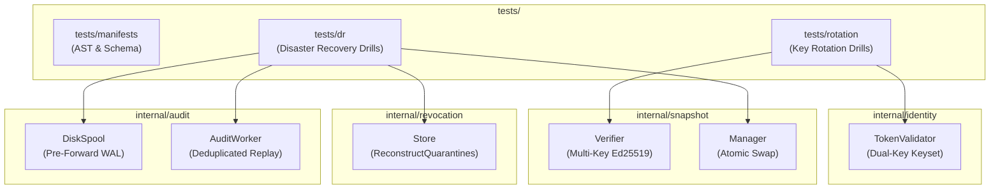

# Phase 6: Production Hardening & Operational Runbooks — Code & Architecture Patterns

**Generated:** 2026-10-07  
**Phase:** 06-production-hardening-runbooks  
**Status:** Approved Reference  
**Domain:** Kubernetes Production Hardening, Pod Security Standards (Restricted), NetworkPolicy Isolation, Zero-Downtime Credential Rotation, Disaster Recovery & Quarantine Reconstruction, WAL Crash Recovery, and SRE Operational Runbooks  

---

## 1. Executive Summary & File Inventory

Phase 6 grounds the complete Aegis Distributed Zero-Trust Access Gateway system in production reality. In accordance with [REQUIREMENTS.md](file:///home/logan78/Desktop/Aegis/.planning/REQUIREMENTS.md) (GW-01 through DIST-03, K8S-01, ID-01, PKI-01), [06-RESEARCH.md](file:///home/logan78/Desktop/Aegis/.planning/phases/06-production-hardening-runbooks/06-RESEARCH.md), and [06-VALIDATION.md](file:///home/logan78/Desktop/Aegis/.planning/phases/06-production-hardening-runbooks/06-VALIDATION.md), Phase 6 delivers:

1. **Kubernetes Production Reference Manifests (K8S-01):**
   A declarative Kustomize architecture ([`base/`](file:///home/logan78/Desktop/Aegis/deployments/kubernetes/base/) and [`overlays/production/`](file:///home/logan78/Desktop/Aegis/deployments/kubernetes/overlays/production/)) establishing two strictly isolated namespaces: `aegis-system` (gateway statefulset, control plane, audit worker, redis, postgres) and `aegis-apps` (orders, payments, admin backends). Workloads adhere to the **Kubernetes Pod Security Standard (Restricted Profile)** (`runAsNonRoot: true`, `runAsUser: 10001`, `readOnlyRootFilesystem: true`, `drop: ["ALL"]`). Availability is guarded by `PodDisruptionBudget` (`minAvailable: 2`), `topologySpreadConstraints` across zones, and multi-tier L7 probes (`/livez`, `/readyz`). Strict default-deny `NetworkPolicies` isolate all workloads, restricting backend ingress exclusively to gateway mTLS and gateway egress to backends, Redis, Control Plane, and CoreDNS (port 53).
2. **Automated Zero-Downtime Credential & Key Rotation Drills (AUTH-01, CTRL-02, PKI-01):**
   A dual-key verification window architecture that prevents authentication outages during security credential lifecycles:
   - **User JWT Issuer Keyset:** [`TokenValidator`](file:///home/logan78/Desktop/Aegis/internal/identity/jwt.go#L30-L46) accepts a multi-key trusted keyset $\{K_{\text{old}}, K_{\text{new}}\}$, allowing existing in-flight tokens to validate until TTL expiration while new tokens sign with $K_{\text{new}}$.
   - **Snapshot Ed25519 Signing Keys:** [`Verifier`](file:///home/logan78/Desktop/Aegis/internal/snapshot/verifier.go#L30-L40) supports multiple trusted Ed25519 public keys, enabling the control plane to rotate its private key and publish snapshot $N+1$ without gateway stream disconnection or verification rejection.
   - **Workload mTLS CA Trust Pool:** [`CA.CertPool`](file:///home/logan78/Desktop/Aegis/internal/pki/pki.go#L18-L23) verifies workload client certificates against both old and new Intermediate CAs during workload reissuance.
   All three scenarios are verified programmatically via an automated Go test suite ([`tests/rotation/rotation_test.go`](file:///home/logan78/Desktop/Aegis/tests/rotation/rotation_test.go)).
3. **Automated Disaster Recovery & State Reconstruction (REV-03, AUD-01, DIST-01):**
   Disaster recovery procedures guaranteeing that infrastructure wipeouts never compromise security invariants:
   - **Redis Quarantine Reconstruction:** When Redis restarts with empty in-memory state, gateways fail closed (503 `DEPENDENCY_OUTAGE_REDIS`) until an automated reconstruction pipeline pulls unexpired bans from PostgreSQL and repopulates Redis via [`Store.ReconstructQuarantines`](file:///home/logan78/Desktop/Aegis/internal/revocation/store.go).
   - **PostgreSQL PITR Version Continuity:** Point-in-time recovery reconciles snapshot version counters ($\max(N_{\text{gateway}}, M_{\text{db}}) + 1$) so active gateways do not reject restored configurations with [`ErrMonotonicVersionViolation`](file:///home/logan78/Desktop/Aegis/internal/snapshot/verifier.go#L18).
   - **WAL Crash Replay:** Ingestion workers restart from persistent [`cursor.json`](file:///home/logan78/Desktop/Aegis/internal/audit/cursor.go), reading unflushed `.wal` records and inserting with `ON CONFLICT (event_date, event_id) DO NOTHING` deduplication.
   Verified via automated Go DR tests ([`tests/dr/dr_test.go`](file:///home/logan78/Desktop/Aegis/tests/dr/dr_test.go)).
4. **Comprehensive SRE Incident Response Runbooks & Production SLO Gates:**
   Authoritative Markdown runbooks in [`docs/runbooks/`](file:///home/logan78/Desktop/Aegis/docs/runbooks/) covering SEV-1 through SEV-4 incident triage, emergency quarantine, 90% WAL saturation mitigation, severed control plane partitions, and a formal production SLO release gate checklist (<2ms OPA, <20ms p99 gateway added latency, 100% fail-closed semantics).

```
aegis/
├── deployments/
│   ├── compose/
│   │   ├── docker-compose.distributed.yml          # [EXISTING ANALOG] Reference Compose cluster
│   │   └── haproxy/haproxy.cfg                     # [EXISTING ANALOG] Reference L7 load balancer
│   └── kubernetes/                                 # [NEW] Plan 06-01: Production K8s Reference Manifests
│       ├── base/
│       │   ├── kustomization.yaml                  # Root base kustomization resource list
│       │   ├── namespaces.yaml                     # aegis-system and aegis-apps namespace definitions
│       │   ├── gateway/
│       │   │   ├── statefulset.yaml                # 3 replicas, PSS Restricted, WAL volumeClaimTemplates
│       │   │   ├── service.yaml                    # LoadBalancer/ClusterIP (:8080, :8443, :9091)
│       │   │   ├── pdb.yaml                        # PodDisruptionBudget (minAvailable: 2)
│       │   │   ├── networkpolicy.yaml              # Strict ingress/egress allowlists + CoreDNS port 53
│       │   │   └── configmap.yaml                  # Gateway environment defaults
│       │   ├── control-plane/
│       │   │   ├── deployment.yaml                 # PAP daemon (:8084, :9090, :9092)
│       │   │   ├── service.yaml                    # ClusterIP for gRPC streaming & Management REST
│       │   │   └── networkpolicy.yaml              # Ingress from gateway + operator; egress to PG & Redis
│       │   ├── audit-worker/
│       │   │   ├── deployment.yaml                 # Background WAL drainer pod
│       │   │   └── networkpolicy.yaml              # Egress to PostgreSQL & CoreDNS only
│       │   ├── redis/
│       │   │   ├── deployment.yaml                 # Redis 7.2 cache with maxmemory noeviction
│       │   │   ├── service.yaml                    # ClusterIP (:6379)
│       │   │   └── networkpolicy.yaml              # Ingress restricted to gateway and control plane
│       │   ├── postgres/
│       │   │   ├── statefulset.yaml                # PostgreSQL 16 with persistent volume claim
│       │   │   ├── service.yaml                    # ClusterIP (:5432)
│       │   │   └── networkpolicy.yaml              # Ingress restricted to CP and audit worker
│       │   └── backends/
│       │       ├── orders.yaml                     # Orders microservice (:8081 - mTLS private)
│       │       ├── payments.yaml                   # Payments microservice (:8082 - mTLS private)
│       │       ├── admin.yaml                      # Admin microservice (:8083 - mTLS private)
│       │       └── networkpolicy.yaml              # Zero-direct-ingress; mTLS ingress from gateway only
│       └── overlays/
│           └── production/
│               ├── kustomization.yaml              # Production overlay referencing base
│               ├── gateway-prod.yaml               # 3 replicas, resource requests/limits, topologySpread
│               ├── control-plane-prod.yaml         # Production resource bounds & readiness probes
│               └── networkpolicy-prod.yaml         # Production namespace CIDR and zone constraints
├── internal/
│   ├── identity/
│   │   ├── jwt.go                                  # [MODIFIED] Multi-key trusted keyset & rotation hooks
│   │   └── jwt_test.go                             # [EXISTING] Existing JWT unit tests
│   ├── snapshot/
│   │   ├── verifier.go                             # [MODIFIED] Multi-key Ed25519 trusted keyset verification
│   │   ├── manager.go                              # [EXISTING] Atomic snapshot swap manager
│   │   └── verifier_test.go                        # [MODIFIED/NEW] Multi-key verification tests
│   ├── revocation/
│   │   ├── store.go                                # [MODIFIED] Add ReconstructQuarantines pipeline helper
│   │   └── store_test.go                           # [MODIFIED/NEW] Quarantine reconstruction tests
│   ├── audit/
│   │   ├── spool.go                                # [EXISTING ANALOG] Append-only WAL spool
│   │   └── worker.go                               # [EXISTING ANALOG] Persistent cursor replay & deduplication
│   └── pki/
│       └── pki.go                                  # [EXISTING ANALOG] Workload CA & x509 CertPool
├── tests/
│   ├── manifests/
│   │   └── manifest_test.go                        # [NEW] Plan 06-01: Manifest validation & PSS compliance
│   ├── rotation/
│   │   └── rotation_test.go                        # [NEW] Plan 06-02: Zero-downtime key rotation drills
│   ├── dr/
│   │   └── dr_test.go                              # [NEW] Plan 06-03: Disaster recovery & reconstruction drills
│   ├── chaos/
│   │   ├── chaos_test.go                           # [EXISTING ANALOG] Distributed chaos fault injection
│   │   └── test_helpers.go                         # [EXISTING ANALOG] Multi-gateway mock cluster harness
│   └── failure/
│       └── failure_test.go                         # [EXISTING ANALOG] Negative fail-closed unit tests
└── docs/
    └── runbooks/                                   # [NEW] Plans 06-02, 06-03: Operational Runbooks
        ├── credential-rotation.md                  # Runbook: JWT, Ed25519, and mTLS CA zero-downtime rotation
        ├── disaster-recovery.md                    # Runbook: PG PITR, Redis reconstruction, WAL crash recovery
        ├── incident-response.md                    # Runbook: SEV-1 to SEV-4 severity, escalation & triage
        ├── quarantine-and-revocation.md            # Runbook: Emergency principal quarantine & mass revocation
        ├── spool-saturation-recovery.md            # Runbook: 90% WAL saturation triage & recovery (HTTP 503)
        ├── control-plane-partition.md              # Runbook: Severed gRPC stream & 60s lease boundary response
        └── production-slo-checklist.md             # Runbook: Formal release sign-off checklist & SLO verification
```

---

## 2. Classification by Role & Data Flow

| File Path | Architectural Role | Ingress / Input | Processing / Transformation | Egress / Output | Invariants & Requirements | Existing Analog |
|---|---|---|---|---|---|---|
| `deployments/kubernetes/base/gateway/statefulset.yaml` | Production Gateway Data Plane Orchestrator | Kubernetes API / Kustomize | Declares 3 replicas, PSS Restricted security context (`runAsUser: 10001`, `drop: ALL`, `readOnlyRootFilesystem: true`), PVC mounts, and L7 probes | Running pod instances with local SSD WAL spools | K8S-01, GW-01, Invariant 10 | [`deployments/compose/docker-compose.distributed.yml`](file:///home/logan78/Desktop/Aegis/deployments/compose/docker-compose.distributed.yml#L71-L120) |
| `deployments/kubernetes/base/gateway/networkpolicy.yaml` | Gateway Grid Network Perimeter Isolation | Ingress traffic from external clients (:8080) and workload mTLS (:8443) | Enforces strict default-deny; allows egress to `aegis-apps` (:8443), Redis (:6379), CP (:9090), and CoreDNS (port 53 UDP/TCP) | Packet filtering at CNI layer | K8S-01, Invariant 12 | [`docs/threat-model/threat-model.md`](file:///home/logan78/Desktop/Aegis/docs/threat-model/threat-model.md#L68-L77) |
| `deployments/kubernetes/base/backends/networkpolicy.yaml` | Private Backend Zero-Bypass Network Policy | CNI packet inspection | Rejects all direct ingress except from pods labeled `app: aegis-gateway` in namespace `aegis-system` on mTLS port 8443 | Verified backend mTLS traffic | K8S-01, BYP-01, BYP-03, Invariant 5 | [`deployments/compose/docker-compose.distributed.yml`](file:///home/logan78/Desktop/Aegis/deployments/compose/docker-compose.distributed.yml#L182-L245) |
| `deployments/kubernetes/base/gateway/pdb.yaml` | Cluster High Availability & Disruption Bound | Kubernetes node drain / upgrade events | Restricts voluntary pod evictions so at least 2 gateway replicas remain healthy at all times | PDB eviction admission decisions | K8S-01, DIST-01 | [`deployments/compose/haproxy/haproxy.cfg`](file:///home/logan78/Desktop/Aegis/deployments/compose/haproxy/haproxy.cfg#L18-L26) |
| `deployments/kubernetes/overlays/production/gateway-prod.yaml` | Production Topology Spread & Resource Bounds | Kustomize patch overlay | Injects cross-zone `topologySpreadConstraints`, production CPU/memory limits, and hardened replica parameters | Production StatefulSet spec | K8S-01, DIST-01 | [`deployments/compose/docker-compose.distributed.yml`](file:///home/logan78/Desktop/Aegis/deployments/compose/docker-compose.distributed.yml#L71-L120) |
| `internal/identity/jwt.go` | Dual-Key Ingress JWT Authentication Engine | HTTP `Authorization: Bearer <token>` header | Evaluates signature across trusted keyset $\{K_{\text{old}}, K_{\text{new}}\}$, verifying claims and expiration with 30s clock leeway | [`UserClaims`](file:///home/logan78/Desktop/Aegis/internal/identity/jwt.go#L24-L28) or 401 Unauthorized | AUTH-01, Invariant 2 | [`internal/identity/jwt.go`](file:///home/logan78/Desktop/Aegis/internal/identity/jwt.go#L30-L76) |
| `internal/snapshot/verifier.go` | Multi-Key Ed25519 Snapshot & Lease Verifier | Incoming `SnapshotEnvelope` or `FreshnessLease` bytes from gRPC stream | Verifies payload SHA-256 and Ed25519 signature against any trusted public key in rotation set | Unmarshaled [`SnapshotPayload`](file:///home/logan78/Desktop/Aegis/internal/snapshot/verifier.go#L44) or verification error | CTRL-02, Invariant 9 | [`internal/snapshot/verifier.go`](file:///home/logan78/Desktop/Aegis/internal/snapshot/verifier.go#L30-L78) |
| `internal/revocation/store.go` | Disaster Recovery Quarantine Reconstruction Client | SRE DR reconstruction script or startup routine | Executes Redis pipeline batch inserts for active quarantines and unexpired revocations | Populated Redis in-memory cache | REV-03, Invariant 1 | [`internal/revocation/store.go`](file:///home/logan78/Desktop/Aegis/internal/revocation/store.go#L110-L158) |
| `tests/manifests/manifest_test.go` | Automated Kubernetes Manifest AST & Schema Validator | Manifest YAML files from Kustomize build | Parses YAML into Go structures; validates PSS Restricted rules, non-root user, dropped capabilities, NetworkPolicies, CoreDNS egress, and PDB | Pass/Fail unit test assertions | K8S-01 | [`internal/config/config_test.go`](file:///home/logan78/Desktop/Aegis/internal/config/config_test.go) |
| `tests/rotation/rotation_test.go` | Automated Credential Rotation Drill Suite | Cryptographic keypairs (JWT, Ed25519, CA) | Simulates complete 3-phase rotation lifecycle under concurrent traffic; asserts zero 401s during overlap and rejection of retired keys | Rotation drill verification results | AUTH-01, CTRL-02, PKI-01 | [`tests/failure/failure_test.go`](file:///home/logan78/Desktop/Aegis/tests/failure/failure_test.go#L63-L97), [`internal/pki/pki_test.go`](file:///home/logan78/Desktop/Aegis/internal/pki/pki_test.go) |
| `tests/dr/dr_test.go` | Automated Disaster Recovery Drill Suite | Mock Redis, PostgreSQL, and WAL spool state | Injects Redis wipeout (`FlushAll`), PostgreSQL PITR rollback, and worker crash; asserts state reconstruction, version monotonicity, and zero WAL loss | Disaster recovery verification results | REV-03, AUD-01, Invariants 1, 9, 10 | [`tests/chaos/chaos_test.go`](file:///home/logan78/Desktop/Aegis/tests/chaos/chaos_test.go#L65-L100), [`internal/audit/worker_test.go`](file:///home/logan78/Desktop/Aegis/internal/audit/worker_test.go) |
| `docs/runbooks/*.md` | SRE Incident Response & Operational Runbooks | Operator telemetry, alert triggers, incident reports | Structured decision trees, triage commands, remediation scripts, and verification checklists | Documented operational procedures | DIST-01, GW-01 through DIST-03 | [`docs/threat-model/threat-model.md`](file:///home/logan78/Desktop/Aegis/docs/threat-model/threat-model.md), [`docs/adr/0004-signed-freshness-leases-and-snapshots.md`](file:///home/logan78/Desktop/Aegis/docs/adr/0004-signed-freshness-leases-and-snapshots.md) |

---

## 3. Concrete Code Patterns & Existing Analogs

### Pattern 1: Kubernetes StatefulSet with Pod Security Standards (Restricted) & Local WAL PVCs
**File:** `deployments/kubernetes/base/gateway/statefulset.yaml`  
**Existing Analog:** [`deployments/compose/docker-compose.distributed.yml`](file:///home/logan78/Desktop/Aegis/deployments/compose/docker-compose.distributed.yml#L71-L101)  
**Problem Solved:** In a multi-replica gateway cluster, mounting a single `ReadWriteOnce` persistent volume to a `Deployment` prevents pods from scheduling across distinct nodes (volume multi-attach error). Using a `StatefulSet` with `volumeClaimTemplates` provisions a dedicated `ReadWriteOnce` local SSD PVC per replica (`wal-spool-aegis-gateway-0`, etc.), preserving local WAL append isolation while strictly enforcing the Kubernetes Pod Security Standard Restricted profile.

```yaml
apiVersion: apps/v1
kind: StatefulSet
metadata:
  name: aegis-gateway
  namespace: aegis-system
  labels:
    app: aegis-gateway
spec:
  serviceName: aegis-gateway
  replicas: 3
  selector:
    matchLabels:
      app: aegis-gateway
  template:
    metadata:
      labels:
        app: aegis-gateway
    spec:
      securityContext:
        runAsNonRoot: true
        runAsUser: 10001
        runAsGroup: 10001
        fsGroup: 10001
        seccompProfile:
          type: RuntimeDefault
      containers:
        - name: gateway
          image: aegis/gateway:latest
          imagePullPolicy: IfNotPresent
          securityContext:
            allowPrivilegeEscalation: false
            readOnlyRootFilesystem: true
            capabilities:
              drop:
                - ALL
          ports:
            - containerPort: 8080
              name: http-user
            - containerPort: 8443
              name: mtls-workload
            - containerPort: 9091
              name: metrics
          resources:
            requests:
              cpu: 250m
              memory: 256Mi
            limits:
              cpu: 1000m
              memory: 512Mi
          startupProbe:
            httpGet:
              path: /livez
              port: 8080
            initialDelaySeconds: 1
            periodSeconds: 2
            failureThreshold: 30
          livenessProbe:
            httpGet:
              path: /livez
              port: 8080
            periodSeconds: 10
            failureThreshold: 3
          readinessProbe:
            httpGet:
              path: /readyz
              port: 8080
            periodSeconds: 5
            failureThreshold: 1
          volumeMounts:
            - name: wal-spool
              mountPath: /var/log/aegis/wal
            - name: tmp
              mountPath: /tmp
      volumes:
        - name: tmp
          emptyDir: {}
  volumeClaimTemplates:
    - metadata:
        name: wal-spool
      spec:
        accessModes: ["ReadWriteOnce"]
        resources:
          requests:
            storage: 2Gi
```

---

### Pattern 2: Kubernetes Default-Deny NetworkPolicy with CoreDNS Egress
**File:** `deployments/kubernetes/base/gateway/networkpolicy.yaml`  
**Existing Analog:** [`docs/threat-model/threat-model.md`](file:///home/logan78/Desktop/Aegis/docs/threat-model/threat-model.md#L68-L77) (Trust Boundaries TB-1 through TB-7)  
**Problem Solved:** Pods in Kubernetes share the cluster flat network by default, violating Invariant 12 (*Network Proximity Never Confers Authorization*). The gateway NetworkPolicy enforces default-deny on ingress and egress, explicitly whitelisting only verified destinations (backends on :8443, Redis on :6379, Control Plane on :9090), and crucially whitelisting CoreDNS (port 53 UDP/TCP) to prevent catastrophic name resolution failures.

```yaml
apiVersion: networking.k8s.io/v1
kind: NetworkPolicy
metadata:
  name: aegis-gateway-networkpolicy
  namespace: aegis-system
spec:
  podSelector:
    matchLabels:
      app: aegis-gateway
  policyTypes:
    - Ingress
    - Egress
  ingress:
    # 1. Allow public user traffic on :8080
    - from: []
      ports:
        - protocol: TCP
          port: 8080
    # 2. Allow internal workload mTLS on :8443 (from aegis-apps namespace)
    - from:
        - namespaceSelector:
            matchLabels:
              kubernetes.io/metadata.name: aegis-apps
      ports:
        - protocol: TCP
          port: 8443
  egress:
    # 1. Allow mTLS forwarding to backend services in aegis-apps on :8443
    - to:
        - namespaceSelector:
            matchLabels:
              kubernetes.io/metadata.name: aegis-apps
      ports:
        - protocol: TCP
          port: 8443
    # 2. Allow Redis communication on :6379 in aegis-system
    - to:
        - podSelector:
            matchLabels:
              app: redis
      ports:
        - protocol: TCP
          port: 6379
    # 3. Allow gRPC snapshot stream to Control Plane on :9090 in aegis-system
    - to:
        - podSelector:
            matchLabels:
              app: aegis-control-plane
      ports:
        - protocol: TCP
          port: 9090
    # 4. Mandatory CoreDNS egress on port 53 UDP/TCP in kube-system
    - to:
        - namespaceSelector:
            matchLabels:
              kubernetes.io/metadata.name: kube-system
          podSelector:
            matchLabels:
              k8s-app: kube-dns
      ports:
        - protocol: UDP
          port: 53
        - protocol: TCP
          port: 53
```

---

### Pattern 3: Dual-Key Ingress JWT Token Validator with Keyset Overlap Window
**File:** `internal/identity/jwt.go`  
**Existing Analog:** [`internal/identity/jwt.go`](file:///home/logan78/Desktop/Aegis/internal/identity/jwt.go#L30-L76)  
**Problem Solved:** The existing [`TokenValidator`](file:///home/logan78/Desktop/Aegis/internal/identity/jwt.go#L30) stores only a single `publicKey crypto.PublicKey`. Instant key replacement invalidates all active client tokens before their TTL expires, triggering mass 401 Unauthorized outages. Expanding `TokenValidator` to maintain a concurrency-safe slice of public keys allows clients signed under $K_{\text{old}}$ to validate seamlessly while new clients authenticate with $K_{\text{new}}$.

```go
// TokenValidator enforces RFC 8725 JWT validation with a pinned algorithm allowlist
// and a multi-key trusted keyset for zero-downtime key rotation (AUTH-01).
type TokenValidator struct {
	issuer       string
	audience     string
	publicKeys   []crypto.PublicKey // Trusted keyset for zero-downtime rotation
	allowedAlgos []string
	mu           sync.RWMutex
}

// NewTokenValidator initializes a TokenValidator with one or more trusted public keys.
func NewTokenValidator(issuer, audience string, publicKeys ...crypto.PublicKey) *TokenValidator {
	return &TokenValidator{
		issuer:       issuer,
		audience:     audience,
		publicKeys:   publicKeys,
		allowedAlgos: []string{"EdDSA", "RS256", "ES256"},
	}
}

// AddPublicKey adds a newly issued public key to the trusted keyset (Phase 1 of rotation).
func (v *TokenValidator) AddPublicKey(pubKey crypto.PublicKey) {
	v.mu.Lock()
	defer v.mu.Unlock()
	v.publicKeys = append(v.publicKeys, pubKey)
}

// SetPublicKeys atomically replaces the trusted keyset (Phase 3 of rotation: retirement).
func (v *TokenValidator) SetPublicKeys(keys []crypto.PublicKey) {
	v.mu.Lock()
	defer v.mu.Unlock()
	v.publicKeys = keys
}

// ValidateBearerToken validates an incoming Authorization header against any trusted key.
func (v *TokenValidator) ValidateBearerToken(authHeader string) (*UserClaims, error) {
	if !strings.HasPrefix(authHeader, "Bearer ") {
		return nil, ErrMissingAuthHeader
	}
	tokenStr := strings.TrimSpace(strings.TrimPrefix(authHeader, "Bearer "))
	if tokenStr == "" {
		return nil, ErrMissingAuthHeader
	}

	v.mu.RLock()
	keys := make([]crypto.PublicKey, len(v.publicKeys))
	copy(keys, v.publicKeys)
	v.mu.RUnlock()

	var lastErr error
	for _, key := range keys {
		claims := &UserClaims{}
		token, err := jwt.ParseWithClaims(tokenStr, claims, func(token *jwt.Token) (interface{}, error) {
			validMethod := false
			for _, algo := range v.allowedAlgos {
				if token.Method.Alg() == algo {
					validMethod = true
					break
				}
			}
			if !validMethod {
				return nil, fmt.Errorf("%w: %s", ErrInvalidAlgorithm, token.Method.Alg())
			}
			return key, nil
		},
			jwt.WithIssuer(v.issuer),
			jwt.WithAudience(v.audience),
			jwt.WithLeeway(30*time.Second),
		)

		if err == nil && token.Valid && claims.Subject != "" {
			return claims, nil // Successfully validated with this key in the keyset
		}
		lastErr = err
	}

	if lastErr != nil {
		if errors.Is(lastErr, jwt.ErrTokenExpired) {
			return nil, fmt.Errorf("%w: %w", ErrTokenExpired, lastErr)
		}
		return nil, fmt.Errorf("%w: %w", ErrInvalidClaims, lastErr)
	}
	return nil, ErrInvalidClaims
}
```

---

### Pattern 4: Multi-Key Ed25519 Snapshot Envelope & Lease Verifier
**File:** `internal/snapshot/verifier.go`  
**Existing Analog:** [`internal/snapshot/verifier.go`](file:///home/logan78/Desktop/Aegis/internal/snapshot/verifier.go#L30-L78)  
**Problem Solved:** The existing [`Verifier`](file:///home/logan78/Desktop/Aegis/internal/snapshot/verifier.go#L30) pins a single `pubKey ed25519.PublicKey`. When rotating the Control Plane's Ed25519 snapshot signing key, newly published snapshots signed with $K_{\text{new}}$ would be rejected by gateways. Supporting a concurrency-safe slice of trusted public keys allows gateways to verify snapshots and 10s freshness leases signed with either key during rotation.

```go
// Verifier verifies snapshot envelopes and freshness leases using one or more trusted Ed25519 public keys.
type Verifier struct {
	trustedKeys []ed25519.PublicKey
	mu          sync.RWMutex
}

// NewVerifier creates a new Verifier initialized with one or more trusted Ed25519 public keys.
func NewVerifier(pubKeys ...ed25519.PublicKey) *Verifier {
	return &Verifier{
		trustedKeys: pubKeys,
	}
}

// AddTrustedKey appends an additional trusted public key during zero-downtime key rotation.
func (v *Verifier) AddTrustedKey(pubKey ed25519.PublicKey) {
	v.mu.Lock()
	defer v.mu.Unlock()
	v.trustedKeys = append(v.trustedKeys, pubKey)
}

// SetTrustedKeys atomically replaces the trusted keyset (Phase 3 of rotation: retirement).
func (v *Verifier) SetTrustedKeys(keys []ed25519.PublicKey) {
	v.mu.Lock()
	defer v.mu.Unlock()
	v.trustedKeys = keys
}

// VerifySnapshot validates monotonic version, checksum, and signature against any trusted key.
func (v *Verifier) VerifySnapshot(env *snapshotv1.SnapshotEnvelope, currentVersion int64) (*snapshotv1.SnapshotPayload, error) {
	if env == nil {
		return nil, errors.New("cannot verify nil snapshot envelope")
	}
	if env.Version <= currentVersion {
		return nil, fmt.Errorf("%w: received version %d <= active version %d", ErrMonotonicVersionViolation, env.Version, currentVersion)
	}

	sum := sha256.Sum256(env.Payload)
	computedDigest := hex.EncodeToString(sum[:])
	if env.PayloadSha256 != computedDigest {
		return nil, fmt.Errorf("%w: expected %s, got %s", ErrChecksumMismatch, env.PayloadSha256, computedDigest)
	}

	v.mu.RLock()
	keys := make([]ed25519.PublicKey, len(v.trustedKeys))
	copy(keys, v.trustedKeys)
	v.mu.RUnlock()

	validSig := false
	for _, key := range keys {
		if ed25519.Verify(key, []byte(env.PayloadSha256), env.Signature) {
			validSig = true
			break
		}
	}
	if !validSig {
		return nil, ErrInvalidSignature
	}

	var payload snapshotv1.SnapshotPayload
	if err := proto.Unmarshal(env.Payload, &payload); err != nil {
		return nil, fmt.Errorf("failed to unmarshal snapshot payload: %w", err)
	}
	if payload.Version != env.Version {
		return nil, fmt.Errorf("payload version %d does not match envelope version %d", payload.Version, env.Version)
	}

	return &payload, nil
}
```

---

### Pattern 5: Disaster Recovery Redis Quarantine State Reconstruction
**File:** `internal/revocation/store.go`  
**Existing Analog:** [`internal/revocation/store.go`](file:///home/logan78/Desktop/Aegis/internal/revocation/store.go#L103-L158) ([`QuarantinedPrincipal`](file:///home/logan78/Desktop/Aegis/internal/revocation/store.go#L104) & [`ListQuarantined`](file:///home/logan78/Desktop/Aegis/internal/revocation/store.go#L111))  
**Problem Solved:** When Redis crashes and restarts cleanly with empty memory, all quarantine and revocation state is lost. If gateways become ready before this state is restored, banned principals can bypass authorization. The [`ReconstructQuarantines`](file:///home/logan78/Desktop/Aegis/internal/revocation/store.go) method pipeline-inserts all active quarantines with their remaining TTL in a single network roundtrip before gateway readiness is marked healthy.

```go
// ReconstructQuarantines pipeline-inserts an entire slice of quarantined principals into Redis.
// Used during Disaster Recovery to restore security state before marking gateway readiness healthy.
func (s *Store) ReconstructQuarantines(ctx context.Context, principals []QuarantinedPrincipal) error {
	if len(principals) == 0 {
		return nil
	}
	ctx, cancel := context.WithTimeout(ctx, 2*time.Second)
	defer cancel()

	pipe := s.client.Pipeline()
	for _, p := range principals {
		ttl := p.TTL
		if ttl <= 0 {
			ttl = 24 * time.Hour
		}
		key := "quarantine:principal:" + p.PrincipalID
		reason := p.Reason
		if reason == "" {
			reason = "DISASTER_RECOVERY_RECONSTRUCTED"
		}
		pipe.Set(ctx, key, reason, ttl)
	}

	_, err := pipe.Exec(ctx)
	if err != nil {
		return fmt.Errorf("failed to reconstruct quarantine state in Redis: %w", err)
	}
	return nil
}
```

---

### Pattern 6: Monotonic Version Continuity Reconciler during Database Point-in-Time Recovery
**File:** `tests/dr/dr_test.go` and `internal/control/publish_handler.go`  
**Existing Analog:** [`internal/snapshot/manager.go`](file:///home/logan78/Desktop/Aegis/internal/snapshot/manager.go#L88-L100) and [`internal/control/ack.go`](file:///home/logan78/Desktop/Aegis/internal/control/ack.go)  
**Problem Solved:** When PostgreSQL is restored from a backup taken at version $M = 4$, but running gateways are actively serving snapshot version $N = 7$, any new configuration published by the restored control plane would use version $M + 1 = 5$. Gateways would reject the snapshot with [`ErrMonotonicVersionViolation`](file:///home/logan78/Desktop/Aegis/internal/snapshot/verifier.go#L18) ($5 \le 7$). The reconciliation pattern queries connected gateway acknowledgment versions ($N$) and forces the next published snapshot to be $\max(N_{\text{gateway}}, M_{\text{db}}) + 1$.

```go
// ReconcileVersionContinuity determines the next valid monotonic snapshot version
// following a database point-in-time recovery event, preventing ErrMonotonicVersionViolation.
func ReconcileVersionContinuity(dbLatestVersion int64, gatewayFleetMaxVersion int64) int64 {
	baseVersion := dbLatestVersion
	if gatewayFleetMaxVersion > baseVersion {
		baseVersion = gatewayFleetMaxVersion
	}
	return baseVersion + 1
}
```

---

### Pattern 7: Local Disk Spool Crash Recovery & Deduplicated Audit Replay
**File:** `internal/audit/worker.go`  
**Existing Analog:** [`internal/audit/worker.go`](file:///home/logan78/Desktop/Aegis/internal/audit/worker.go#L70-L88) and [`internal/audit/cursor.go`](file:///home/logan78/Desktop/Aegis/internal/audit/cursor.go)  
**Problem Solved:** When a gateway replica crashes or is terminated mid-operation, uncommitted `.wal` segments remain on disk. The audit worker resumes from the persistent [`cursor.json`](file:///home/logan78/Desktop/Aegis/internal/audit/cursor.go) offset, re-reading records and flushing to PostgreSQL with `ON CONFLICT (event_date, event_id) DO NOTHING`. This guarantees zero event loss and zero duplicate error crashes.

```go
// Excerpt from internal/audit/worker.go: ProcessBatch demonstrating deduplication
func (w *AuditWorker) ProcessBatch(ctx context.Context, events []CompletionEvent, segmentFile string, newOffset int64) error {
	if len(events) == 0 {
		return nil
	}

	batch := &pgx.Batch{}
	query := `
		INSERT INTO audit_events (
			event_id, event_type, request_id, timestamp, event_date,
			principal_id, principal_kind, roles, service_id, route_id,
			http_method, request_path, decision, reason_code, snapshot_version,
			http_status, duration_ms, client_ip, error_code
		) VALUES (
			$1, $2, $3, $4, $5, $6, $7, $8, $9, $10,
			$11, $12, $13, $14, $15, $16, $17, $18, $19
		) ON CONFLICT (event_date, event_id) DO NOTHING;
	`
    // Events added to batch, executed, and cursor committed only after successful DB flush
    // ...
}
```

---

### Pattern 8: Go Manifest AST Unit Testing
**File:** `tests/manifests/manifest_test.go`  
**Existing Analog:** [`internal/config/config_test.go`](file:///home/logan78/Desktop/Aegis/internal/config/config_test.go) and [`tests/security/headers_test.go`](file:///home/logan78/Desktop/Aegis/tests/security/headers_test.go)  
**Problem Solved:** Validates declarative Kubernetes manifests without requiring a live cloud cluster, asserting Pod Security Standard attributes, non-root user (10001), read-only root filesystems, dropped Linux capabilities, CoreDNS egress in NetworkPolicies, and PDB `minAvailable: 2`.

```go
package manifests

import (
	"os"
	"path/filepath"
	"testing"

	"github.com/stretchr/testify/assert"
	"github.com/stretchr/testify/require"
	"gopkg.in/yaml.v3"
)

func TestGatewayManifestHardening(t *testing.T) {
	manifestPath := filepath.Join("..", "..", "deployments", "kubernetes", "base", "gateway", "statefulset.yaml")
	data, err := os.ReadFile(manifestPath)
	require.NoError(t, err, "StatefulSet manifest must be present")

	var doc map[string]interface{}
	err = yaml.Unmarshal(data, &doc)
	require.NoError(t, err, "Manifest must parse as valid YAML")

	// Verify Kind and Replicas
	assert.Equal(t, "StatefulSet", doc["kind"])
	spec := doc["spec"].(map[string]interface{})
	assert.Equal(t, 3, spec["replicas"])

	// Verify Pod Security Context
	template := spec["template"].(map[string]interface{})
	podSpec := template["spec"].(map[string]interface{})
	podSec := podSpec["securityContext"].(map[string]interface{})
	assert.Equal(t, true, podSec["runAsNonRoot"])
	assert.Equal(t, 10001, podSec["runAsUser"])

	// Verify Container Security Context
	containers := podSpec["containers"].([]interface{})
	gatewayContainer := containers[0].(map[string]interface{})
	cSec := gatewayContainer["securityContext"].(map[string]interface{})
	assert.Equal(t, false, cSec["allowPrivilegeEscalation"])
	assert.Equal(t, true, cSec["readOnlyRootFilesystem"])
}
```

---

### Pattern 9: Automated Zero-Downtime Rotation Drill Runner
**File:** `tests/rotation/rotation_test.go`  
**Existing Analog:** [`tests/failure/failure_test.go`](file:///home/logan78/Desktop/Aegis/tests/failure/failure_test.go#L63-L97) and [`tests/chaos/chaos_test.go`](file:///home/logan78/Desktop/Aegis/tests/chaos/chaos_test.go#L21-L63)  
**Problem Solved:** Programmatically executes a three-phase rotation drill (Overlap $\rightarrow$ Switch Active $\rightarrow$ Retire Old) against [`TokenValidator`](file:///home/logan78/Desktop/Aegis/internal/identity/jwt.go#L30) and [`Verifier`](file:///home/logan78/Desktop/Aegis/internal/snapshot/verifier.go#L30), proving zero authentication errors during the overlap window and strict fail-closed rejection after key retirement.

```go
package rotation

import (
	"crypto/ed25519"
	"crypto/rand"
	"testing"
	"time"

	"aegis/internal/identity"

	"github.com/golang-jwt/jwt/v5"
	"github.com/stretchr/testify/assert"
	"github.com/stretchr/testify/require"
)

func TestJWTIssuerKeyRotation(t *testing.T) {
	// Generate Key A (Initial) and Key B (Rotated)
	pubA, privA, err := ed25519.GenerateKey(rand.Reader)
	require.NoError(t, err)
	pubB, privB, err := ed25519.GenerateKey(rand.Reader)
	require.NoError(t, err)

	issuer := "aegis-issuer"
	audience := "aegis-gateway"

	// Phase 1: Gateway starts with Key A only
	val := identity.NewTokenValidator(issuer, audience, pubA)
	tokenA := mintTestToken(t, privA, issuer, audience, "user-1", 10*time.Minute)
	claims, err := val.ValidateBearerToken("Bearer " + tokenA)
	require.NoError(t, err)
	assert.Equal(t, "user-1", claims.Subject)

	// Phase 2: Overlap Window Established - Add Key B to Keyset
	val.AddPublicKey(pubB)
	tokenB := mintTestToken(t, privB, issuer, audience, "user-2", 10*time.Minute)

	// Both Token A and Token B must validate seamlessly with ZERO errors
	claimsA, errA := val.ValidateBearerToken("Bearer " + tokenA)
	require.NoError(t, errA)
	assert.Equal(t, "user-1", claimsA.Subject)

	claimsB, errB := val.ValidateBearerToken("Bearer " + tokenB)
	require.NoError(t, errB)
	assert.Equal(t, "user-2", claimsB.Subject)

	// Phase 3: Token A TTL Expires - Retire Key A (Keyset = [Key B])
	val.SetPublicKeys([]interface{}{pubB})

	// Token B continues validating
	claimsB2, errB2 := val.ValidateBearerToken("Bearer " + tokenB)
	require.NoError(t, errB2)
	assert.Equal(t, "user-2", claimsB2.Subject)

	// Token A signed by retired Key A is now rejected
	_, errRetired := val.ValidateBearerToken("Bearer " + tokenA)
	assert.Error(t, errRetired, "Retired key must fail closed")
}
```

---

### Pattern 10: Automated Disaster Recovery Drill Suite
**File:** `tests/dr/dr_test.go`  
**Existing Analog:** [`tests/chaos/test_helpers.go`](file:///home/logan78/Desktop/Aegis/tests/chaos/test_helpers.go#L42-L76) and [`tests/failure/failure_test.go`](file:///home/logan78/Desktop/Aegis/tests/failure/failure_test.go#L36-L59)  
**Problem Solved:** Programmatically verifies the three critical zero-trust disaster recovery scenarios: Redis quarantine reconstruction, PostgreSQL point-in-time version continuity, and local WAL crash replay.

```go
package dr

import (
	"context"
	"testing"
	"time"

	"aegis/internal/revocation"

	"github.com/alicebob/miniredis/v2"
	"github.com/redis/go-redis/v9"
	"github.com/stretchr/testify/assert"
	"github.com/stretchr/testify/require"
)

func TestRedisQuarantineReconstruction(t *testing.T) {
	mr := miniredis.RunT(t)
	rdb := redis.NewClient(&redis.Options{Addr: mr.Addr()})
	defer rdb.Close()
	store := revocation.NewStore(rdb)

	ctx := context.Background()

	// 1. Initial State: Quarantine active in Redis
	err := store.QuarantinePrincipal(ctx, "malicious-user", "ADMIN_BLOCK", 1*time.Hour)
	require.NoError(t, err)

	revoked, reason, err := store.CheckRevocation(ctx, "malicious-user", "")
	require.NoError(t, err)
	assert.True(t, revoked)
	assert.Equal(t, "PRINCIPAL_QUARANTINED", reason)

	// 2. Disaster: Redis crashes and restarts cleanly with empty memory
	mr.FlushAll()

	revokedAfterWipe, _, err := store.CheckRevocation(ctx, "malicious-user", "")
	require.NoError(t, err)
	assert.False(t, revokedAfterWipe, "Empty cache must not show quarantine before reconstruction")

	// 3. Disaster Recovery: Reconstruct state from PostgreSQL authoritative source
	activeQuarantines := []revocation.QuarantinedPrincipal{
		{
			PrincipalID: "malicious-user",
			Reason:      "ADMIN_BLOCK_RESTORED",
			TTL:         55 * time.Minute,
		},
	}
	err = store.ReconstructQuarantines(ctx, activeQuarantines)
	require.NoError(t, err)

	// 4. Verification: Quarantine is restored; gateway readiness is now healthy
	revokedRestored, reasonRestored, err := store.CheckRevocation(ctx, "malicious-user", "")
	require.NoError(t, err)
	assert.True(t, revokedRestored, "Principal must be quarantined after DR reconstruction")
	assert.Equal(t, "PRINCIPAL_QUARANTINED", reasonRestored)
}
```

---

### Pattern 11: Production Runbook Standard Structure & Decision Trees
**Files:** [`docs/runbooks/*.md`](file:///home/logan78/Desktop/Aegis/docs/runbooks/)  
**Existing Analog:** [`docs/threat-model/threat-model.md`](file:///home/logan78/Desktop/Aegis/docs/threat-model/threat-model.md) and [`docs/adr/0004-signed-freshness-leases-and-snapshots.md`](file:///home/logan78/Desktop/Aegis/docs/adr/0004-signed-freshness-leases-and-snapshots.md)  
**Standard Specification:** Every operational runbook adheres strictly to the following 6-part standardized layout:
1. **Metadata & Severity:** Incident classification (SEV-1 to SEV-4), SLO impact, and primary on-call owners.
2. **Alert Triggers & Symptoms:** Exact Prometheus alert expression, metric names, and observed client HTTP error codes.
3. **Triage Decision Tree:** Step-by-step visual ASCII or Mermaid diagram guiding the SRE operator through diagnostics.
4. **Remediation Procedures:** Exact, copy-pasteable CLI commands (`kubectl`, `curl`, `redis-cli`, `psql`) with expected outputs.
5. **Verification & Exit Criteria:** Concrete commands proving healthy recovery before closing the incident ticket.
6. **Post-Incident Review:** Root cause analysis checklist and preventive action items.

---

## 4. Dependencies, Interfaces & Integration Points

### Cross-Package Module Dependencies


### External Library Versions
- **`gopkg.in/yaml.v3` (`v3.0.1`):** YAML parsing in `tests/manifests/manifest_test.go` for declarative manifest AST inspection.
- **`github.com/stretchr/testify` (`v1.10.0`):** `assert` and `require` libraries across all rotation and DR test suites.
- **`github.com/golang-jwt/jwt/v5` (`v5.3.1`):** Cryptographic token parsing and multi-key validation in `internal/identity/jwt.go`.
- **`crypto/ed25519` (Go Stdlib):** Digital signature generation and verification for snapshots, leases, and assertions.
- **`github.com/redis/go-redis/v9` (`v9.22.0`):** Redis pipelining for `ReconstructQuarantines` in `internal/revocation/store.go`.
- **`github.com/jackc/pgx/v5` (`v5.9.2`):** Batch execution and conflict handling in `internal/audit/worker.go`.
- **`bitnami/kubectl` (`latest` / `v1.37.1` client, `kustomize v5.8.1`):** Dockerized Kustomize compilation and validation tooling.

---

## 5. Critical Anti-Patterns & Don't Hand-Roll Traps

### Anti-Patterns to Strictly Avoid

| Anti-Pattern | Consequence | Correct Architecture Pattern |
|---|---|---|
| **Attaching single ReadWriteOnce PVC to Deployment** | Multi-replica pod scheduling hangs indefinitely across nodes with `Multi-Attach error for volume`. | Use a **`StatefulSet` with `volumeClaimTemplates`**. Each gateway replica receives an isolated local SSD PVC (`wal-spool-aegis-gateway-N`). |
| **Omitting CoreDNS egress (port 53) in default-deny NetworkPolicy** | Pods cannot resolve service DNS names (`redis:6379`, `postgres:5432`). All outbound requests fail with `no such host`, causing total cluster failure. | Explicitly whitelist UDP/TCP traffic on port 53 to pods matching `k8s-app: kube-dns` in namespace `kube-system`. |
| **Enabling readOnlyRootFilesystem without /tmp and WAL mounts** | Container crashes immediately on startup (`open /var/log/aegis/wal: read-only file system`). | Mount explicit persistent volumes or `emptyDir` mounts for all writable directories (`/var/log/aegis/wal` on PVC, `/tmp` on `emptyDir`). |
| **Instant signing key overwrite without overlap window** | In-flight tokens and snapshot streams are rejected immediately, generating cascading 401/403/503 outages. | Deploy the new verification key to gateways *before* activating the new private signing key; retain the old verification key until token TTL has elapsed. |
| **Marking gateways ready immediately after Redis restart** | Quarantined malicious principals and revoked token JTIs are admitted during the empty-cache window, creating an unauthorized bypass. | Keep gateways unready (503) until the automated reconstruction routine queries PostgreSQL and populates Redis via `ReconstructQuarantines`. |
| **Restoring PostgreSQL without snapshot version reconciliation** | Restored DB has snapshot version $M < N$ (where $N$ was active in gateways). Gateways reject restored snapshots with `ErrMonotonicVersionViolation`. | Control plane must query connected gateway acknowledgment versions upon reconnection and publish restored configurations with version $\max(N_{\text{gateway}}, M_{\text{db}}) + 1$. |
| **Static HTTP 200 readiness probe (`/readyz`)** | Load balancer routes traffic to gateway replicas that have expired snapshot leases (>60s), saturated WAL spools (>90%), or disconnected dependencies. | Readiness probe `/readyz` must dynamically evaluate: (1) not draining, (2) snapshot loaded, (3) lease fresh ($\le 60$s), and (4) WAL spool $< 90\%$ capacity. |

---

### "Looks Done But Isn't" Verification Gates

- [ ] **Kubernetes NetworkPolicy Isolation:** Manifests include default-deny policies, and CoreDNS egress on port 53 UDP/TCP is explicitly permitted.
- [ ] **Read-Only Root Filesystem:** Pod security context sets `readOnlyRootFilesystem: true`, and the container specifies writable mounts for `/tmp` and `/var/log/aegis/wal`.
- [ ] **Dual-Key JWT Keyset:** `TokenValidator` iterates through all trusted keys without returning early on the first signature mismatch.
- [ ] **Snapshot Verifier Multi-Key Support:** `Verifier` verifies both snapshot envelopes and 10s freshness leases against the active or secondary trusted Ed25519 public key.
- [ ] **Redis Quarantine Reconstruction:** The reconstruction routine restores keys with their original *remaining* TTL, rather than resetting TTL to 24 hours.
- [ ] **WAL Replay Deduplication:** Audit worker replay handles duplicate WAL entries idempotently without failing the batch transaction (`ON CONFLICT (event_date, event_id) DO NOTHING`).
- [ ] **PodDisruptionBudget Validation:** `minAvailable: 2` allows cluster nodes to be drained one at a time while maintaining healthy ingress quorum.
