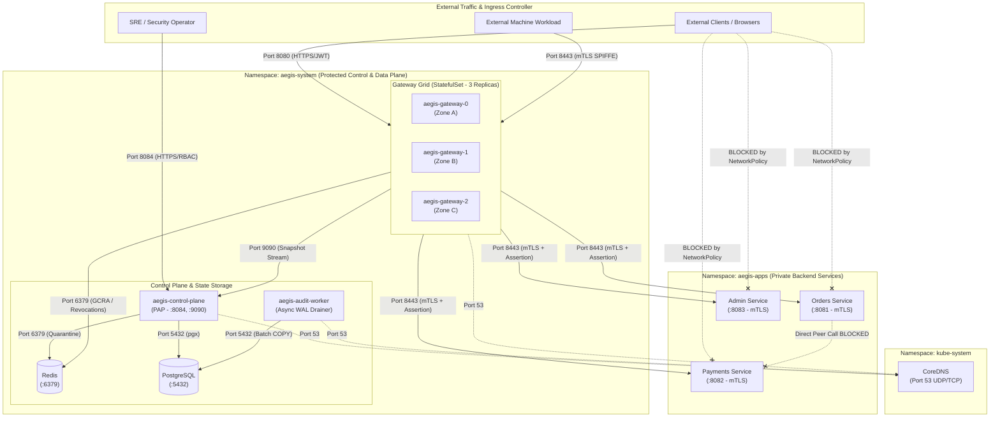
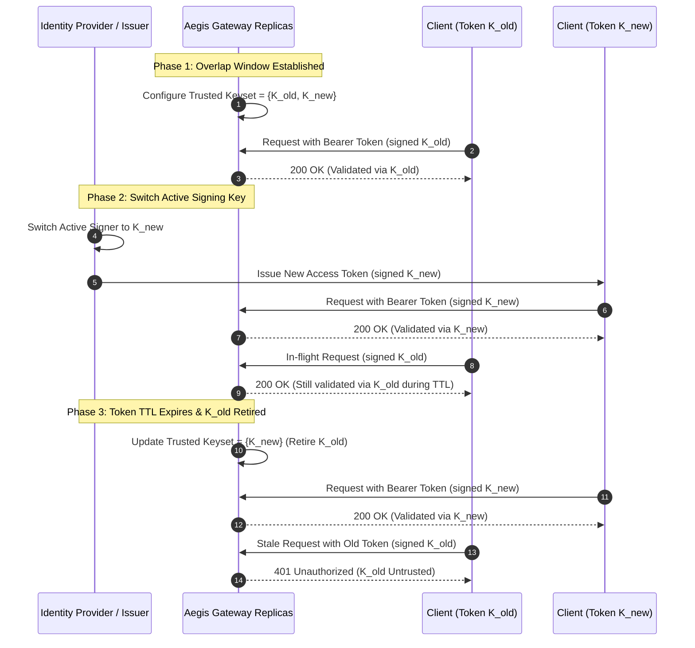
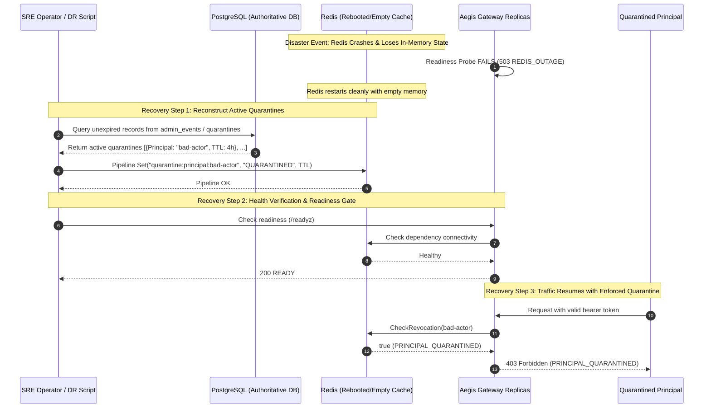

# Phase 6: Production Hardening & Operational Runbooks - Research

**Researched:** 2026-10-07  
**Domain:** Kubernetes Production Engineering, Zero-Trust Hardening, Credential Rotation, Disaster Recovery, and Operational Runbooks  
**Confidence:** HIGH  

---

<user_constraints>
## User Constraints (from PROJECT.md, REQUIREMENTS.md, and ROADMAP.md)

### Locked Decisions
- **Phase Goal:** Establish production reference manifests, automated credential and key rotation drills, disaster recovery procedures, and comprehensive operational runbooks validating all release acceptance criteria.
- **Requirements Addressed:**
  - Grounds operationalization and release gates for all v1 requirements: **GW-01 through DIST-03**.
  - Operates as the production grounding and foundation for v2 requirements: **K8S-01** (Production Kubernetes reference manifests with default-deny `NetworkPolicies` and topology spread), **ID-01** (External OIDC PKCE foundation), and **PKI-01** (Workload PKI and automated rotation foundation).
- **Mandatory Invariants:**
  - *Invariant 1 (Default-Deny Authorization):* Missing, expired, or degraded security state must never fail open.
  - *Invariant 2 (Verified Identity Only):* Ingress identity derived strictly from verified credentials; all untrusted headers stripped.
  - *Invariant 3 (Workload Certificate Authenticates, Policy Authorizes):* Dedicated workload mTLS listener (:9443 or :8443) extracts SPIFFE URI SANs; Rego policy explicitly authorizes workload role.
  - *Invariant 4 (TLS Verification Enabled Everywhere):* `InsecureSkipVerify: false` across all internal/external connections.
  - *Invariant 5 (Backend Bypass Prevention):* Backends require gateway mTLS identity and valid, short-lived signed assertion (`X-Aegis-Assertion`, $\le 15$s).
  - *Invariant 6 (Fixed Upstream Route Binding):* Routes bind deterministically to upstream services; client headers never choose target upstream.
  - *Invariant 7 (Identical Validated Path/Method):* Zero-repair path canonicalization rejects traversal (`%2f`, `..`, NUL) with HTTP 400 before policy or proxy dispatch.
  - *Invariant 8 (No Gateway Impersonation):* Reverse proxy strips all `X-Aegis-*` and forwarding headers on ingress.
  - *Invariant 9 (Atomic Monotonic Configuration):* Monotonic versioning ($N+1$), Ed25519 snapshot signing, and atomic pointer swap (`sync/atomic.Pointer`).
  - *Invariant 10 (Pre-Forward Durable Audit):* Permitted requests require durable WAL append with `fsync` before upstream forwarding; spool saturation at 90% disk capacity halts permitted admissions (HTTP 503).
  - *Invariant 11 (Management Isolation):* Port :8084 remains isolated from public ingress; requires independent operator authorization.
  - *Invariant 12 (Network Proximity Never Confers Authorization):* Shared cluster subnets or pod networks confer zero trust. All pod-to-pod communications enforce mTLS and signed assertions.

### the agent's Discretion
- **Kubernetes Resource Architecture:** Selection between `StatefulSet` with `volumeClaimTemplates` versus `Deployment` with persistent volumes for gateway replicas with local WAL spools. (*Recommendation: Provide `StatefulSet` for multi-replica independent WAL storage per pod, with standard `Deployment` alternative for shared persistent storage, fully structured using Kustomize overlays.*)
- **Manifest Validation Tooling:** Verification executed via `bitnami/kubectl:latest` container (providing `kubectl kustomize` v5.8.1 and Kubernetes schema validation) as well as automated Go manifest unit tests in `tests/manifests/manifest_test.go`.
- **Drill Test Architecture:** Pure Go automated rotation drill (`tests/rotation/rotation_test.go`) and disaster recovery drill (`tests/dr/dr_test.go`) validating end-to-end zero-downtime key rotation, Redis quarantine reconstruction, and WAL crash recovery.
- **Runbook Documentation Format:** Structured Markdown runbooks in `docs/runbooks/` with severity matrix, exact CLI commands, triage decision trees, and recovery verification procedures.

### Deferred Ideas (OUT OF SCOPE)
- Managed cloud Terraform/OpenTofu provisioning (AWS EKS / GCP GKE) -> Deferred to v2.
- Full automated SPIRE / SPIFFE server daemon sidecar injection -> Deferred to v2 (foundational pure Go PKI scripts and rotation runbooks implemented in Phase 6).
- External OIDC PKCE BFF integration (ID-01) -> Deferred to v2.
- Distributed event streaming broker (Kafka / RabbitMQ) for WAL -> Deferred to v2.
- Real-time ML anomaly scoring (RISK-01) -> Deferred to v2.
</user_constraints>

---

<architectural_responsibility_map>
## Architectural Responsibility Map

| Capability | Primary Tier | Secondary Tier | Rationale |
|------------|-------------|----------------|-----------|
| **Kubernetes Reference Manifests (K8S-01)** | Kustomize Base & Production Overlay | Gateway & Backend Pods | Establishes declaratively versioned manifests across `aegis-system` and `aegis-apps` namespaces with strict Pod Security Standards (Restricted profile). |
| **Pod Hardening & Availability Bounds** | Kubernetes API (PDB & Topology) | Gateway Daemon | Enforces `minAvailable: 2` PDB, non-root user (`runAsUser: 10001`), read-only root filesystems, and cross-zone topology spread constraints. |
| **Cluster Network Isolation & Default-Deny** | Kubernetes `NetworkPolicy` (CNI) | Reverse Proxy & Backend Middleware | Default-deny on all ingress/egress. Ingress to backends strictly limited to gateway pods on mTLS ports; egress locked down to Redis, Postgres, and CoreDNS. |
| **Zero-Downtime Credential Rotation** | Gateway & Control Plane Cryptographic Modules | Ingress JWT & Snapshot Clients | Dual-key trust window pattern allows seamless verification transition for user JWT issuer keys, Ed25519 snapshot signing keys, and mTLS Intermediate CAs without dropped requests. |
| **Disaster Recovery & State Reconstruction** | Control Plane & Storage Layer | PostgreSQL & Redis | Rebuilds active principal quarantines and JTI revocations from PostgreSQL audit logs into Redis before gateway readiness activation; restores monotonic snapshot continuity. |
| **WAL Spool Recovery & Replay** | Audit Ingestion Worker | Local Disk Spool & PostgreSQL | Tails uncommitted WAL log segments following node crashes, replaying batches with `ON CONFLICT (event_date, event_id) DO NOTHING` deduplication to guarantee zero audit loss. |
| **Incident Response & Operational Runbooks** | Site Reliability Engineering (SRE) | Control Plane Management APIs | Provides unambiguous step-by-step operational procedures for SEV-1 through SEV-4 incidents, emergency quarantines, 90% WAL saturation, and CP partitions. |
| **Production SLO Release Gate Validation** | Performance & Audit Benchmark Suite | Operator Dashboard & Telemetry | Formally verifies <2ms OPA evaluation, <20ms p99 added gateway latency at 1,000 RPS, and 100% fail-closed failure semantics prior to production sign-off. |
</architectural_responsibility_map>

---

<research_summary>
## Summary

Phase 6 grounds the complete Aegis Distributed Zero-Trust Access Gateway system in production reality. Over Phases 1 through 5, Aegis demonstrated an in-memory OPA vertical slice, workload mTLS with bypass prevention, dynamic monotonic control plane snapshot streaming, durable local WAL spooling, an operator dashboard, multi-replica distributed resilience, and sub-millisecond benchmark performance. Phase 6 operationalizes this foundation into production-grade infrastructure, automated drills, and comprehensive operator runbooks.

The standard industry approach for zero-trust production hardening encompasses four pillars:

1. **Kubernetes Production Reference Architecture (K8S-01):**
   A declarative Kustomize structure (`deployments/kubernetes/base/` and `deployments/kubernetes/overlays/production/`) dividing the architecture into two strictly isolated namespaces:
   - `aegis-system`: Gateway replicas (3 instances), Control Plane, Audit Ingestion Worker, Redis, and PostgreSQL.
   - `aegis-apps`: Private backend microservices (`orders`, `payments`, `admin`).
   All workloads adhere to the **Kubernetes Pod Security Standard (Restricted Profile)**: `runAsNonRoot: true`, `runAsUser: 10001`, `readOnlyRootFilesystem: true`, and all Linux capabilities dropped (`drop: ["ALL"]`). Availability is guarded by `PodDisruptionBudget` (`minAvailable: 2`), `topologySpreadConstraints` across zones and nodes, and multi-tier L7 probes (`/livez`, `/readyz`).
   Strict default-deny `NetworkPolicies` lock down all inter-pod traffic: backend microservices accept ingress exclusively from gateway pods over mTLS, while gateway egress is restricted to backend pods, Redis, Control Plane, and CoreDNS (port 53).

2. **Automated Credential and Key Rotation Drills:**
   Zero-downtime rotation requires a **dual-key verification window**:
   - *User JWT Issuer Key Rotation:* Gateway supports a trusted keyset $\{K_{\text{old}}, K_{\text{new}}\}$. Signer switches to $K_{\text{new}}$ while existing tokens signed by $K_{\text{old}}$ remain valid until their TTL expires, after which $K_{\text{old}}$ is retired.
   - *Snapshot Signing Key Rotation:* Gateway snapshot client verifier supports multiple trusted Ed25519 public keys. Control plane rotates its private key, publishing snapshot $N+1$ signed with $K_{\text{snap-new}}$. Gateways atomically verify and activate the new snapshot without dropping connections.
   - *Workload mTLS CA Rotation:* CA trust pools are updated to trust both old and new Intermediate CAs during workload certificate reissuance.
   All three scenarios are verified programmatically via an automated Go test suite (`tests/rotation/rotation_test.go`).

3. **Disaster Recovery Procedures and State Reconstruction:**
   In zero-trust architecture, restoring services after an infrastructure wipeout cannot compromise security state.
   - *Redis Quarantine Reconstruction:* If Redis crashes and loses state, running gateways fail closed or risk admitting banned principals. The recovery procedure reconstructs active quarantines and JTI revocations directly from PostgreSQL audit and administrative records before gateway readiness is marked healthy.
   - *PostgreSQL Point-in-Time Recovery:* Restores database schema and snapshots while reconciling monotonic version counters ($\max(N_{\text{gateway}}, M_{\text{db}}) + 1$) to prevent snapshot rejection by active gateways.
   - *WAL Spool Crash Replay:* Audit workers resume from persistent cursor checkpoints, draining uncommitted WAL segments into PostgreSQL with idempotent deduplication (`ON CONFLICT DO NOTHING`).
   Verified via automated Go DR tests (`tests/dr/dr_test.go`).

4. **Comprehensive Incident Response Runbooks & SLO Checklists:**
   Authoritative operator runbooks (`docs/runbooks/`) providing exact remediation steps for SEV-1 to SEV-4 incidents:
   - `incident-response.md`: Severity definitions, escalation paths, and rapid isolation protocols.
   - `quarantine-and-revocation.md`: Operator emergency quarantine via CLI/API and mass JTI revocation.
   - `spool-saturation-recovery.md`: Triage and recovery when the 90% WAL saturation circuit breaker trips (HTTP 503).
   - `control-plane-partition.md`: Managing severed snapshot distribution streams and the 60-second fail-closed lease boundary.
   - `production-slo-checklist.md`: Formal release sign-off checklist validating latency SLOs (<2ms OPA, <20ms p99 gateway added latency), 100% fail-closed semantics, and zero-bypass guarantees.
</research_summary>

---

<standard_stack>
## Standard Stack

### Core Technologies
| Technology | Version | Purpose | Why Standard |
|------------|---------|---------|--------------|
| **Kubernetes** | `1.31+` / `1.32+` | Container orchestration, namespace isolation, network policies, and pod lifecycle | The industry-standard container orchestration engine. Provides native `NetworkPolicy`, `PodDisruptionBudget`, `TopologySpreadConstraints`, and Pod Security Standards (Restricted profile). |
| **Kustomize** | `v5.8.1` (integrated with `kubectl`) | Declarative configuration management without templating boilerplate | Native Kubernetes configuration management. Allows clean separation between structural resource definitions (`base/`) and environment-specific constraints (`overlays/production/`) without Helm template sprawl. |
| **Go** | `1.25.5` runtime (`go 1.24+` in `go.mod`) | Implementation of rotation drills, DR tests, and manifest validation tests | Project runtime standard. High-speed compilation, native concurrency, and strict typing for automated integration drills. |
| **Docker Engine** | `29.1.3` | Local manifest validation and container execution | Allows offline syntax and schema validation of Kubernetes manifests using `bitnami/kubectl:latest` without requiring a live cloud cluster. |

### Supporting Libraries & Tools
| Library / Tool | Version | Purpose | When to Use |
|----------------|---------|---------|-------------|
| **`bitnami/kubectl`** | `latest` (`v1.37.1` client, `kustomize v5.8.1`) | Offline Kustomize compilation and dry-run validation | Executed via Docker during CI to compile and validate Kubernetes manifests without requiring cluster access. |
| **`gopkg.in/yaml.v3`** | `v3.0.1` | YAML parsing and manifest validation in Go test suites | Used in `tests/manifests/manifest_test.go` to parse generated Kustomize outputs and verify security attributes. |
| **`github.com/stretchr/testify`** | `v1.10.0` / `v1.12.1` | Unit, integration, and drill test assertions | Writing objective assertions in rotation drills (`tests/rotation/`) and disaster recovery tests (`tests/dr/`). |
| **`crypto/ed25519` & `crypto/tls`** | Go Stdlib | Cryptographic key rotation and dual-key verification | Standard library implementations providing constant-time verification and zero CGO overhead. |
| **`github.com/redis/go-redis/v9`** | `v9.22.0` | Redis client for quarantine state reconstruction | Pipelined batch restoration of active quarantine and revocation keys during disaster recovery. |
| **`github.com/jackc/pgx/v5`** | `v5.9.2` | PostgreSQL driver for state querying and audit replay | Querying historical administrative events and inserting replayed WAL events with deduplication. |

### Alternatives Considered & Rejected
| Recommended | Alternative | Tradeoff & Rationale |
|-------------|-------------|----------------------|
| **Kustomize** | Helm Charts | Helm requires complex Go template syntax (`{{ .Values... }}`), values file management, and Tiller/release tracking. Kustomize uses pure declarative YAML patches, native in `kubectl`, reducing syntax bugs and maintenance overhead. |
| **StatefulSet for Gateway Replicas** | Deployment with single ReadWriteOnce PVC | A Kubernetes `Deployment` mounting a `ReadWriteOnce` PVC cannot schedule multiple pods across different nodes due to volume multi-attach restrictions. A `StatefulSet` with `volumeClaimTemplates` provisions a dedicated `ReadWriteOnce` SSD PVC per replica (`wal-spool-aegis-gateway-0`, etc.), preserving local WAL isolation per replica. |
| **In-Cluster Redis Sentinel / Cluster** | Managed AWS ElastiCache | For reference production manifests, a hardened Redis manifest with password authentication and resource limits provides complete self-contained reproducibility; cloud deployments can point to ElastiCache via external endpoints. |
| **Dual Verification Keyset** | Instant Private Key Overwrite | Overwriting a signing key instantly invalidates all in-flight and unexpired user tokens and snapshot streams, triggering massive 401/403/503 outages. A dual-key verification window guarantees zero client disruption. |
</standard_stack>

---

<architecture_patterns>
## Architecture Patterns

### Recommended Project Directory Structure

```
Aegis/
├── deployments/
│   ├── compose/                       # Local Compose profiles (mvp, hardened, distributed)
│   └── kubernetes/                    # Production Kubernetes Reference Manifests (Plan 06-01)
│       ├── base/                      # Base resource definitions
│       │   ├── kustomization.yaml
│       │   ├── namespaces.yaml        # aegis-system & aegis-apps
│       │   ├── gateway/
│       │   │   ├── statefulset.yaml   # 3 replicas, PSS restricted, WAL volumeClaimTemplates
│       │   │   ├── service.yaml       # ClusterIP / LoadBalancer (:8080, :8443, :9091)
│       │   │   ├── pdb.yaml           # PodDisruptionBudget (minAvailable: 2)
│       │   │   ├── networkpolicy.yaml # Strict ingress/egress allowlists
│       │   │   └── configmap.yaml
│       │   ├── control-plane/
│       │   │   ├── deployment.yaml    # Control Plane daemon (:8084, :9090, :9092)
│       │   │   ├── service.yaml
│       │   │   └── networkpolicy.yaml
│       │   ├── audit-worker/
│       │   │   ├── deployment.yaml    # Background WAL drainer
│       │   │   └── networkpolicy.yaml
│       │   ├── redis/
│       │   │   ├── deployment.yaml    # Redis cache/revocation store (:6379)
│       │   │   ├── service.yaml
│       │   │   └── networkpolicy.yaml
│       │   ├── postgres/
│       │   │   ├── statefulset.yaml   # PostgreSQL 16 persistence (:5432)
│       │   │   ├── service.yaml
│       │   │   └── networkpolicy.yaml
│       │   └── backends/
│       │       ├── orders.yaml        # Orders demo service (:8081)
│       │       ├── payments.yaml      # Payments demo service (:8082)
│       │       ├── admin.yaml         # Admin demo service (:8083)
│       │       └── networkpolicy.yaml # Strict zero-direct-ingress network policy
│       └── overlays/
│           └── production/            # Production environment overlay
│               ├── kustomization.yaml
│               ├── gateway-prod.yaml  # Replicas: 3, resource requests/limits, topologySpread
│               ├── control-plane-prod.yaml
│               └── networkpolicy-prod.yaml
├── docs/
│   └── runbooks/                      # Comprehensive Operational Runbooks (Plan 06-02, 06-03)
│       ├── credential-rotation.md     # Zero-downtime JWT, snapshot key, and mTLS CA rotation
│       ├── disaster-recovery.md       # PostgreSQL PITR, Redis reconstruction, WAL crash recovery
│       ├── incident-response.md       # SEV-1 to SEV-4 severity levels, escalation, containment
│       ├── quarantine-and-revocation.md# Operator emergency quarantine & mass JTI revocation
│       ├── spool-saturation-recovery.md# Handling 90% WAL saturation events (HTTP 503)
│       ├── control-plane-partition.md # Managing severed gRPC streams & 60s lease expiry
│       └── production-slo-checklist.md# Release acceptance gates & SLO validation sign-off
└── tests/
    ├── manifests/                     # Kubernetes Manifest Validation (Plan 06-01)
    │   └── manifest_test.go
    ├── rotation/                      # Automated Credential Rotation Drills (Plan 06-02)
    │   └── rotation_test.go
    └── dr/                            # Automated Disaster Recovery Drills (Plan 06-03)
        └── dr_test.go
```

---

### System Architecture: Kubernetes Network Isolation Topology



---

### Sequence: Zero-Downtime User JWT Issuer Key Rotation



---

### Sequence: Disaster Recovery & Quarantine Reconstruction



---

</architecture_patterns>

---

<dont_hand_roll>
## Don't Hand-Roll & Common Pitfalls

### Critical Production Traps & Anti-Patterns

| Category | Dangerous Anti-Pattern | What Goes Wrong | Correct Architecture |
|----------|------------------------|-----------------|----------------------|
| **Kubernetes Storage** | Attaching a single `ReadWriteOnce` PVC to a multi-replica `Deployment` | `ReadWriteOnce` volumes can only be attached to a single node at a time. When replicas 2 and 3 are scheduled across nodes (per topology spread), pod creation hangs indefinitely with `Multi-Attach error for volume`. | Use a **`StatefulSet` with `volumeClaimTemplates`**. Each replica `gateway-0`, `gateway-1`, `gateway-2` automatically receives a dedicated local SSD PVC (`wal-spool-aegis-gateway-N`), preserving independent local WAL spools. |
| **NetworkPolicy DNS** | Omitting egress to CoreDNS (Port 53) in a default-deny NetworkPolicy | Pods cannot resolve service DNS names (`redis:6379`, `postgres:5432`, `control-plane:9090`). All outbound connections fail with `no such host`, causing total cluster failure. | Explicitly include an egress rule allowing UDP/TCP traffic on port 53 to pods matching `k8s-app: kube-dns` in namespace `kube-system`. |
| **Pod Security Context** | Enabling `readOnlyRootFilesystem: true` without mounting writable volumes for WAL or `/tmp` | Go application crashes immediately on startup when attempting to create WAL log files or temporary sockets (`open /var/log/aegis/wal: read-only file system`). | Mount explicit persistent volumes or `emptyDir` mounts for all writable directories (`/var/log/aegis/wal` on PVC, `/tmp` on `emptyDir`). |
| **Credential Rotation** | Overwriting signing keys instantly without an overlap window | In-flight client tokens, cached JWTs, and gRPC snapshot streams are rejected immediately, generating thousands of 401/403/503 errors and cascading client retries. | Establish a **dual-key verification window**: deploy the new verification key to all gateways *before* activating the new private signing key, and retain the old key until token TTL has elapsed. |
| **Disaster Recovery** | Marking gateways ready immediately after Redis restarts with empty state | Quarantined malicious principals and revoked token JTIs are unblocked during the memory cache window, creating a temporary unauthorized access bypass. | Gateways must remain unready until an automated reconstruction script queries PostgreSQL and pipeline-repopulates Redis with all active quarantines and unexpired revocations. |
| **PostgreSQL PITR** | Restoring PostgreSQL backup without reconciling snapshot version numbers | The restored PostgreSQL database contains snapshot version $M < N$ (where $N$ was active in running gateways). When the control plane streams snapshot $M$, gateways reject it with `ErrMonotonicVersionViolation`. | Control plane must query connected gateway acknowledgment versions upon reconnection and publish restored configurations with version $\max(N_{\text{gateway}}, M_{\text{db}}) + 1$. |
| **Readiness Probes** | Implementing `/readyz` as a static HTTP 200 check | Load balancer routes traffic to gateway replicas that have expired snapshot leases (>60s), saturated WAL spools (>90%), or disconnected dependencies, dropping user requests with 503. | Readiness probe `/readyz` must dynamically evaluate: (1) not draining, (2) snapshot loaded, (3) lease fresh ($\le 60$s), and (4) WAL spool $< 90\%$ capacity. |

---

### "Looks Done But Isn't" Checklist

- [ ] **Kubernetes NetworkPolicy Isolation:** Manifests include default-deny policies, but is egress to CoreDNS explicitly permitted? (Verify DNS resolution passes).
- [ ] **Read-Only Root Filesystem:** Pod security context sets `readOnlyRootFilesystem: true`, but does the container have writable mounts for `/tmp` and `/var/log/aegis/wal`?
- [ ] **Dual-Key JWT Keyset:** `TokenValidator` accepts multiple public keys, but does it verify signatures against each key in the keyset without returning early on the first key mismatch?
- [ ] **Snapshot Verifier Dual-Key Support:** `snapshot.Verifier` verifies both snapshot envelopes AND 10-second freshness leases against the active or secondary trusted Ed25519 public key.
- [ ] **Redis Quarantine Reconstruction:** Does the reconstruction script restore keys with their original *remaining* TTL, rather than resetting TTL to 24 hours?
- [ ] **WAL Replay Deduplication:** Does audit worker replay handle duplicate WAL entries without failing the batch transaction? (Must use `ON CONFLICT (event_date, event_id) DO NOTHING`).
- [ ] **PodDisruptionBudget Validation:** Does `minAvailable: 2` allow cluster nodes to be drained one at a time while maintaining healthy ingress quorum?

</dont_hand_roll>

---

<code_examples>
## Code Examples & Implementation Blueprints

### 1. Dual-Key JWT Token Validator Pattern (`internal/identity/jwt.go`)

```go
// TokenValidator enforces RFC 8725 JWT validation with support for a multi-key trusted keyset.
type TokenValidator struct {
	issuer       string
	audience     string
	publicKeys   []crypto.PublicKey // Trusted keyset for zero-downtime rotation
	allowedAlgos []string
	mu           sync.RWMutex
}

// NewTokenValidator initializes a TokenValidator with one or more trusted public keys.
func NewTokenValidator(issuer, audience string, publicKeys ...crypto.PublicKey) *TokenValidator {
	return &TokenValidator{
		issuer:       issuer,
		audience:     audience,
		publicKeys:   publicKeys,
		allowedAlgos: []string{"EdDSA", "RS256", "ES256"},
	}
}

// AddPublicKey adds a newly issued public key to the trusted keyset (Phase 1 of rotation).
func (v *TokenValidator) AddPublicKey(pubKey crypto.PublicKey) {
	v.mu.Lock()
	defer v.mu.Unlock()
	v.publicKeys = append(v.publicKeys, pubKey)
}

// SetPublicKeys atomically replaces the trusted keyset (Phase 3 of rotation: retirement).
func (v *TokenValidator) SetPublicKeys(keys []crypto.PublicKey) {
	v.mu.Lock()
	defer v.mu.Unlock()
	v.publicKeys = keys
}

// ValidateBearerToken validates an incoming Authorization header against any trusted key.
func (v *TokenValidator) ValidateBearerToken(authHeader string) (*UserClaims, error) {
	if !strings.HasPrefix(authHeader, "Bearer ") {
		return nil, ErrMissingAuthHeader
	}
	tokenStr := strings.TrimSpace(strings.TrimPrefix(authHeader, "Bearer "))
	if tokenStr == "" {
		return nil, ErrMissingAuthHeader
	}

	v.mu.RLock()
	keys := make([]crypto.PublicKey, len(v.publicKeys))
	copy(keys, v.publicKeys)
	v.mu.RUnlock()

	var lastErr error
	for _, key := range keys {
		claims := &UserClaims{}
		token, err := jwt.ParseWithClaims(tokenStr, claims, func(token *jwt.Token) (interface{}, error) {
			validMethod := false
			for _, algo := range v.allowedAlgos {
				if token.Method.Alg() == algo {
					validMethod = true
					break
				}
			}
			if !validMethod {
				return nil, fmt.Errorf("%w: %s", ErrInvalidAlgorithm, token.Method.Alg())
			}
			return key, nil
		},
			jwt.WithIssuer(v.issuer),
			jwt.WithAudience(v.audience),
			jwt.WithLeeway(30*time.Second),
		)

		if err == nil && token.Valid && claims.Subject != "" {
			return claims, nil // Successfully validated with this key in the keyset
		}
		lastErr = err
	}

	if lastErr != nil {
		if errors.Is(lastErr, jwt.ErrTokenExpired) {
			return nil, fmt.Errorf("%w: %w", ErrTokenExpired, lastErr)
		}
		return nil, fmt.Errorf("%w: %w", ErrInvalidClaims, lastErr)
	}
	return nil, ErrInvalidClaims
}
```

---

### 2. Multi-Key Snapshot Verifier Pattern (`internal/snapshot/verifier.go`)

```go
// Verifier verifies snapshot envelopes and freshness leases using one or more trusted Ed25519 public keys.
type Verifier struct {
	trustedKeys []ed25519.PublicKey
	mu          sync.RWMutex
}

// NewVerifier creates a new Verifier initialized with a primary trusted Ed25519 public key.
func NewVerifier(pubKey ed25519.PublicKey) *Verifier {
	return &Verifier{
		trustedKeys: []ed25519.PublicKey{pubKey},
	}
}

// AddTrustedKey appends an additional trusted public key during zero-downtime key rotation.
func (v *Verifier) AddTrustedKey(pubKey ed25519.PublicKey) {
	v.mu.Lock()
	defer v.mu.Unlock()
	v.trustedKeys = append(v.trustedKeys, pubKey)
}

// VerifySnapshot validates monotonic version, checksum, and signature against any trusted key.
func (v *Verifier) VerifySnapshot(env *snapshotv1.SnapshotEnvelope, currentVersion int64) (*snapshotv1.SnapshotPayload, error) {
	if env == nil {
		return nil, errors.New("cannot verify nil snapshot envelope")
	}
	if env.Version <= currentVersion {
		return nil, fmt.Errorf("%w: received version %d <= active version %d", ErrMonotonicVersionViolation, env.Version, currentVersion)
	}

	sum := sha256.Sum256(env.Payload)
	computedDigest := hex.EncodeToString(sum[:])
	if env.PayloadSha256 != computedDigest {
		return nil, fmt.Errorf("%w: expected %s, got %s", ErrChecksumMismatch, env.PayloadSha256, computedDigest)
	}

	v.mu.RLock()
	keys := make([]ed25519.PublicKey, len(v.trustedKeys))
	copy(keys, v.trustedKeys)
	v.mu.RUnlock()

	validSig := false
	for _, key := range keys {
		if ed25519.Verify(key, []byte(env.PayloadSha256), env.Signature) {
			validSig = true
			break
		}
	}
	if !validSig {
		return nil, ErrInvalidSignature
	}

	var payload snapshotv1.SnapshotPayload
	if err := proto.Unmarshal(env.Payload, &payload); err != nil {
		return nil, fmt.Errorf("failed to unmarshal snapshot payload: %w", err)
	}
	if payload.Version != env.Version {
		return nil, fmt.Errorf("payload version %d does not match envelope version %d", payload.Version, env.Version)
	}

	return &payload, nil
}
```

---

### 3. Redis Quarantine State Reconstruction Helper (`internal/revocation/store.go`)

```go
// ReconstructQuarantines pipeline-inserts an entire slice of quarantined principals into Redis.
// Used during Disaster Recovery to restore security state before marking gateway readiness healthy.
func (s *Store) ReconstructQuarantines(ctx context.Context, principals []QuarantinedPrincipal) error {
	if len(principals) == 0 {
		return nil
	}
	ctx, cancel := context.WithTimeout(ctx, 2*time.Second)
	defer cancel()

	pipe := s.client.Pipeline()
	for _, p := range principals {
		ttl := p.TTL
		if ttl <= 0 {
			ttl = 24 * time.Hour
		}
		key := "quarantine:principal:" + p.PrincipalID
		reason := p.Reason
		if reason == "" {
			reason = "DISASTER_RECOVERY_RECONSTRUCTED"
		}
		pipe.Set(ctx, key, reason, ttl)
	}

	_, err := pipe.Exec(ctx)
	if err != nil {
		return fmt.Errorf("failed to reconstruct quarantine state in Redis: %w", err)
	}
	return nil
}
```

---

### 4. Kubernetes Gateway StatefulSet & Pod Security Context (`deployments/kubernetes/base/gateway/statefulset.yaml`)

```yaml
apiVersion: apps/v1
kind: StatefulSet
metadata:
  name: aegis-gateway
  namespace: aegis-system
  labels:
    app: aegis-gateway
spec:
  serviceName: aegis-gateway
  replicas: 3
  selector:
    matchLabels:
      app: aegis-gateway
  template:
    metadata:
      labels:
        app: aegis-gateway
    spec:
      securityContext:
        runAsNonRoot: true
        runAsUser: 10001
        runAsGroup: 10001
        fsGroup: 10001
        seccompProfile:
          type: RuntimeDefault
      containers:
        - name: gateway
          image: aegis/gateway:latest
          imagePullPolicy: IfNotPresent
          securityContext:
            allowPrivilegeEscalation: false
            readOnlyRootFilesystem: true
            capabilities:
              drop:
                - ALL
          ports:
            - containerPort: 8080
              name: http-user
            - containerPort: 8443
              name: mtls-workload
            - containerPort: 9091
              name: metrics
          resources:
            requests:
              cpu: 250m
              memory: 256Mi
            limits:
              cpu: 1000m
              memory: 512Mi
          startupProbe:
            httpGet:
              path: /livez
              port: 8080
            initialDelaySeconds: 1
            periodSeconds: 2
            failureThreshold: 30
          livenessProbe:
            httpGet:
              path: /livez
              port: 8080
            periodSeconds: 10
            failureThreshold: 3
          readinessProbe:
            httpGet:
              path: /readyz
              port: 8080
            periodSeconds: 5
            failureThreshold: 1
          volumeMounts:
            - name: wal-spool
              mountPath: /var/log/aegis/wal
            - name: tmp
              mountPath: /tmp
      volumes:
        - name: tmp
          emptyDir: {}
  volumeClaimTemplates:
    - metadata:
        name: wal-spool
      spec:
        accessModes: ["ReadWriteOnce"]
        resources:
          requests:
            storage: 2Gi
```

---

### 5. Kubernetes Default-Deny & Isolation NetworkPolicy (`deployments/kubernetes/base/gateway/networkpolicy.yaml`)

```yaml
apiVersion: networking.k8s.io/v1
kind: NetworkPolicy
metadata:
  name: aegis-gateway-networkpolicy
  namespace: aegis-system
spec:
  podSelector:
    matchLabels:
      app: aegis-gateway
  policyTypes:
    - Ingress
    - Egress
  ingress:
    # 1. Allow public user traffic on :8080
    - from: []
      ports:
        - protocol: TCP
          port: 8080
    # 2. Allow internal workload mTLS on :8443 (from aegis-apps namespace)
    - from:
        - namespaceSelector:
            matchLabels:
              kubernetes.io/metadata.name: aegis-apps
      ports:
        - protocol: TCP
          port: 8443
  egress:
    # 1. Allow mTLS forwarding to backend services in aegis-apps on :8443
    - to:
        - namespaceSelector:
            matchLabels:
              kubernetes.io/metadata.name: aegis-apps
      ports:
        - protocol: TCP
          port: 8443
    # 2. Allow Redis communication on :6379 in aegis-system
    - to:
        - podSelector:
            matchLabels:
              app: redis
      ports:
        - protocol: TCP
          port: 6379
    # 3. Allow gRPC snapshot stream to Control Plane on :9090 in aegis-system
    - to:
        - podSelector:
            matchLabels:
              app: aegis-control-plane
      ports:
        - protocol: TCP
          port: 9090
    # 4. Mandatory CoreDNS egress on port 53 UDP/TCP in kube-system
    - to:
        - namespaceSelector:
            matchLabels:
              kubernetes.io/metadata.name: kube-system
          podSelector:
            matchLabels:
              k8s-app: kube-dns
      ports:
        - protocol: UDP
          port: 53
        - protocol: TCP
          port: 53
```

---

</code_examples>

---

<environment_availability>
## Environment Availability

- **Go Runtime:** Go 1.25.5 available at `/usr/local/go/bin/go`. Fully supports standard library crypto, networking, testing, and race detector.
- **Docker Engine:** Docker 29.1.3 active and functional on host.
- **Kubernetes Tooling Image:** `bitnami/kubectl:latest` cached locally, containing `kubectl` client v1.37.1 and `kustomize` v5.8.1.
  - Manifest dry-run command:
    ```bash
    docker run --rm -v $(pwd):/work -w /work bitnami/kubectl:latest kustomize build deployments/kubernetes/overlays/production
    ```
- **Existing Test Infrastructure:** Full suite of unit, security, integration, and chaos tests passes cleanly in `tests/` in under 0.1s.

</environment_availability>

---

<validation_architecture>
## Validation Architecture

### Task-Level Requirement Verification Map

| Task / Component | Verification Scope | Automated Verification Method | Exit Criteria |
|------------------|-------------------|--------------------------------|---------------|
| **Plan 06-01: Kubernetes Production Manifests (K8S-01)** | Kustomize compilation, PSS compliance, NetworkPolicy isolation, PDB, and probes | Go test `tests/manifests/manifest_test.go` and `kubectl kustomize build` | Manifests compile cleanly; all pods enforce non-root (10001), read-only root FS, dropped capabilities, PDB (`minAvailable: 2`), and default-deny policies. |
| **Plan 06-02: Security Audit & Invariant Review** | Formal checklist covering 12 mandatory security invariants and threat model mappings | `opa test policies/ -v` and `go test -v ./tests/security/...` | All 12 security invariants mapped to active passing tests; 100% negative fuzz tests pass. |
| **Plan 06-02: Zero-Downtime Credential Rotation Drill** | Dual-key verification window for User JWTs, Snapshot Ed25519 keys, and Workload mTLS CAs | Go test `tests/rotation/rotation_test.go` and `docs/runbooks/credential-rotation.md` | Zero request drops or 401 errors during key rotation; old keys rejected after overlap window. |
| **Plan 06-03: Disaster Recovery Drills** | PostgreSQL PITR version continuity, Redis quarantine state reconstruction, and WAL crash replay | Go test `tests/dr/dr_test.go` and `docs/runbooks/disaster-recovery.md` | Redis flushall reconstructed from DB; WAL records replayed after crash with zero event loss; version monotonicity preserved. |
| **Plan 06-03: Comprehensive Operational Runbooks** | Incident response, emergency quarantine, 90% WAL saturation, CP partition, and SLO checklist | Documentation review against `docs/runbooks/*.md` | All 7 runbooks established with severity levels, exact CLI commands, triage procedures, and SLO gates. |

---

### Verification Commands

```bash
# 1. Quick Unit & Security Suite (<5 seconds)
go test -v -race ./internal/identity/... ./internal/snapshot/... ./tests/security/...

# 2. Manifest Validation & Kustomize Dry-Run
docker run --rm -v $(pwd):/work -w /work bitnami/kubectl:latest kustomize build deployments/kubernetes/overlays/production
go test -v ./tests/manifests/...

# 3. Automated Credential Rotation Drill Suite
go test -v -race ./tests/rotation/...

# 4. Automated Disaster Recovery Drill Suite
go test -v -race ./tests/dr/...

# 5. Full System Verification Suite
go test -v -race ./internal/... ./tests/...
```

---

</validation_architecture>

---

<security_domain>
## Security Domain & Threat Model

### Applicable OWASP ASVS v4.0.3 / v5 Categories
- **V1 (Architecture, Design & Threat Modeling):** Multi-tier trust boundary verification (TB-1 through TB-7); explicit default-deny across network and policy layers; documented STRIDE threat mitigations.
- **V2 (Authentication Verification):** Pinned algorithm allowlists (`EdDSA`, `RS256`, `ES256`); strict rejection of `alg: none`; dual-key verification window preventing authentication outages during key rotation.
- **V4 (Access Control Verification):** Default-deny Rego evaluation; principal quarantine and JTI revocation active within 5 seconds; zero-bypass backend enforcement.
- **V9 (Communications Verification):** Strict mTLS everywhere (`InsecureSkipVerify: false`); URI SAN SPIFFE validation (`spiffe://aegis.local/...`); short-lived signed assertions ($\le 15$s).
- **V14 (Configuration & Infrastructure Verification):** Kubernetes Pod Security Standards (Restricted profile); non-root execution (`runAsUser: 10001`); read-only root filesystems; all Linux capabilities dropped (`drop: ["ALL"]`); default-deny NetworkPolicies on all namespaces.

---

### STRIDE Production Hardening & Operational Threat Model

| STRIDE Category | Production Threat Scenario | Mitigation Architecture & Runbook Gate |
|-----------------|----------------------------|-----------------------------------------|
| **Spoofing (S)** | Attacker exploits old compromised JWT signing key after rotation. | Runbook `credential-rotation.md`: Strict overlap TTL window. Old public key removed from gateway keyset immediately following token expiry. |
| **Tampering (T)** | Restored PostgreSQL database contains stale snapshot version $M < N$, causing split-brain. | Runbook `disaster-recovery.md`: Control plane queries active gateway fleet versions upon reconnection, publishing next snapshot as $\max(N, M) + 1$. |
| **Repudiation (R)** | Gateway node killed abruptly before audit worker drains local WAL spool to database. | Runbook `disaster-recovery.md`: Worker resumes from persistent `cursor.json`, reading unflushed `.wal` records and inserting with `ON CONFLICT DO NOTHING` deduplication. |
| **Information Disclosure (I)** | Container breakout or unauthorized read access to gateway root filesystem. | Kubernetes Hardening: `readOnlyRootFilesystem: true`, non-root user `10001`, dropped capabilities (`ALL`), and restrictive file permissions (`0600`/`0644`). |
| **Denial of Service (D)** | Node maintenance drains 2 gateway replicas simultaneously, causing traffic overload. | Kubernetes Availability: `PodDisruptionBudget` enforces `minAvailable: 2` out of 3 replicas; cross-zone `topologySpreadConstraints` prevent single-zone failure. |
| **Elevation of Privilege (E)** | Redis crashes; banned principal attempts access during cache downtime. | Disaster Recovery: Gateways fail closed (503 `DEPENDENCY_OUTAGE_REDIS`). Gateway readiness probe remains unready until Redis active quarantine state is reconstructed from PostgreSQL. |

---

</security_domain>

---

<sources_and_metadata>
## Sources & Metadata

- **Kubernetes Documentation (v1.31+)**: Pod Security Standards (Restricted Profile), NetworkPolicies, PodDisruptionBudgets, and TopologySpreadConstraints.
- **Kustomize Documentation**: Declarative overlay management and resource patching.
- **NIST SP 800-207**: Zero Trust Architecture (Section 3: Zero Trust Core Architecture & Continuous Verification).
- **RFC 8725**: JSON Web Token Best Current Practices (Section 2.1: Key Rotation & Keyset Management).
- **OWASP Application Security Verification Standard (ASVS) v4.0.3**: Categories V1, V2, V4, V9, V14.
- **CIS Kubernetes Benchmark v1.8**: Pod security controls, network isolation, and non-root execution rules.
- **Aegis Architecture Decision Records**: ADR-0001 through ADR-0006.
- **Aegis Zero-Trust Threat Model**: `docs/threat-model/threat-model.md`.
</sources_and_metadata>
