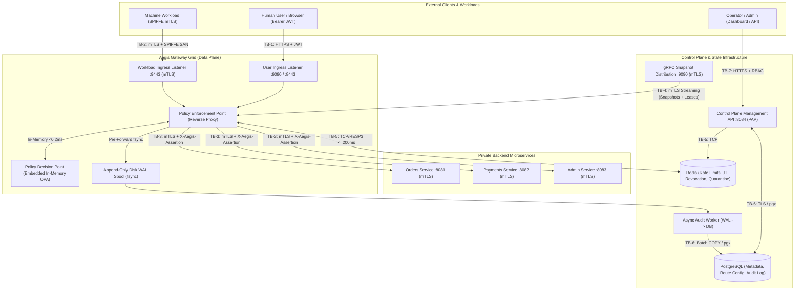

# Aegis — Zero-Trust Threat Model & Invariant Verification Matrix

## 1. System Overview & Architecture Model

Aegis is an independently designed, cloud-native distributed zero-trust access gateway and control plane in Go. It operates according to the principles of **NIST SP 800-207 (Zero Trust Architecture)**, enforcing continuous verification, explicit identity assertion, and fail-closed security for private backend microservices without requiring an external service mesh.

### Core Architectural Roles (NIST SP 800-207 Mapping)
* **Policy Enforcement Point (PEP)**: Aegis Gateway reverse proxy instances. Terminates client TLS, scrubs untrusted headers, canonicalizes paths without auto-repair, requests policy decisions, verifies Redis revocation state, writes pre-forward audit WAL, and forwards requests to backends with signed assertion tokens over mutual TLS.
* **Policy Decision Point (PDP)**: Embedded OPA engine (`github.com/open-policy-agent/opa/v1/rego`) running in-memory inside the gateway process. Evaluates strictly typed request attributes against compiled Rego v1 policies in <0.2ms with zero network hops.
* **Policy Administration Point (PAP)**: Aegis Control Plane. Manages route definitions, role mappings, and policy modules in PostgreSQL, validates configurations, signs monotonic snapshots with Ed25519, streams snapshots and 10s freshness leases to gateways via gRPC, and coordinates emergency quarantines via Redis.

---

## 2. Trust Boundaries & Data Flows

Aegis explicitly defines **7 distinct Trust Boundaries (TB-1 through TB-7)** across data and control planes:

| Trust Boundary | Name | Protocol | Direction | Authentication & Integrity Mechanism | Data Sensitivity | Primary Threat Profile |
|---|---|---|---|---|---|---|
| **TB-1** | External Client to Gateway User Ingress | HTTPS (HTTP/1.1, HTTP/2) | External -> Gateway (:8080/:8443) | Server TLS; RFC 8725 Bearer JWT (`RS256`, `ES256`, `EdDSA`); Redis JTI revocation check | Medium / High (User credentials, request payload) | Spoofed `X-Forwarded-*` headers, JWT algorithm confusion, replay of revoked tokens |
| **TB-2** | Workload Client to Gateway Workload Ingress | mTLS (TLS 1.3 preferred) | Workload -> Gateway (:9443) | Mutual TLS; mandatory client cert with SPIFFE ID in SAN URI (`spiffe://aegis.local/...`); Workload CA verification | High (Internal service communication) | Forged SPIFFE SAN, expired workload cert, client bypassing CA verification |
| **TB-3** | Gateway to Backend Microservices | Private mTLS + HTTP | Gateway -> Backend (:8081, :8082, :8083) | Gateway client cert verified by backend; short-lived (<=15s) Ed25519 signed JWT assertion (`X-Aegis-Assertion`, `iss: aegis-gateway`) | High (Target business logic & data) | Direct bypass from adjacent network containers, assertion token replay |
| **TB-4** | Control Plane to Gateway Replicas | gRPC over HTTP/2 | Control Plane <-> Gateway (:9090) | Mutual TLS; Ed25519 digital signature over snapshot payload SHA-256; monotonic version check; 10s signed freshness leases | Critical (Route catalogs, Rego policies, auth rules) | Rollback attacks, configuration tampering, split-brain operation on stale policy |
| **TB-5** | Gateway to Redis | TCP (RESP3 protocol) | Gateway <-> Redis (:6379) | Password / TLS auth; atomic single-roundtrip Lua scripts (GCRA); rigid 200ms timeout context | High (Revocation index, rate limit counters, quarantine state) | Cache exhaustion, denial of service to force fail-open, poisoning quarantine index |
| **TB-6** | Gateway & Audit Worker to PostgreSQL | TCP (PostgreSQL 16 binary wire) | Control Plane / Worker -> PostgreSQL (:5432) | SCRAM-SHA-256; TLS; dedicated least-privilege DB credentials | High / Critical (Policy persistence, audit history) | SQL injection, audit tampering, connection starvation on proxy path |
| **TB-7** | Operator to Control Plane REST / Dashboard | HTTPS (REST JSON) | Operator -> Control Plane (:8084) | Bearer JWT with `admin` scope; optimistic concurrency ETag (`If-Match`); idempotency keys | Critical (Administrative control of system) | CSRF, broken access control, concurrent configuration overwrite |

---

## 3. Threat Actors & Attacker Capabilities

### Defined Threat Actors
1. **Actor 1: External Unauthenticated Adversary (Internet / Edge)**
   - Capabilities: Sends arbitrary HTTP requests, malformed paths with traversal sequences (`..`, `%2f`, `%00`), forged headers (`X-Aegis-*`, `X-Forwarded-For`), expired or manipulated JWT tokens (`alg: none`, forged signatures), and volumetric traffic floods.
   - Goals: Gain unauthorized access to private backend microservices; bypass authentication; trigger denial of service.
2. **Actor 2: Authenticated Normal User (Valid Token, Restricted Role)**
   - Capabilities: Possesses valid, unexpired JWT with low-privilege roles (e.g. `developer`). Issues API calls within granted scope.
   - Goals: Elevate privileges horizontally or vertically (e.g. access `/api/admin/users`); bypass rate limits; evade audit logging.
3. **Actor 3: Compromised Internal Workload / Malicious Container**
   - Capabilities: Runs inside the internal container network (Docker bridge or K8s pod). Has network access to peer microservice IP addresses and ports. May possess a valid or expired workload certificate.
   - Goals: Bypass gateway PEP entirely (direct bypass); forge gateway assertions; replay stolen assertion tokens; tamper with audit spool.
4. **Actor 4: Malicious Network Adversary (Man-in-the-Middle / Partition)**
   - Capabilities: Can observe, drop, delay, or replay packets on the internal network. Can simulate network partitions between gateway replicas and the control plane or Redis.
   - Goals: Induce split-brain; force gateways to evaluate stale policy; exploit fail-open behavior during dependency outages.

### Explicit Out-of-Scope Risks
* Physical host hardware compromise or hypervisor escape.
* Root compromise of the gateway host operating system kernel.
* Compromise of the Root Certificate Authority (CA) private key (assumed protected via secure offline HSM / KMS).

---

## 4. Comprehensive STRIDE Threat Analysis

| Threat Category | Specific Threat Scenario | Trust Boundary | Primary Architectural Mitigation | Failure Semantics | Verification Mechanism |
|---|---|---|---|---|---|
| **Spoofing (S)** | Ingress caller supplies fabricated `X-Aegis-User`, `X-Aegis-Roles`, or `Forwarded` headers to spoof identity. | TB-1, TB-2 | Modern Go `Rewrite` hook unconditionally strips all `X-Aegis-*` and forwarding headers on ingress; identity is reconstructed exclusively from verified JWT or client certificate. | Reject forged headers; evaluate only verified claims. | Integration test injecting forged `X-Aegis-User` and verifying upstream backend receives stripped/minted values only. |
| **Spoofing (S)** | External caller attempts JWT algorithm confusion (`alg: none`, HMAC with public key). | TB-1 | JWT parser enforces strict pinned algorithm allowlist (`RS256`, `ES256`, `EdDSA`). Rejects unsigned or mismatched algorithms. | Returns **HTTP 401 Unauthorized**. | Test suite evaluating token with `alg: none` and invalid signatures. |
| **Spoofing (S)** | Rogue workload connects to backend directly, claiming to be the gateway. | TB-3 | Backends enforce mTLS and verify gateway SPIFFE identity (`spiffe://aegis.local/ns/gateway/sa/aegis-gateway`) and Ed25519 signature on `X-Aegis-Assertion`. | Backend terminates TLS handshake or returns **HTTP 403 Forbidden**. | Bypass test connecting directly to backend port from test container. |
| **Tampering (T)** | Path traversal (`..`, `%2f`, `%5c`, `//`, `%00`) bypasses route matching and accesses unauthorized upstream paths. | TB-1, TB-2 | Zero-repair path canonicalization immediately rejects malformed path bytes with **HTTP 400 Bad Request** before OPA or proxy dispatch. Upstream receives exact validated bytes. | Returns **HTTP 400 Bad Request**. No auto-repair. | Path fuzzing and negative security test suite with dot segments and encoded separators. |
| **Tampering (T)** | Attacker replays an older configuration snapshot with revoked permissions during a control-plane update. | TB-4 | Gateways enforce strictly increasing monotonic integer version check (`version > current_version`) and Ed25519 envelope signature. | Rejects snapshot; keeps active configuration; sends negative ack (`ACK_STATUS_REJECTED`). | Integration test streaming snapshot version `N-1`. |
| **Tampering (T)** | Stolen `X-Aegis-Assertion` token replayed against another backend service. | TB-3 | Assertion tokens are strictly audience-bound (`aud: <target-backend>`) and short-lived (`exp: <= 15s`). | Target backend rejects token due to audience mismatch or expiry (**HTTP 401/403**). | Test forwarding orders assertion token to admin backend. |
| **Repudiation (R)** | Permitted financial mutation (`POST /api/payments`) succeeds on backend, but gateway crashes before logging the event. | TB-3, TB-6 | Pre-forward disk Write-Ahead Log (WAL) append with synchronous `os.File.Sync()` (`fsync`) before upstream network dispatch. | If WAL write or `fsync` fails, upstream is never dispatched; client receives **HTTP 500/503**. | Fault injection test crashing DB or killing process before proxy forward. |
| **Information Disclosure (I)** | Ingress error responses leak internal backend stack traces, private IPs, or database schema errors. | TB-1 | Gateway intercepts upstream error statuses and formats responses as sanitized RFC 7807 problem details without internal stack traces. | Sanitized JSON error returned to caller. | Negative test triggering upstream 500 and inspecting response body. |
| **Information Disclosure (I)** | Observability telemetry exposes sensitive principal identifiers, passwords, or PII. | TB-1, TB-7 | Prometheus metric labels are bounded to static low-cardinality sets (`route`, `status_code`, `method`). Principal IDs and PII are strictly excluded from metric labels. | Metrics export checked for cardinal labels. | Linter / test asserting metric label definitions. |
| **Denial of Service (D)** | Redis revocation store or rate limiter suffers outage or network partition. | TB-5 | Redis calls execute under a strict 200ms context deadline. If Redis fails or times out, the gateway **fails closed** immediately. | Returns **HTTP 503 Service Unavailable** (`DEPENDENCY_OUTAGE_REDIS`). | Chaos test severing Redis network and verifying 503 responses. |
| **Denial of Service (D)** | Local audit spool volume fills up due to prolonged database outage or disk exhaustion. | Local Spool | Gateway monitors spool volume capacity. If disk reaches **90% capacity**, admission circuit breaker halts new requests. | Halts admission with **HTTP 503 Service Unavailable**. Never drops audit events. | Disk saturation test verifying gateway 503 behavior at 90% threshold. |
| **Elevation of Privilege (E)** | Partitioned gateway replica continues authorizing traffic against stale policy indefinitely. | TB-4 | Control plane issues 10-second signed freshness leases. If a gateway receives no valid lease for >60 seconds, it drops readiness and fails closed. | Drops readiness; returns **HTTP 503 Service Unavailable** on protected routes. | Partition drill severing gRPC stream for 65 seconds and testing route access. |
| **Elevation of Privilege (E)** | Unmapped route accessed without explicit policy definition, defaulting to permit. | TB-1, TB-2 | OPA Rego policy enforces `default allow := false` and `default reason_code := "DENIED_DEFAULT"`. | Returns **HTTP 403 Forbidden**. | Test accessing unmapped route (`GET /api/unknown`). |

---

## 5. Non-Negotiable Security Invariant Verification Matrix

Every one of the 12 non-negotiable security invariants mandated by `spec.md` §3 is mapped below to its formal architectural enforcement mechanism, threat mitigation, failure semantics, and verifiable automated test command:

| Invariant ID | Formal Invariant Statement | Architectural Enforcement Mechanism | Threat Mitigated | Failure Semantics | Automated Verification Mechanism |
|---|---|---|---|---|---|
| **Invariant 1** | **Default deny across all routes** | Rego policy specifies `default allow := false` and `default reason_code := "DENIED_DEFAULT"`. Unmapped routes or policy evaluation errors fail closed. | Elevation of Privilege (E) | Returns **HTTP 403 Forbidden** with `DENIED_DEFAULT`. | `opa test policies/ -v` testing unmapped routes; integration test `curl /api/unmapped -> 403`. |
| **Invariant 2** | **Verified identity only** | Ingress identity is derived exclusively from cryptographically verified Bearer JWTs (user listener) or verified client cert SPIFFE SANs (workload listener). Untrusted headers stripped. | Spoofing (S) | Missing or invalid credential returns **HTTP 401 Unauthorized**. | Negative test sending `X-User: admin` without JWT; verifying 401 response and zero header trust. |
| **Invariant 3** | **Workload cert authenticates, policy authorizes** | Workload listener authenticates identity via SPIFFE URI in client cert SAN; embedded OPA policy explicitly evaluates permissions for that workload ID. | Elevation of Privilege (E) | Valid certificate without matching policy rule returns **HTTP 403 Forbidden**. | Test workload cert `spiffe://aegis.local/ns/default/sa/orders` attempting to access `/api/admin/users` -> 403. |
| **Invariant 4** | **TLS verification enabled everywhere** | All internal and external TLS configurations enforce `InsecureSkipVerify: false`. Certificates verified against designated Root and Intermediate CAs. | Spoofing (S), Tampering (T) | Invalid or self-signed certificate immediately halts TLS handshake; proxy returns **HTTP 502 Bad Gateway**. | Test pointing gateway upstream to untrusted self-signed backend; verifying handshake failure and 502. |
| **Invariant 5** | **Backends accept only gateway client identity + assertion** | Backend microservices configure mTLS requiring gateway SPIFFE identity AND validate short-lived (`exp: <= 15s`) `X-Aegis-Assertion` signed by gateway. | Spoofing (S), Direct Bypass | Direct calls or calls without valid assertion return **HTTP 401/403** or connection drop. | Test issuing curl directly to backend port `:8081` bypassing gateway; verifying rejection. |
| **Invariant 6** | **Route identifies upstream; headers never choose upstream** | Route configuration binds paths strictly to declared cluster upstreams. Client `Host`, `X-Forwarded-Host`, or routing headers are ignored for dispatch. | Tampering (T), SSRF | Unmatched routes return **HTTP 404 / 403**. | Test sending `Host: attacker.com` to `/api/orders`; verifying dispatch reaches configured `orders` upstream only. |
| **Invariant 7** | **Policy and proxy use identical validated path/method & snapshot** | Zero-repair path canonicalization runs before both OPA and proxy dispatch. PDP and proxy evaluate identical byte sequences and snapshot pointer. | Tampering (T), Path Traversal | Malformed paths (`..`, `%2f`, `%00`) return **HTTP 400 Bad Request**. No path repair. | Fuzz test with `/api/orders/..%2fadmin`; verifying HTTP 400 rejection with zero upstream dispatch. |
| **Invariant 8** | **No incoming header impersonates gateway** | Reverse proxy `Rewrite` hook unconditionally strips all incoming `X-Aegis-*` headers and standard forwarding headers. | Spoofing (S) | Stripped unconditionally before application processing; minted values replace them. | Test injecting `X-Aegis-Assertion: forged`; verifying upstream receives valid gateway assertion or stripped header. |
| **Invariant 9** | **Configuration activation is atomic; monotonic versioning** | Snapshots are signed with Ed25519 and validated out-of-band; activation swaps an immutable pointer atomically (`sync/atomic.Pointer`). Versions strictly increase. | Tampering (T), Rollback (T) | Version `<= current_version` or invalid signature rejected with negative ack; active state preserved. | Test streaming snapshot with lower version number; verifying gateway logs rejection and retains current state. |
| **Invariant 10** | **Permitted requests require durable pre-forward audit record** | Permitted requests append an audit event to local disk WAL with synchronous `os.File.Sync()` (`fsync`) before upstream network dispatch. | Repudiation (R) | If disk write or `fsync` fails, upstream is never dispatched; client receives **HTTP 500/503**. | Fault injection test killing database and verifying all completed requests have durable WAL records on disk. |
| **Invariant 11** | **Management access separately authorized & audited** | Control plane management endpoints (`/control/v1`) run on dedicated port `:8084` with independent RBAC tokens and separate audit logging. | Elevation of Privilege (E) | Data-plane credentials presented to `/control/v1` return **HTTP 403 Forbidden**. | Test using valid user data-plane token to invoke `/control/v1/policies`; verifying 403 rejection. |
| **Invariant 12** | **Network location is never authorization** | Network proximity (same Docker bridge, shared private subnet) confers zero authorization. All communication requires mTLS and assertion. | Elevation of Privilege (E) | Unauthenticated requests from within private network return **HTTP 401/403**. | Test initiating request from adjacent test container directly to backend; verifying rejection without gateway mTLS. |
